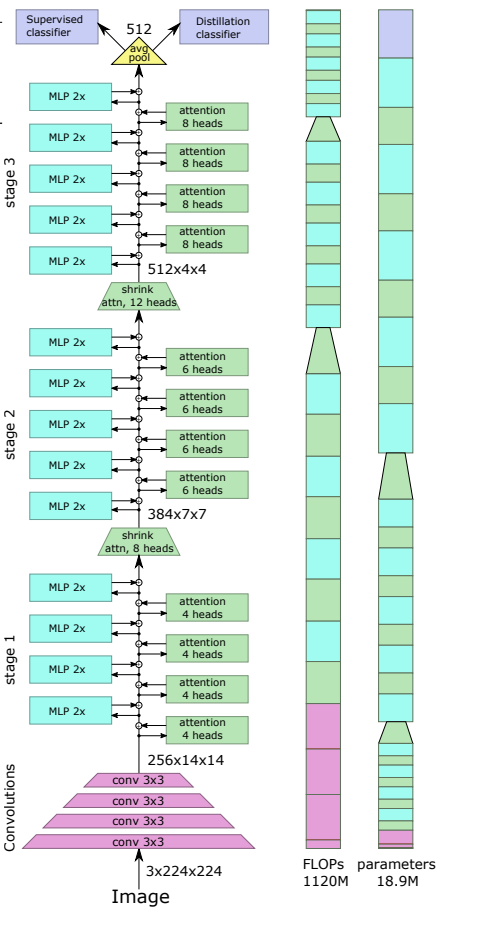

TODO: Summarize the paper:
* What is the core idea?

The paper proposed LeViT， a high speed vision based transofrmer that achieves relatively high accuracy on both CPU and GPU based hardware. They have integrated a few known discoveries from previous work, and new discoveries like the attention bias together for fast inference. 

* How is it realized (technically)?

The paper is motivated by the following facts:

1. Training process produce filter like the traditional area
2. Grafted architecture (Resnet50 + DeiT) produce better result in faster time
3. With runtime in mind, it is best to add conv layers below a transformer

With the above motivation in mind, LeViT uses ViT and DeiT transformer training methods, while incoporating training methods for convolution layers. Mainly

1. *Patch Embedding* small convnet is applied on input before transofmrer
2. *No classification token* replace classification token with averagepooling to use BCHW token
3. *Normalization* use ViT's normalization technique plus batch norm after every convolutin layer, which provides **runtime advantage in inference time**
4. *Multi resolution pyramid* Decrese conv layer's activation map while increasing channel size. 
5. *Downsampling* shrinkibng attention block before Q activation
6. *Attention bias* replaces positional embedding, which allows injection of position information in attention
7. *Smaller Keys* Attention bias reduce pressure on location information, which means that we can safely reduce V matrix's size.
8. *Attention Activation* use Hardwish activation to $$A^hV$$, which is similar to ResNet bottleneck
8. *Reducing MLP blocks* reduce expansion factor of convolution to minimize compution cost

* How well does the paper perform?

The author claimed to acheive relatively good result (80% or more on ImageNet classification) while remaining extremely fast.

In comparsion to other efficient models, LeVit net greatly improve efficiency while only having 25% to 75% more parameter than previous models.

* What interesting variants are explored?

The autho also performed ablation study with different components removed. Without pyramid shape the number of parameters takes a drastic hit along the accuracy. Other variations shows similar performance and paramter size with the base model.

## TL;DR
* Three
* Bullets
* To highlight the core concepts
