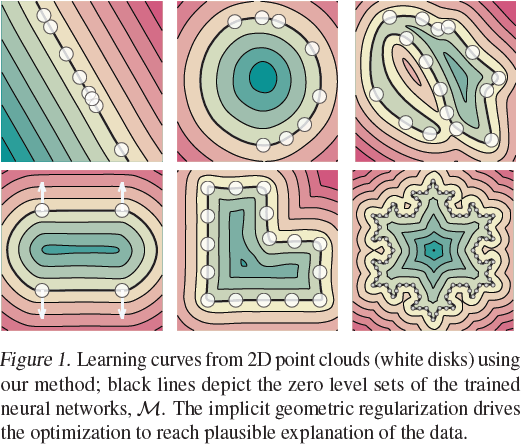
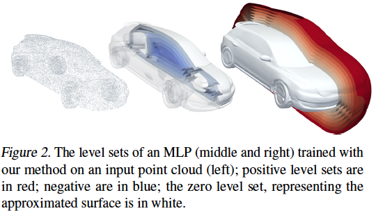
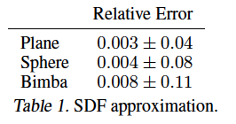
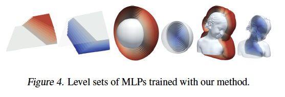
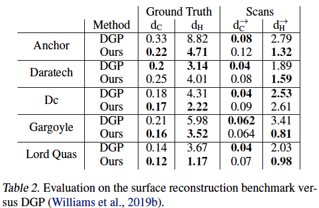
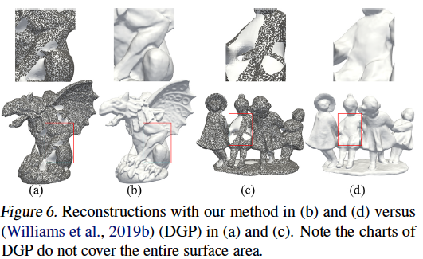
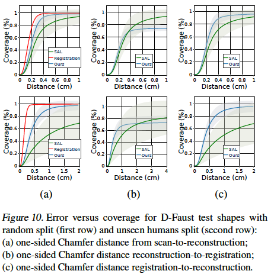
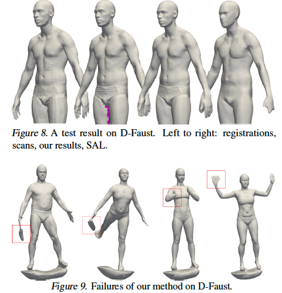

## Core idea?  
* 2D and 3D Shapes can be represented as level sets of neural networks.    
* Neural shape representations can be learned from raw data by using implicit geometric regularization.  
* Implicit neural representations can be achieved without 3D supervision and/or a direct loss on the zero level set.     

## Technical Implementation  
* **Given**: a point cloud $$X = \{x_i\}_{i\in I}\subset\mathbb{R}^3$$ with or without normal data $$N =\{n_i\}_{i\in I}\subset\mathbb{R}^3$$  
* **Goal**: compute the parameters $$\theta$$ of a Multilayer Perceptron(MLP) $$f(x;\theta)$$ where $$f:\mathbb{R}^3\times\mathbb{R}^m\rightarrow\mathbb{R}$$ so that it approximates a signed distance function to a surface $$M$$ defined by $$X\text{ and }N$$.  
  
   
* **Using loss**: $$l(\theta) = l_x(\theta) + \lambda\mathbb{E}_x(\Vert\nabla_xf(x;\theta)\Vert-1)^2$$  
	* Note: $$\lambda>0$$  is a parameter, $$\Vert\cdot\Vert=\Vert\cdot\Vert_2$$ is the euclidean 2-norm  
	* The authors prove this funciton has the *plane reproduction* property: if the point cloud $$X$$ is sampled approximately from a plane $$H$$, then gradient descent on the loss converges to the approximate signed distance function to $$H$$.       
	* The first term: $$l_x(\theta)=\frac{1}{I}\sum_{i\in I}(\lvert f(x_i;\theta)\rvert+\tau\Vert\nabla_xf(x_i;\theta)-n_i\Vert)$$  
		* encourages $$f$$ to vanish on $$X$$ and if normal data exists, that $$\nabla_xf$$ is close to the normals $$N$$    
	* The second term is the Eikonal term, and encourages $$\nabla_xf$$ to be of unit 2-norm  
		* A solution to the Eikonal PDE has the form $$\Vert\nabla_xf(x)\Vert=1$$  
			* A solution for point boundary data $$X, N$$ is not unique  
		* Furthermore a solution will be a signed distance function and a global minimum of of the loss equation    
		* The expectration is taken w.r.t. some probability distribution in $$\mathbb{R}^3$$  
* Optimization uses Stochastic Gradient Descent  
* Architecture:  
	* 8 layers each with 512 hidden units   
	* single skip connection from the input to the middle hidden layer  
	* weights $$\theta\in\mathbb{R}^m$$ initialized using geometric initialization  
	* loss parameters $$\lambda=0.1, \tau=1$$  
* Distribution:  
	* distribution of the expectation $$\mathbb{E}$$ is the average of a uniform distribution and a sum of Gaussians centered at $$X$$  
	* standard deviation equal to the distance to the *k*-th nearest neighbor (*k*=50)  
* Level set extraction:  
	* utilizes the *Marching Cubes* meshing algorithm on uniform samples grids of size $$l^3$$, $$l\in\{256,512\}$$}  
* Evaulation metrics:  
	* calculating the Chamfer and Hausdorff distances on point sets $$X_1,X_2\subset\mathbb{R}^3$$  
	* Chamfer: $$d_C(X_1,X_2)=\frac{1}{2}(d_{\overrightarrow{C}}(X_1,X_2)+d_{\overrightarrow{C}}(X_2,X_1))$$  
		* where: $$d_{\overrightarrow{C}}(X_1,X_2)=\frac{1}{\lvert X_1\rvert}\sum_{x_1\in X_1}\text{min}_{x_2\in X_2}\Vert x_1-x_2\Vert$$
	* Hausdorff: $$d_H(X_1,X_2)=\text{max}\{d_{\overrightarrow{H}}(X_1,X_2),d_{\overrightarrow{H}}(X_2,X_1)\}$$  
		* where: $$d_{\overrightarrow{H}}(X_1,X_2)=\text{max}_{x_1\in X_1}\text{min}_{x_2\in X_2}\Vert x_1-x_2\Vert$$

## Variants  
The model's architecture was extended to learn multiple shapes.  
* The MLP is thus defined as $$f(x;\theta;z_j)$$  
	* Where $$z_j\in\mathbb{R}^{256}$$ is a latent vector corresponding to each training example $$j\in J$$  
	* Latent vectors are initialized to $$0\in\mathbb{R}^{256}$$  
* The loss takes the form of $$\frac{1}{\lvert B\rvert}\sum_{j\in B}l(\theta,z_j)+\alpha\Vert z_j\Vert$$  
	* Where $$B\subset J$$ is a batch, $$\alpha=0.01$$, and $$l,\tau,\lambda$$ are as defined above.

## Results 
### Signed Distance Function Approximation 
MLPs trained independently on 3 different shapes.  
  
  
### Surface Reconstruction  
The paper's method outperformed DGP on 4 out of 5 tasks. 
  
  
### Learning Shape Space 
The authors noted that their model was sensitive to noisy normal data, as seen in Figure 9. 
  
  
## TL;DR
* High fidelity implicit neural representations of shapes can be learned directly from raw data using a simple loss function  
* Optimization using gradient descent tends to find a favorable minima out of the infinite possible signed distance functions  
* This method's primary shortcoming is sensitivity to noisy normals
