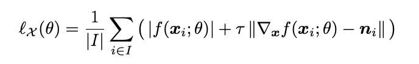
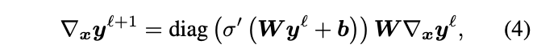

The core idea of the paper was to introduce a new paradigm built on implicit geometric regularization for computing high fidelity implicit neural representations directly from raw data scans. 
The Authors do this by introducing a new loss function which utilizes the Eikonal term wich encourages gradients to be of unit 2-norm.

Given an input cloud X = $$\{x_i\}_iEI$$ C $$R^3$$ with or without normal data, N = $${n_i}_iEI$$ C $$R^3$$, the goal is to compute the parameters $$\theta$$ of a multi-layer perceptron (MLP) $$f$$(x;$$\theta$$), where f has the shape $$R^3$$ x $$R^m$$ $$\rightarrow$$ $$R$$, such that it approximates a signed distance function to a plausible surface M defined by X and N.

To help learn these parameters the authors propose the loss function:

where $$\lambda$$ > 0 is a hyperparameter, $$\|.\|$$ = $$\|.\|_2$$ (the euclidean 2-norm) and 

which encourages f to vanish on X.

The second term in the first equation is called the Eikonal term, which encourages the gradients to be of unit 2-norm.

Optimizing the loss function using SGD, or a variant of SGD) results in solutions that are close to a signed distance function with a smooth and suprisingly plausible zero level set. 

The loss function also possesses a implicit geometric regularization property that favors smooth and natural zero level set surfaces, avoiding bad zero-loss solutions, which is known as the plane reproduction property.

The plane reproduction property insures that the loss function will always arrive at a minima when optimizing with SGD or a variant.

The proof of plane reproduction is located in the original paper, if the reader is interested.

Instead of using numerical estimes of the gradient when incorporating them into the loss, the authers used:

Comparing this method to other popular methods:

Regular Grid Volumetric Function (RGVF):
* Implicit function is defined only at grid points, requiring an interpolation scheme to extend it to interior of cells
* It requires cubic-size grid and is not data-dependent meaning it does not adhere to the specific geometry of the shapes one wishes to approximate
* A version of the Eikonal regularization term has been used as a normalization term, as apposed to this work which uses it alone as regularizing the zero level set.
* Gradients are computed using finite differences or via some fixed basis function.

Neural parametric surfaces:
* Finding a consistent atlas covering of the surface can be challenging.
* The shape can be easily sampled.
* Challenging to produce a set of perfectly overlapping charts, a property that holds by construction for implicit representations.

To test performance a 8 layer MLP, with hidden size 512 and a single skip connection from the inpu to the middle layer, was used. 
They used geometric initializaiton and $$\lambda$$ = 0.1 and $$\tau$$ = 1.
They defined the distribution D as the average of a uniform distribution and a sum of Gaussians centered at X with standard debiation equal to the distance to the kth nearest neighbor (k = 50).
For evaluation they use Chamfer and Hausdorff distances:

They first evaluated the model by testing its ability to reproduce a signed distance function to known manifold surfaces

 

They then tested Fidelity and level of detail in comparison to regression on two raw scans of humans they were able to achieve much higher levels of detail.

 

They then conducted experiments on the task of surface reconstruction.
They evaluated their method on the surface reconstruction benchmark from Berg elt al., 2013 using input data from william et al. 2019b.
The data consisted of 5 shapes with non trivial tropology or details.

 

Lastly, they experimented on learning shape space. 
They used a dataset of high resolution raw scans of 10 humans in multiple poses (8 humnas for training and 2 for testing).
 
 

## TL;DR
* Introduced a loss function based on the Eikonal term.
* Showed ability of training on raw data from scans.
* Was able to achieve greater detail then SOA models.
