## What is the core idea?
A new transformer in transfomer architecture is proposed for applying transformers in visual detection and classification tasks. The image is uniformly split into patches (visual sentences) and subpatches (visual words). An outer transformer block processes the patches and an inner transformer process subpatches allowing the model to learn both better feature representations and embeddings.

## How is it realized (technically)?

Transformers perform very well in NLP tasks where the input and ground truth labels have a semantic relationship. This is not the case for CV (computer vision) tasks. To address this, images need to be subdivided into patches to calculate the visual sequential information and estimate attention. The architecture of a transformer in transformer (TNT) network consists of outer and inner transformer blocks. If patches represent "visual sentences", then subpatches represent "visual words". The model framework is shown below:

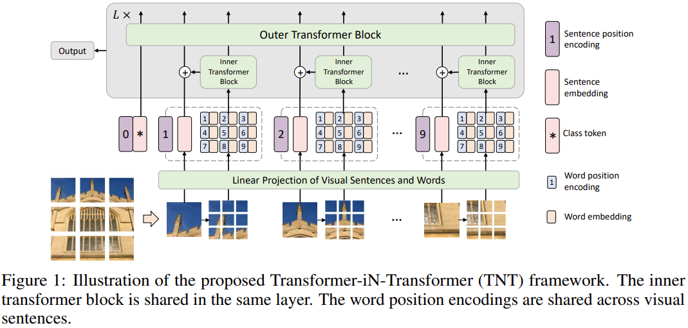

The outer layer transformer extracts the features and attentions of visual sentences,i.e. patches. The inner layer transformers are responsible for extracting features of details from visual words, i.e. sub patches. This allows the TNT model to extract visual information with finer granularity and provide more details to inferred features. The image is divided into n patches as 
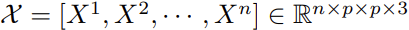. 

Each patch is then divided into subpatches as 
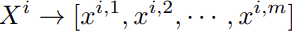

These patches are then mapped into a sequence of word embeddings using linear projection as 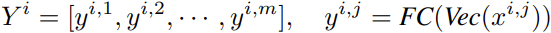. 

The relationship between these words are then learnt by the inner transformer block as:

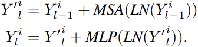

where MSA is the self attention function and the MLP layer is applied to the self attention function to introduce non-linearity and feature transformation. For sentence level representations, they use a similar approach to ViT. It uses the same MSA and MLP layer to calculate sentence level embeddings. In effect the TNT block models the relationship between visual words for local feature extraction and the outer transformer block captures the intrinsic information from sequences to sentences. The classification token serves as the image representation token which is then applied for the classification task.

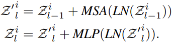

The 1D positions are used to for sentence position encodings and a word position encoding is added to each word embedding.

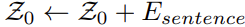

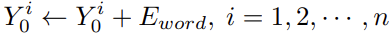

## How well does the paper perform?

The TNT architectures below are used for multiple tasks of image classification and detection across different datasets:

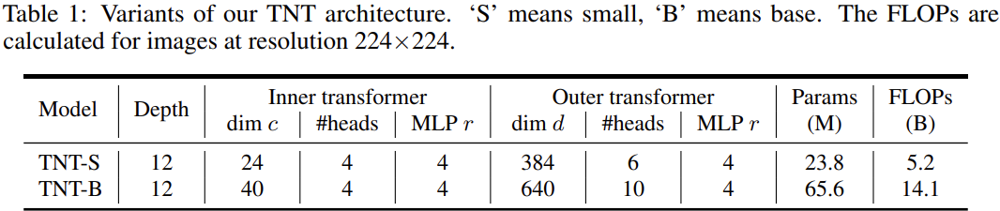

- In the ImageNet dataset, the TNT-S and TNT-B models significantly outperformed other transformer based models. However, it did not beat the state of the art CNN based models.

- The authors found that the number of sub-patches has very little influence on the performance of the transformer.

For Object detection on COCO2017, the TNT-S model does the best compared to other models it is measured against.

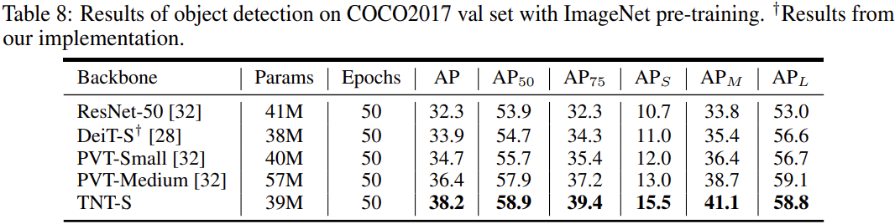

For semantic segmentation, the TNT-S model had the best mIoU (intersection over union) compared to other models. It also used lesser FLOPs than other models:

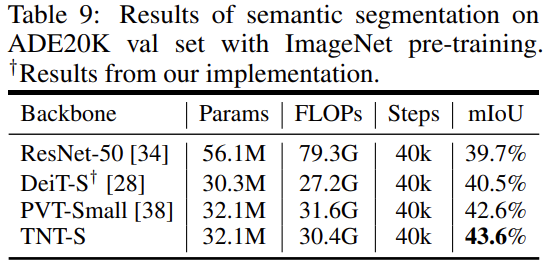

## TL;DR
- Introduces a transformer in transformer architecture to learn visual "words" and "sentence" embeddings by dividing patches into subpatches
- They introduce a TNT block with outer and inner transformer blocks and demonstrate how the subpatches help capture visual word embeddings better
- TNT better preserves local information for visual recognition. The attention values of subpatches are good at capturing similarity to query images, which is not done in other visual transformer models

