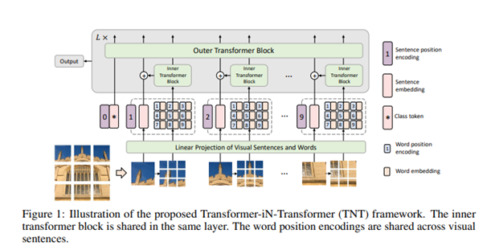
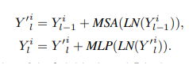
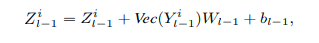
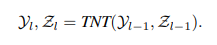
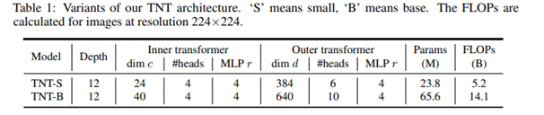
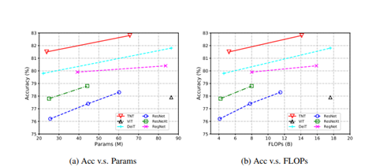

## The Core Idea of this paper?
This paper presents a new architecture of visual transformers the Transformer in Transformer (TNT) architecture for visual recognition. To enhance the 
feature representation ability of visual transformers, TNT first divides the input images into several patches as “visual sentences” and then further 
divides them into sub-patches as “visual words”. Besides the conventional transformer blocks for extracting features and attentions of “visual sentences”, 
it further embeds a sub-transformer into the architecture for excavating the features and details of smaller “visual words”. The features of words are 
aggregated into the corresponding visual sentence. Hence TNT model is capable of extracting visual information with fine granularity and provide features 
with more details.

## Network Architecture:

The Architecture of TNT learns both global and local information in an image. A 2D image is represented as a set of n patches X = [X1 , X2 , • • • , Xn] 
∈ R n×p×p×3 , where (p, p) is the resolution of each image patch and each patch is considered as visual sentences that represent the image. Each patch is 
further divided into m sub-patches, i.e., a visual sentence is composed of a sequence of visual words.

								Xi → [x i,1 , xi,2 , • • • , xi,m]
								
It transforms the visual words into a sequence of word embeddings

				Y i = [y i,1 , yi,2 , • • • , yi,m], yi,j = FC(Vec(x i,j ))
				
The two data flows in which one flow operates across the visual sentences and the other processes the visual words inside each sentence:
					

Y is the input block and l is the length of each block

Sentence embedding is represented as 

The inputs and outputs of the TNT block include the visual word embeddings and sentence embeddings

where Y represents Word embeddings and Z represents Sentenc embeddings.

The inner transformer block is used to model the relationship between visual words for local feature extraction, and the outer transformer block captures 
the intrinsic information from the sequence of sentences. The TNT Architecture consist of patch size e is set as 16×16. The number of sub-patches is set 
as m = 4 • 4 = 16 by default. there are two variants of TNT networks with different model sizes, namely, TNT-S and TNT-B. They consist of 23.8M and 65.6M 
parameters respectively.

## Experiments: 

• Task : To Compare  the performance of TNT with other visual transformers

• Datasets: TNT is applied over ImageNet to check the accuracy of model.

• Results:: TNT out performed all other networks.

## TL;DR
•  TNT block in which an outer transformer block is utilized for processing the sentence embeddings and an inner transformer block is used to model the 
   relation among word embeddings.

•  Compared to the conventional vision transformers (ViT) which corrupts the local structure of the patch, our TNT can better preserve and model the local 
   information for visual recognition

•  TNT has better performance compared to other transformers while experimented over ImageNet.