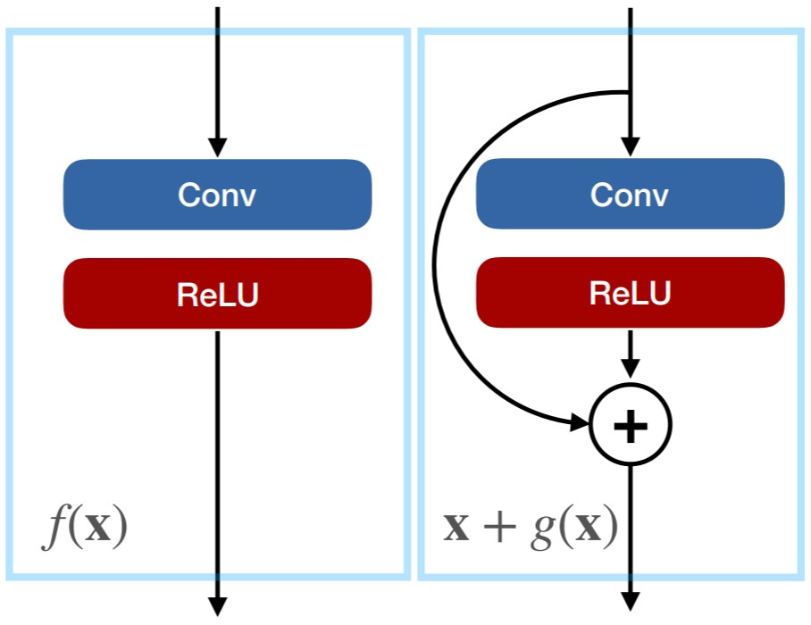
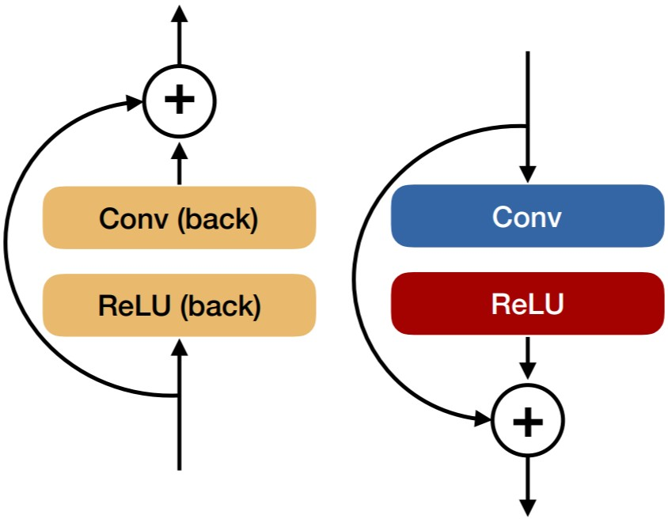
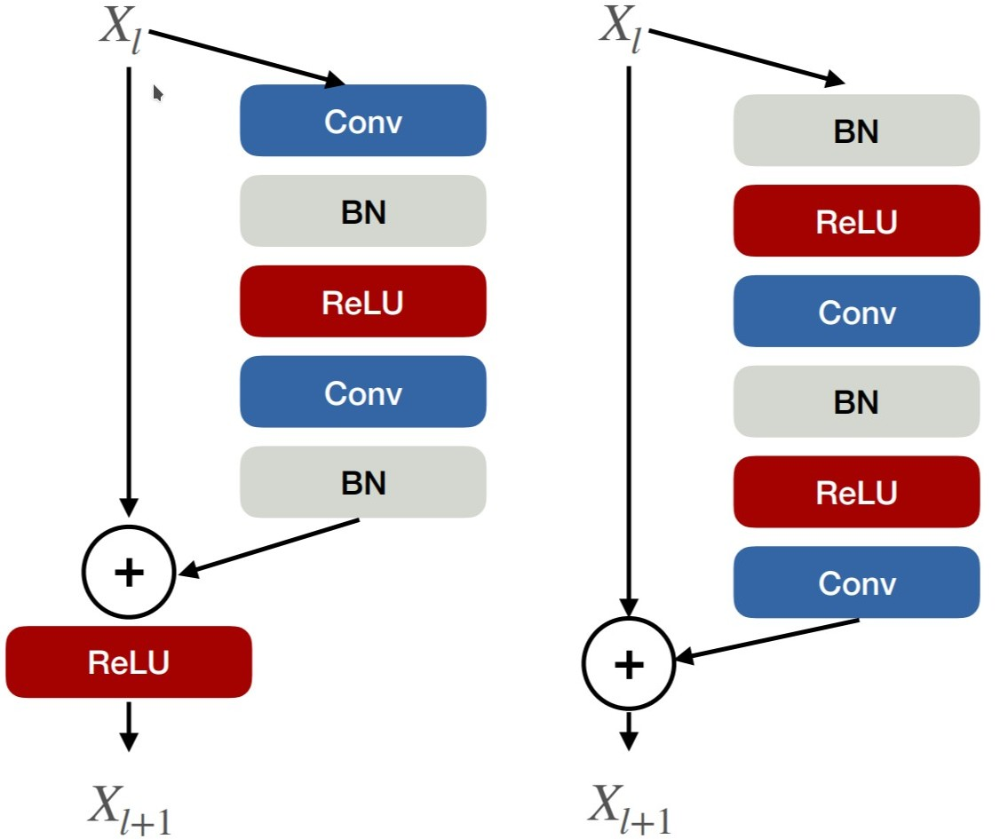
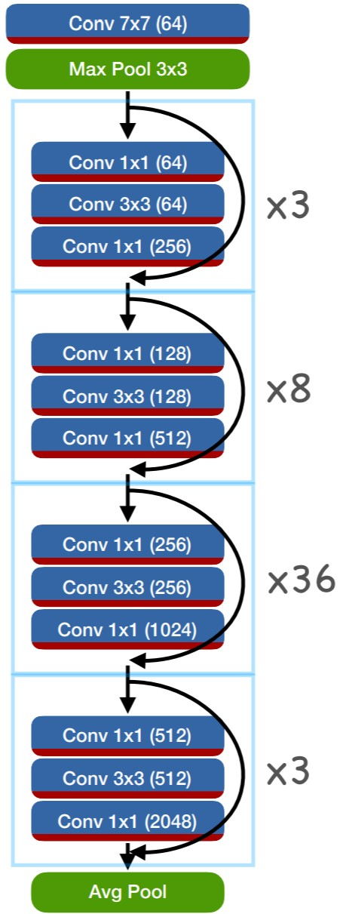

If AlexNet started the modern era of deep learning, ResNets made sure it would spread to all of computer vision and beyond.
The core idea of residual networks is to parametrize each layer (or group of layers) as a residual of a function.
A function $$f_1(x)$$ would now become $$f_2(x) = x + g(x)$$.

Both representations have the same expressional power and computational requirements.
However, they have a different gradient.
For regular networks, back-propagation multiplies a gradient with $$\frac{\partial}{\partial x} f_1(x)$$, while residual networks use $$\frac{\partial}{\partial x} x + g(x) = I + \frac{\partial}{\partial x} g(x)$$.
Hence, back-propagation passes the gradient back directly, and adds a second component multiplied by $$\frac{\partial}{\partial x} g(x)$$.

Fun fact, the backward pass of a resnet block looks the same as the forward pass 

How do we build a network out of this idea?
There are two variants of basic-residual network blocks: post-activation blocks (below left), pre-activation blocks (below right).

ResNets then stack many of these blocks in a network

The first layer if each series of blocks is strided, and it's residual connection uses a 1x1 convolution (to better deal with the change in number of channels).

ResNets really blew the competition out of the water across many computer vision tasks. 
They are still used today.

## TL;DR
* Introduces **ResNet**: First really deep networks
* Beautiful **mathematical interpretation**
* **Stellar results**

