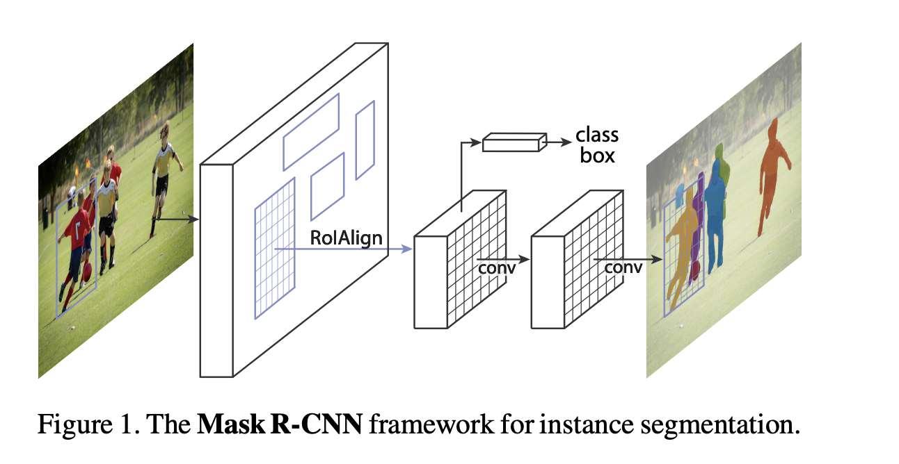
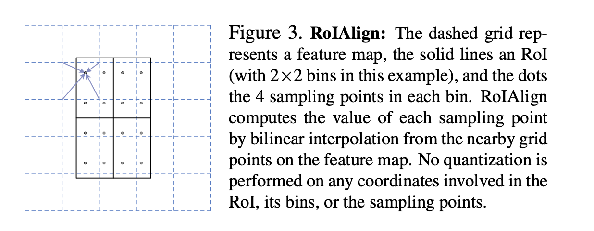
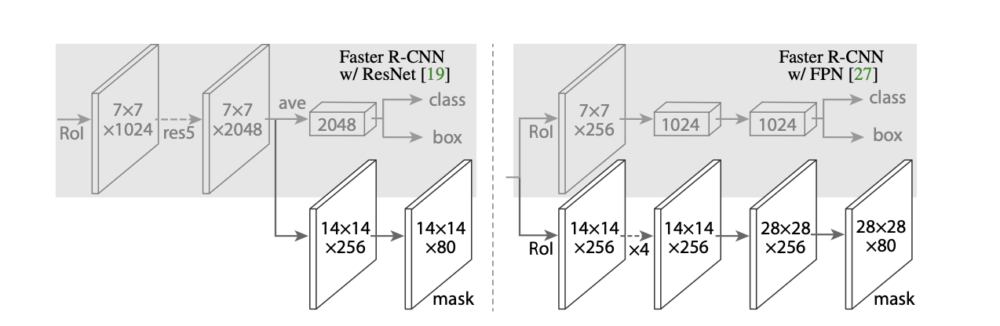
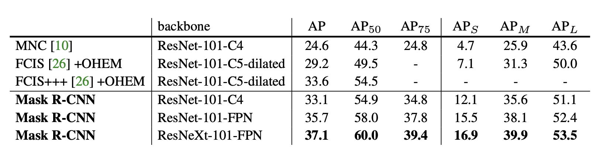
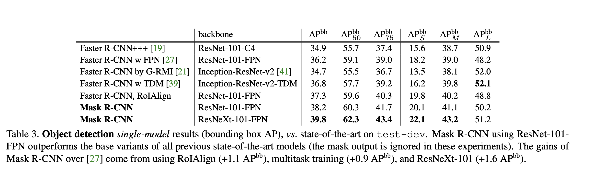
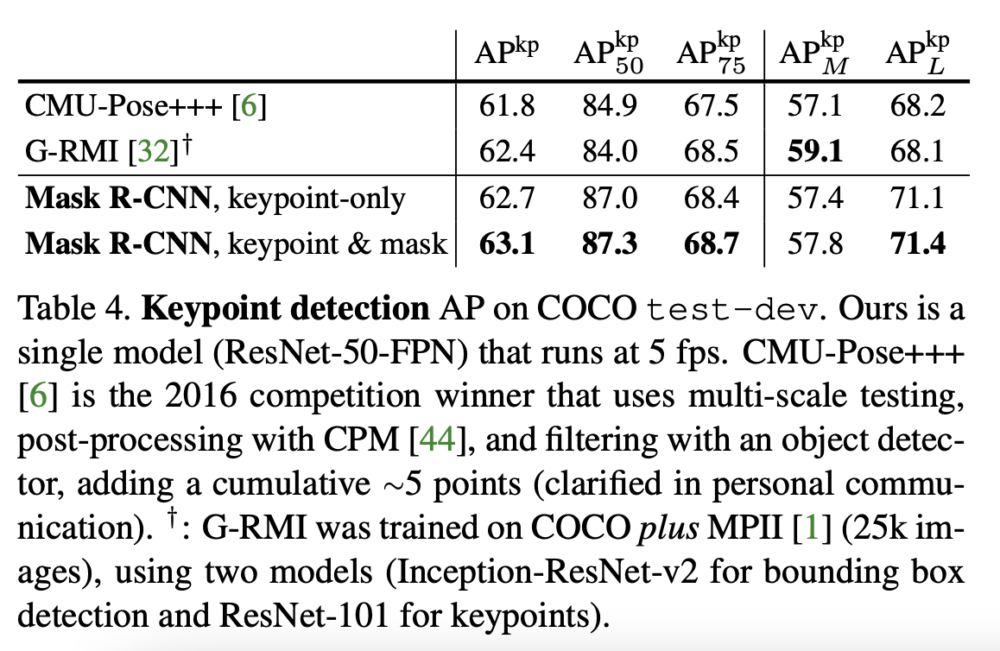
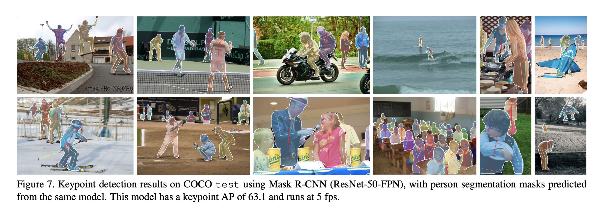

* What is the core idea?
The authors of the paper introduce a new architecture, Mask R-CNN, for object instance segmentation.
This new method builds off of Faster R-CNN by adding a branch for predicting an object mask in parallel with the exisiting branch for bounding box recognition.
Mask R-CNN is proved to be easy to train and and generalize to other tasks such as estimating human poses.

* How is it realized (technically)?

The architecture of Mask R-CNN is a relatively simple addition to Faster R-CNN.
Faster R-CNN outputs for each candidate object a class label and a bounding-box offset, Mask R-CNN adds a third branch that outputs the object mask.
This third output requires the extraction of much finer spatial layout of an object.

Mask R-CNN has an identical first stage, to Faster R-CNN, a Region Proposal Network (RPN).
For the second stage however, the model in parallel predicts the class, box offset and outputs a binary mask for each Region of Interest (RoI).
This contrasts with other systems, in that the classification does not depend on mask predictions.

For training, a multi-task loss on each sample is computed as $$L = L_{cls} + L_{box} + L_{mask}$$.
The first two elements are the same as for the Faster model, the mask branch has a $$Km^2$$-dimensional output for each RoI, which encodes K binary masks of resolution m x m, one for each of the K classes.
A per-pixel sigmoid is applied to the output and the average binary cross-entropy loss is $$L_{mask}$$.
This allows for the network to generate masks for every class without competition among classes.

A m x m mask is predicted for each RoI using a Fully Convolutional Network (FCN). This allows each layer in the mask branch to maintain the explicit m x m object spatial layout without collapsing it into a vector representation that lacks spatial dimensions.

The authors proposed RoIAlign to address RoIPools large negative effect on predicting pixel-accurate masks.
It does this by avoiding any quantization of the RoI boundaries or bins. 
Bilinear interpolation is used to compute the exact values of input features at four regularly sampled locations in each RoI bin and the aggregate result (using max and average).
 
 They instantiated Mask R-CNN with multiple architectures including ResNet-50, -101, -50-C4, -101-C4, and an FPN.
 
 

* How well does the paper perform?

They did a comparison to SOTA with comprehensive ablation on the COCO dataset.
Mask R-CNN outperformed the baseline variants for all previous SOTA models

They also ran experiments on bounding box detection, using the COCO bounding-box detection datasets.

The last experiment they did was on human pose estimation.

* What interesting variants are explored?

## TL;DR
* The authors proposed Mask R-CNN a variant of Faster R-CNN
* Introduced RoIAlign
* Showed that Mask R-CNN is generalizable to several different tasks and architectures.
