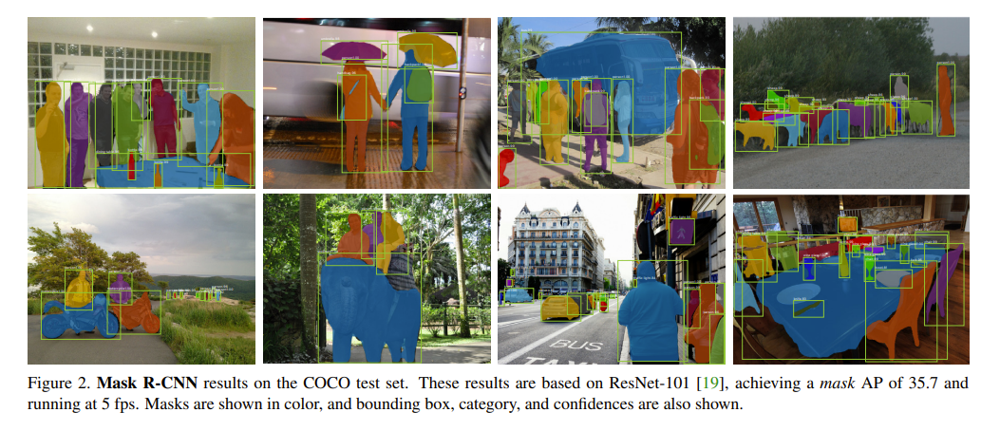
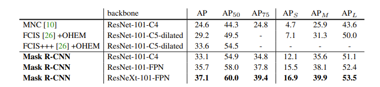
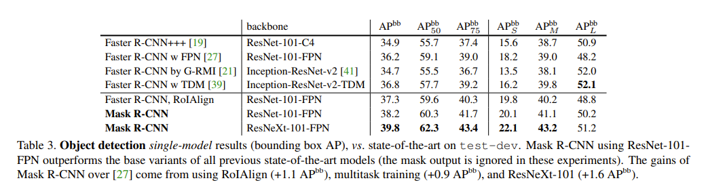
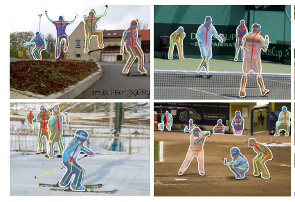
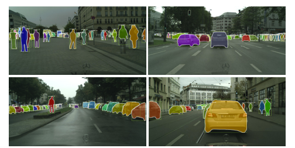

# Main Idea

The authors present a framework for object instance segmentation. It efficiently detects objects in an image and generates a high-quality segmentation mask for each instance. 

The main task in the problem statement is instance semgentation. This requires the correct detectino of all objects in an image while also segmenting each instance. It can be seen as a combination of object detection (classify individual objects and bound them with a bounding box) and semantic segmentation (classify each pixel into a fixed set of categories without differentiating object instances). 

# Technical Implementation

This work is an eextension of Faster R-CNN. It adds a branch for predicting an object mask in parallel with the existing branch for bounding box recognition.

Mask R-CNN has three outputs for each candidate object: class label, bounding box, and an object mask. 

The stages of the framework are initially based on Faster R-CNN. The first one is a Region Proposal Network. This stage proposes candidate object bounding boxes. The next stage extracts features using RoIPool to perform classification and bounding-box regression. In Mask R-CNN, in parallel to predicting the class and bounding box, there is also an ouput for a binary mask for each RoI (Region of Interest), so classification does not depend on mask predictions. This branch uses a small FCN to predict the mask. 

The loss is defined as the summation of the loss over classification, bounding-box, and the mask.

A mask is used to encode an input object's spatial layout. These are different than class labels or box offsets as those will collapse into short output vectors from fully connected layers. 

The authors also propose RoIAlight. This seeks to align the extracted features with the input by removing the harsh quantization of RoIPool. They avoid the quantization of the RoI boundaries and bins, leading to better results. 

When describing the architecture, the authors note the difference between the backbone and head. The backbone is used for feature extraction over an entire image while the head is used for bounding-box recognition and mask prediction. They perform ablation studies by switching the backbones and heads. 

When compared to previous attempts like Fasater R-CNN, Mask R-CNN works better  as it was designed with the idea of pixel-to-pixel alignment between the inputs and outputs.  

# Results

Mask R-CNN is tested on the COCO dataset. It had outperformed the winners of the COCO 2015 and 2016 challenges across all AP values. These winners include MNC and FCIS. 

Mask R-CNN also outperforms the sstate of the art in COCO bounding-box detection. 

Mask R-CNN is not optimzed for speed, but rather for better accuracy. It trains in 23 hours for 35k training instances with ResNet-50-FPN and 44 hours with ResNet-101-FPN. It is only slightly slower than Fasster R-CNN at runs at 5 fps. The paper also says that it takes one to two days to train on a single 8-GPU machine on COCO. 

# Variations

The work can be adapted to solve similar tasks, like pose estimation as well. Mask R-CNN is used to predict K masks for each of the K keypoints on the body, such as left shoulder, right elbow, etc. Mask R-CNN beats the state of the art in keypoint detection, such as G-RMI and CMU-Pose+++. 

The work was also extended to repost instance segmentation on the Cityscapes datset. Across class accuracy, Mask R-CNN beats the state of the art, such as InstanceCut, DWT, SAIS, DIN, and SGN. 

## TL;DR
* Mask R-CNN is a simple and general framework for object instance segmentation
* The technical implementation is an extension upon Faster R-CNN
* Mask R-CNN outperforms the state-of-the-art in tasks in COCO, Pose Estimation, and the Cityscapes dataset. It is easy to generalize to other tasks
