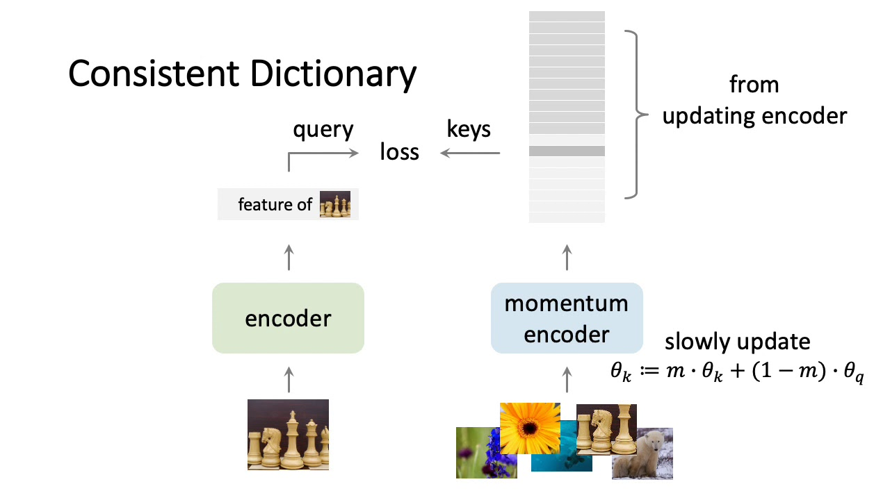
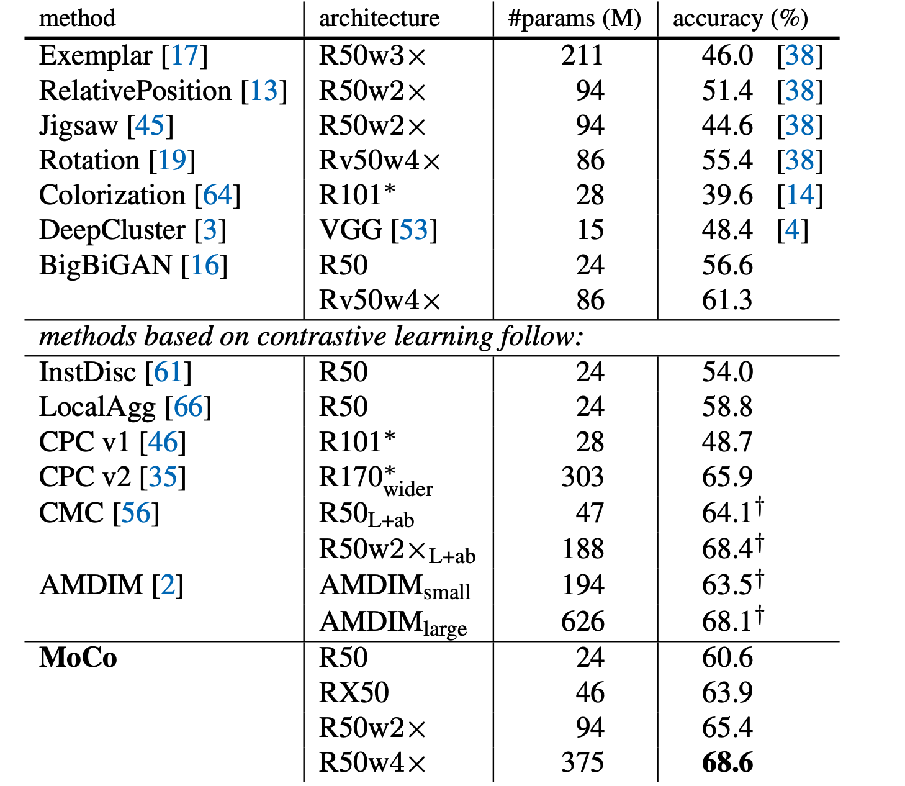
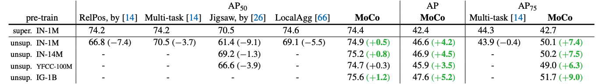
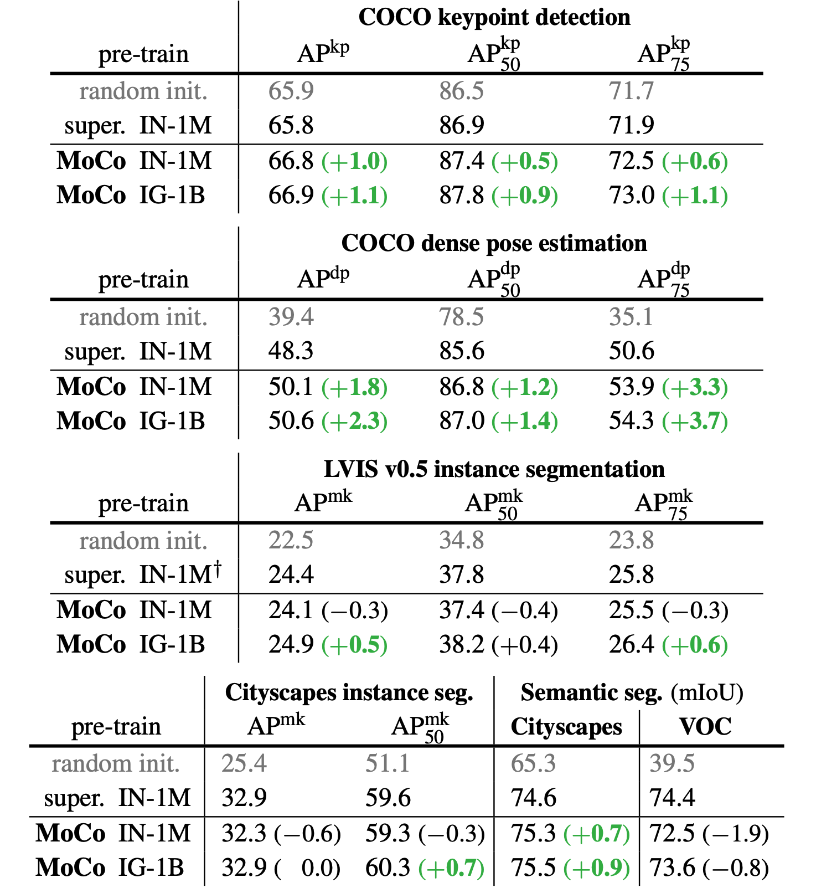
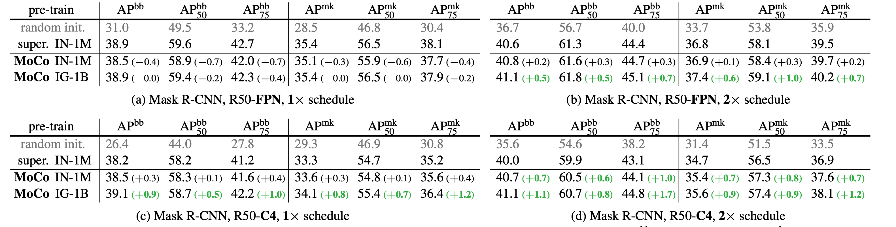

## What's the big idea

A large dynamic dictionary of keys in a queue, built via a momentum encoder, can improve contrastive learning making unsupervised pretraining in computer vision viable and better than supervised pretraining.

## What's hard about unsupervised pre-training in vision

- Language Tasks can utilize unsupervised pre-training easily due to their inherent structure (words are tokens, and finite)

- Pretraining on images is difficult because they are in a continuous space, and the representations learned may not transfer due to the extremely large set of signals an image can represent

- Some work has been done on pretraining computer vision models using pretext tasks, but by in large have failed to outperform supervised pretraining

## What are pretext tasks 

- Pretext tasks are training objectives focused purely on getting good representations of data (image features), so that downstream tasks are easier to solve (finetuning)

- Pretext tasks can be cropping an image in two and training a classifier to know that those two cropped images are from one larger image (there are many tasks like this).

- Contrastive Learning is a loss that can be used in a pretext task, and is usually focused around comparing the similarities of two representations (an example is the bullet point above)

## How does contrastive learning work

- Given some input $$q$$ and a list of keys $$k_i$$ we want to have a low value for when $$q$$ and $$k_+$$ have similar representation and have a high value when they are different.

- One way to measure the similarity between queries and keys is by the dot product.

- We can then measure the basic loss of a contrastive algorithm by:

$$L_q = - log \frac{exp(q \cdot k_+ / t)}{\sum^K_{t=0}exp(q \cdot k_i / t)}$$

- where $$q$$ is the current image query, $$k_+$$ is the correct key that corresponds to the query, $$k_i$$ are negative samples, and $$t$$ is a temperature hyperparameter.

## Why is a Queue and Momentum useful for Encoding keys in Contrastive Learning (technical implementation)

(queue is not shown in this diagram)

- You have to have sufficient numbers of negative samples to get good representations

- At the same time, you don't want to compare keys that were encoded by an outdated previous iteration of the network 

- A queue allows you to accumulate negative samples, but age out sufficiently old samples that were generated by an older version of the network

- Momentum allows you to use the parameter updates from the query encoder on the key encoder but still produce consistant encodings for the keys.

$$\theta_k \leftarrow m\theta_k + (1-m)\theta_q$$

- where $$\theta_k$$ is the Key Encoder network and $$theta_q$$ is the Query encoding network, $$m$$ is how much momentum the query encoders backprop values are allowed to influence the key encoder.

- MoCo introduces both of these ideas in their implementation.

## How does it perform

- MoCo was trained on Image Net 1k (authors call it 1m because each image is a "class" in their pretext task) as well as Instagram 1 Billion (940million public images)

- MoCo was evaluated agianst other pretraining models on the same pretext task.

- MoCo was evaluated against supervised pretraining and randomly initialized models for downstream tasks 
    - Because MoCo is fine-tuned on downstream tasks, the experiment was setup, so the fine-tuning was as long as the supervised/random initialized training so that direct comparisons could take place.

- Extremely well!  It outperforms all other unsupervised pretext models.

  

- MoCo also outperforms every model on nearly every down stream task (note the one failure being semantic segmentations on VOC)

  

  VOC object detection, all use C4 backbone compared against different pretraining datasets and pretext tasks vs supervised pretraining.

  

MOCO performance on downstream tasks.

## Does the pretext task or backbone matter (other variants)

- The pretext task does matter, by tweaking the data augmentation the authors were able to get large performance gains (10%+) on the pretext task.

- MoCo is also capable of scaling up to extremely large unsupervised datasets, and performs better consistently as the pretext dataset increases.

- The backbone does matter as well, the reason is unknown at the time of the paper.

  

## TL;DR

* Contrastive Loss benefits from a large queue-like dictionary of negative samples, where sufficiently old activations are dropped

* Contrastive Loss benefits from momentum weights on the key encoder to produce better keys and thus help the query encoder train better representations

* MoCo and Pretext tasks are now better at pretraining computer vision models than supervised alternatives