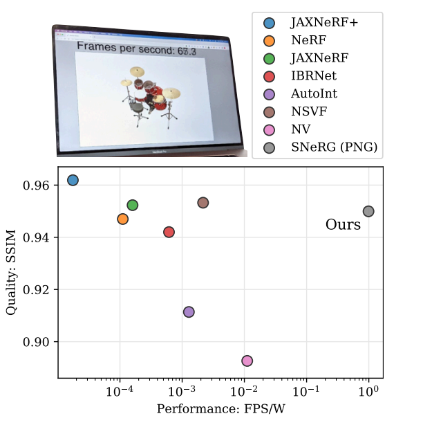
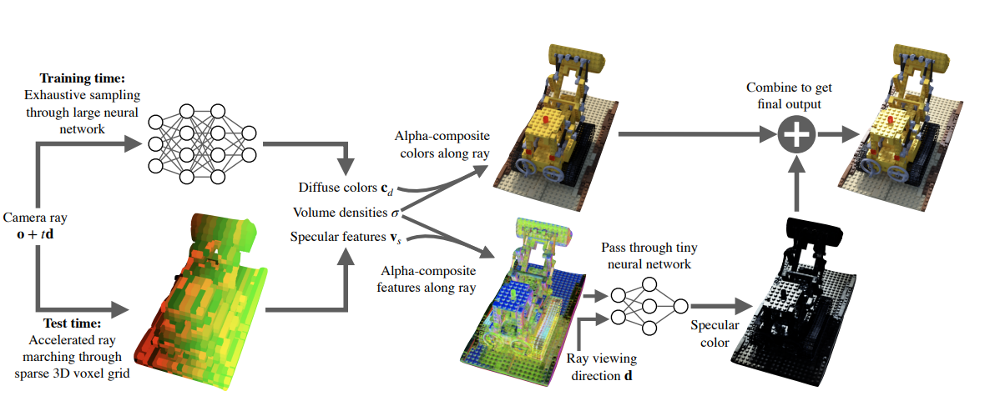
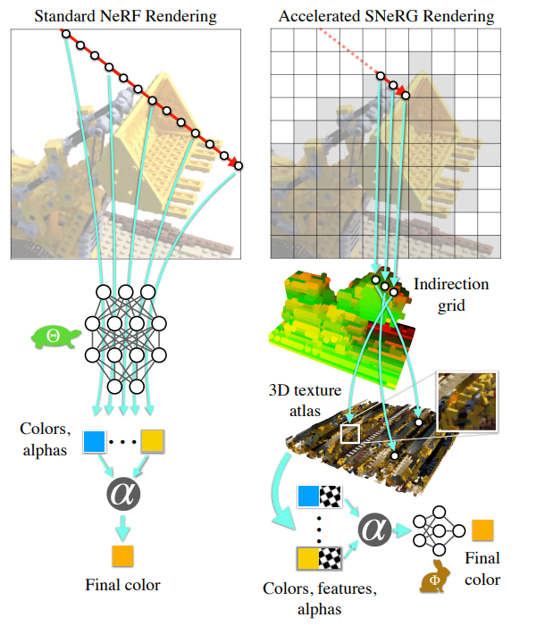
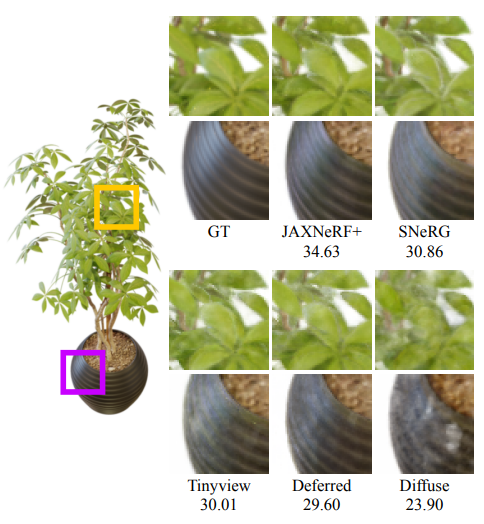
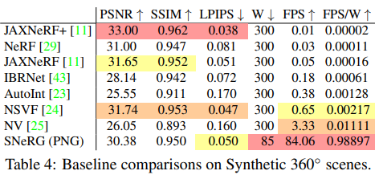
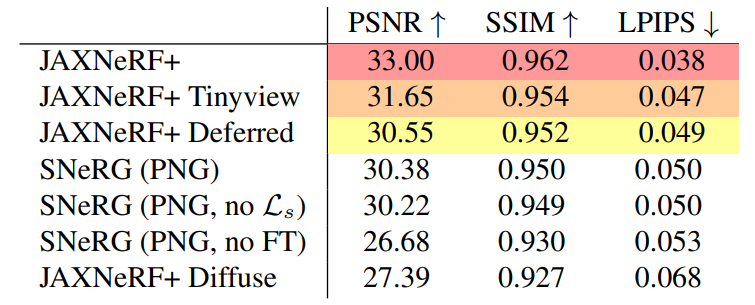
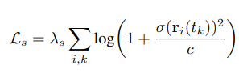
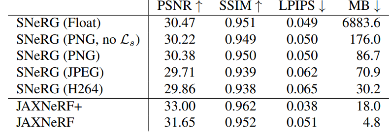

## Core Idea
View synthesis is the task of given a set of images of a specific scene, generating a 3d representation of that scene. An innovative model in this task is NeRF, however this model is slow and intensive. This paper presents SNeRG, a data structure addition to the NeRF that creates two orders of magnitudes speedups. This is done by trading some computation for storage through pre-training.

  

## How This is Realized
This is done by precomputing and storing ("baking") a trained NeRF into a Sparse Neural Radiance Grid which is represented as a sparse 3d voxel grid data structure in which each voxel contains opacity, diffuse color, and a learned feature vector for view-dependent effects.

During training, the model uses a "deferred" NeRF model which computes environmental features but differs view-dependent features to render time. During testing, a method  of storing the model in a sparse 3D data structure is used which allows for quick hash-based look ups when executing the model. From here diffuse color features volume densities and specular features are passed to generate alpha-composite colors and features. The features are then passed though a neural network along with the viewing direction to generate a specular color which is finally concatenated to the colors to generate an output.

  

The SNeRG data structure is constructed using two smaller dense arrays: a  3D texture atlas and a low resolution indirection grid. The 3D texture atlas contains "macroblocks" which includes diffuse color, feature vectors, and opacity of points that exist within the sparse volume. The low resolution indirection grid is a dense representation of the space which includes either an index to the point within the atlas or a value indicating that that value is empty within space.

When rendering, ray are marched through the indirection grid skipping empty values and alpha-composite diffuse colors. This is done till opacity has saturated in which colors and features to a small MLP that produces view-dependent results.

Comparing to NeRF, NeRF has a lot of forward passes needed to be done which are just completely avoided in SNeRG.

  

## Results:

  
   

As can be seen on the image above, the quality of the model remains extremely competitive with other models and the table shows us the large improvements gained in terms of speed.

In the following table we see each design choice independently explored. As can be seen, the changes do cause small drops in the results but they are crucial for the speeds achieved.

  

## Interesting Tricks
#### Opacity regularization
Time and space for volumetric representation was strongly associated with sparsity of opacity in the model.  To encourage this sparsity, the model uses a regulazier that calculates loss for  predicted densities based on Cauchy loss.

  

#### Sparsity
It is crucial for the voxel grid to be represented sparsely as a dense vocel would easily fill up a modern GPU's memory. This is promoted with the spareness of the atlas which results from the ignoring of empty space/low visibility and points that are not visible in any training views.

### Compression
All values within the SNeRG data structure are compress to 8 bits total and also and the indirction grid is represented as a PNG while the atlas is either a set of PNGs, a set of GPEGs, or a video encoded with H264. Here we see the results based on what compression is used:

  

## TL;DR
* Storing geometry data in a precomputed data structure leads to high speed improvements
* Real time rendering is enabled though the use of said data structure
* Regularizing NeRF's opacity predictions during  training encourages sparsity which leads to speed and time  improvements.
