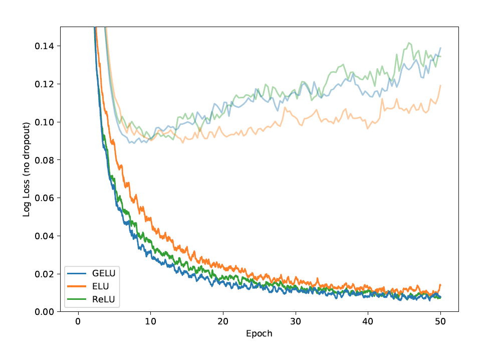
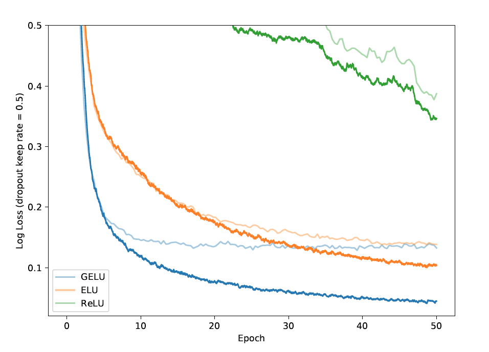
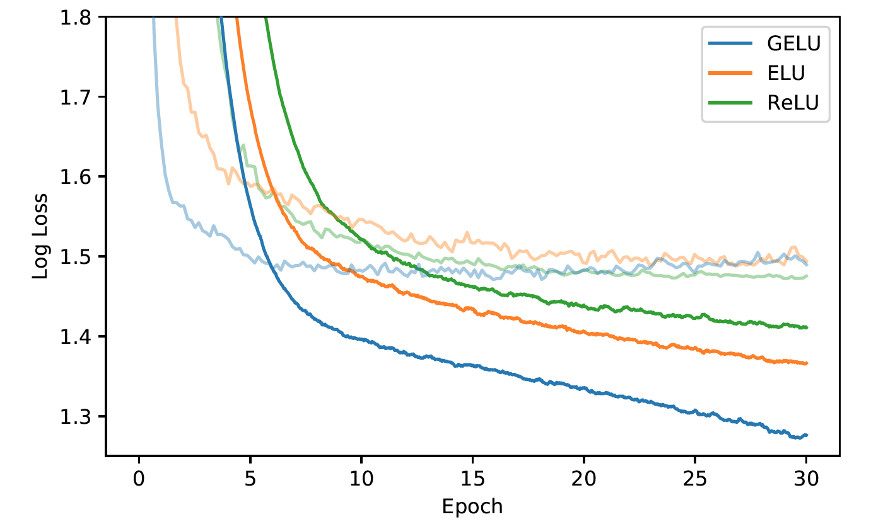
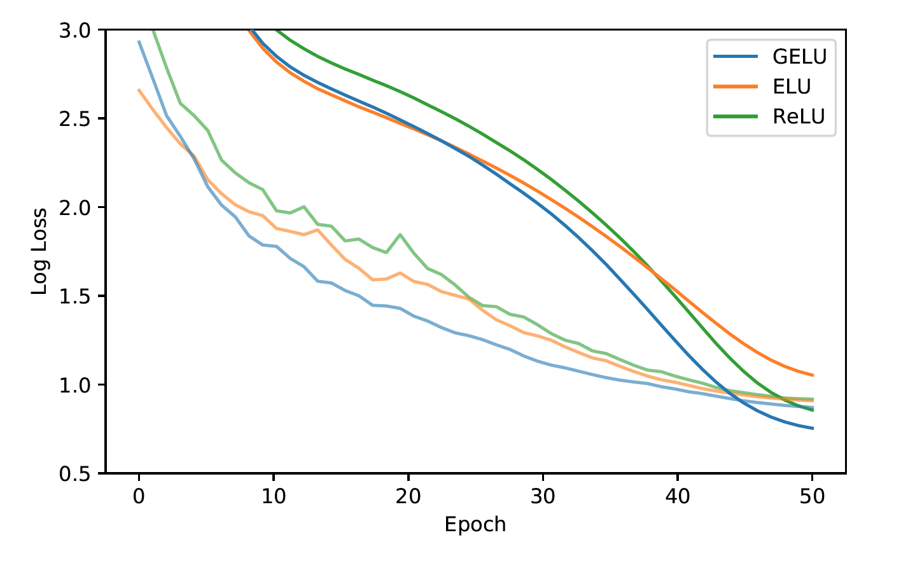

This paper proposes the Gaussian Error Linear Unit (GELU), a neural activation function that performs well against ReLU and ELU in similar training experiments. It is often the case that a "deterministic decision" is wanted from a neural network, which motivates the need for a new nonlinearity. It has often been the case that nonlinearities and dropouts were seperate innovations, hence GELUs are nonlinearities that relate to stochastic regularizers by being the "expectation" to changes in dropout. Thus, in other words, a neuron's output is more probabilistic.

Thus, the GELU is a nonlinearity that weights input by value rather than gates input by sign, such as in ReLUs.

The activiation function is $$x \Phi(x)$$.

This essentially scales $x$ by how much greater it is than other inputs.

In more detail, it is $$x \Phi(x) = x P(X \leq x) = x \frac{1}{2}[1 + erf (x / \sqrt(2))]$$ which is approximated with $$0.5 x (1 + tanh[\sqrt(2/\pi)(x + 0.044715x^3)])$$.

### Performance
Several experiments were done on the MNIST, TIMIT, CIFAR datasets to see effect this nonlinearity is, especially with dropout.

Here is a comparison between MNIST classificaiton results between the GELU, ReLU, and ELU.

Here is the same comparison but with dropout added.

GELU performed well with dropout. It also proved to perform better during TIMIIT Frame Classification.

Finally, during CIFAR classification tests, a more intricate architecture, the GELU nonlinearity proved to outperform ReLUs and ELUs.

In the end, the paper recommends two tips when using GELUs:
1. Using an optimizer with momentum, standard for deep neural networks
2. Use a close approximation to the CDF of a Gaussian distribution

## TL;DR
* The GELU is a nonlinearity
* Performs well with dropout
* Outperforms ReLUs and ELUs on harder classification tasks.
