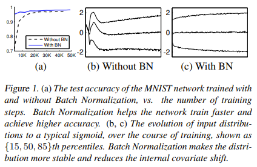
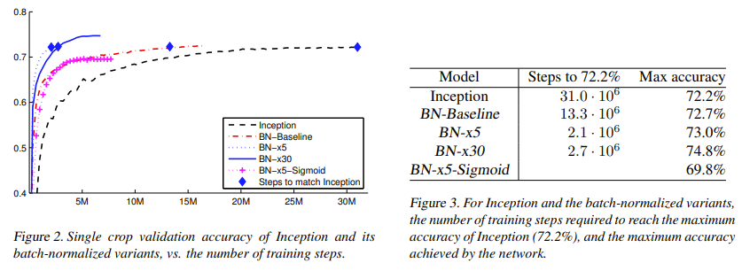

Problem Statement:

The core idea is to reduce internal covariate shift.

Internal covariate shift is the change in the distributions of network activations due to a change in netwrok parameters during training.

Internal covariate shift causes layers to continuously adapt to a new distribution (the layers are chasing a moving target).

Batch normalization reduces interval covariate shift via a normalization step that fixes the means and variances of layer inputs.

Normalization step goes between linear and non-linear layers.

Normalize the activations of a layer so they have 0 mean and unit variance.

Implementation:

Compute mean and standard deviation over all batches.

In the case of convolutional layers, compute mean and standard deviation over all batches and all spatial locations of a single channel.

Subtract mean and divide by standard deviation for all activations.

During test time there are no batches, so use a running average mean and standard deviation from training time.

Experimental Results:

Batch normalization makes the network train much faster and makes the input distribution more stable.

Batch normalization achieves the same accuracy with 14 times fewer training steps.

## TL;DR
* Batch normalization reduces the change in distributions of network activations during training.
* Batch normalization makes activations have 0 mean and unit variance.
* Batch normalization makes network training much faster.
