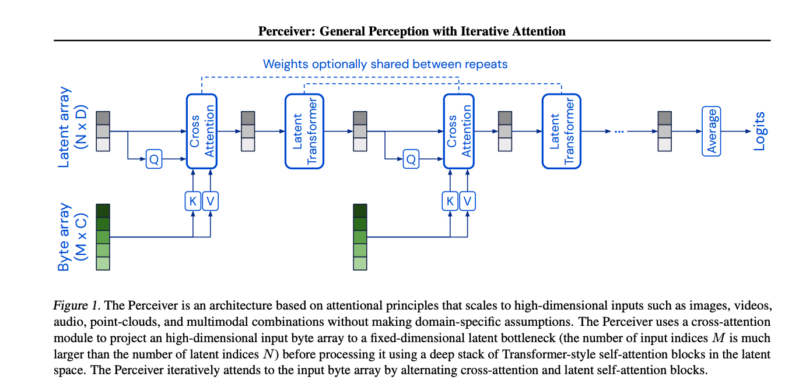

### Introduction
Perceiver is a transformer architecture that can process data including images, point clouds, audio, video, and their combinations but its limited to simple tasks such as classification.
### Problem
1. Biological systems perceive the world by various inputs such as vision, audition, touch, etc. The perception models used in deep learning on the other hand are designed for individual modalities, often relying on domain specific assumptions such as the local grid structures exploited by virtually all existing vision models. These priors introduce helpful inductive biases, but also lock models to individual modalities.
2. Most transformer models have been mostly effective in scenarios with inputs of maximum a few thousand elements. Data types such as images, videos or books can contain millions of elements which makes the use of transformers a bit challenging.

<<<<<<< HEAD
### Solution
To address this, Perceiver builds upon Transformers and hence relies on a general attention layer that does not make any domain-specific assumptions about the input. Specifically, the Perceiver attention model first encodes the input into smaller latent arrays which processing cost is independent of the size of the input. This allow the Perceiver model to scale gracefully with the inputs.

### Implementation

**Overview**  

The Architecture has two components:  
1. A cross-attention module that maps a byte array (e.g. an
pixel array) and a latent array to a latent array
2. A
Transformer tower that maps a latent array to a latent array.  

The size of the byte array is determined by the input data and is generally large, the size of the latent array is a hyperparameter which is typically much smaller.

The model applies the cross-attention module and the Transformer in alternation. 

**Taming quadratic complexity with cross-attention**

Let M be the index dimensionality of large-scale inputs like images (M = 50176 for 224 × 224 ImageNet images). The complexity of a normal QKV attention operation is $O(M^2)$. Using cross-attention: $K$
 and $V$ are projections of the input byte array, $Q$ is a projection of a learned latent array with index dimension $N$ $<<$ $M$. N being a hyperparameter, the resulting cross-attention operation has complexity $O(MN)$

 **Uncoupling depth with a latent Transformer**

The cross-attention layer induces a bottleneck. Therefore Transformers in the latent space come at the low cost of $O(M^2)$. Let $L$ be the number of layers, a latent Transformer has a complexity of $O(LN^2)$

Therefore the architecture as a whole has complexity $O(MN+LN^2)$. Since the cost is independent of the input size, we can construct very large networks on large-scale data.

**Iterative cross-attention & weight Sharing**

The parameter efficiency of the model is increased by sharing weights between the corresponding blocks of each latent Transformer and/or between cross-attend modules. 

The resulting architecture has the functional form of an RNN with a cross-attention input projection, a bottlenecked latent dimensionality and a latent Transformer recurrent core.

## TL;DR
* Perceiver is one of the first large scale architectures able to process different input types.
* Perceiver can scale well by attending to the inputs iteratively and channel its limited capacity to the most relevant inputs
* The paper demonstrate competitive performance in image classification comparing to ResNet-50, AudioSet sound event classification benchmark(audio and video), and cloud classification comparing to ModelNet-40.