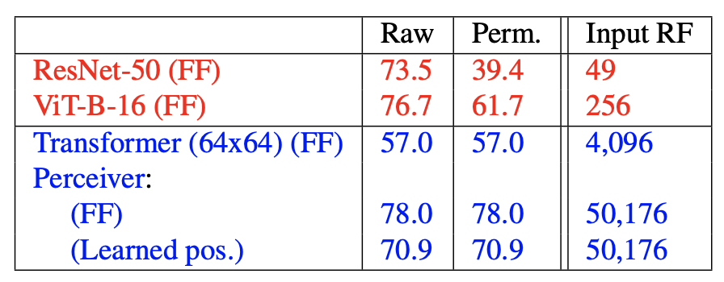
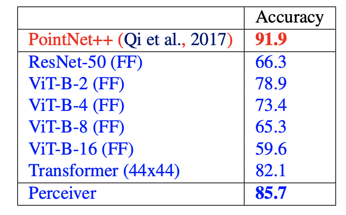

# What is the core idea?

* Inductive biases are baked into models, thus while increasing efficiency, they limit the model's performance to one particular modality. 

  * Enter *Perceiver*, a model designed to handle arbitrary configurations of different modalities.

* *Perceiver* is built upon Transformers

* By introducing a small set of latent units, the authors are able to introduce an attention bottleneck through which inputs must pass. 

  * Eliminates the quadratic scaling problem of the classical Transformer
  * Decouples network depth from input's size

* Allows scaling to hundreds of thousands of inputs like ConvNets

* Employs asymmetric attention mechanism to **iteratively** distill inputs 
  * Hence, can scale to handle very large inputs

* Model is competitive or outperforms strong specialised models across various modalities

  

# How is it realized (technically)?

* 

* Architecture
  * Cross attention module - maps a byte array and a latent array to a latent array
    * A byte array can be something like a pixel array etc.. (the input)
      * Generally large size $$M$$
    * Size of latent array is typically much smaller, and is a hyperparameter - size $$N$$
    * So, $$M << N$$. 
  * Transformer tower maps a latent array to a latent array
  * In essence, the cross-attention module projects a high-dimensional input byte array to a fixed-dimensional latent bottleneck 
    * Then processes it using a deep stack of Transformer-style self-attention blocks in the latent space
  * Cross attention and the Transformer are applied in alternation
    * Allows Perceiver to iteratively attend to input byte array by alternating between cross attention and the latent self-attention blocks.
  * Asymmetric attention
    * Authors use the query-key-value (QKV) attention
      * Problem with QKV in Transformers is quadratic self-attention in input dimensionality
        * In standard QKV attention, $$Q \in \mathbb{R}^{M \times D}, K \in \mathbb{R}^{M \times C}, \text{ and } V \in \mathbb{R}^{M \times C}$$ where $$C$$ and $$D$$ are channel dimensions and $$M$$ is the input size.
        * So $$softmax(QK^T)V$$ is $$\mathcal{O}(M^2)$$
      * Introduce assymmetry
        * $$Q$$ is a projection of the learned latent array with index dimension $$N << M$$, where $$N$$ is a hyperparameter. 
        * $$K$$ and $$V$$ are projections of the inputer byte array
        * Resulting cross attention operation is $$\mathcal{O}(MN)$$
  * Cross attention module takes the shape of input $$Q$$
    * Induces a bottleneck
    * which the authors exploit by building deep Transformers in the latent space - low cost of $$\mathcal{O}(N^2)$$.
    * Hence latent Transformer has complexiity $$\mathcal{O}(LN^2)$$, when considered as a function of the number of layers.
      * notice that a standard Transformer would be $$\mathcal{O}(LM^2)$$
  * Overall architecture - $$\mathcal{O}(MN + LN^2)$$
    * Input size ($$M$$) and depth ($$L$$) are decoupled
      * Allows construction of very large networks on large-scale data
  * Latent transformer uses GPT-2 architecture
    * based on the decoder of the orginal Transformer
  * Iterative cross-attention
    * Severity of the bottleneck may restrict the network's ability to capture all of the necessary details from the input signal
      * Hedge against this by adding multiple cross-attend layers
        * Allows latent array to iteratively extract information 
* Position encodings
  * Permutation invariance and position information
    * Attention is a permutation-invariant operation which is preserved by the *Perceiver* model. 
    * However permutation invariance does not allow exploitation of spatial relationships in the input data.
    * Hence, they also include position encodings
  * Scalable Fourier Features
    * Authors use a parameterization of Fourier features
      * allows direct representation of the position structure of the input data
      * allows control over the number of frequency bands in the position encoding indepdently of the cutoff frequency
      * uniformly sample all frequencies up to a target resolution.
      * Frequency parametrized to take the values $$[\sin(f_k\pix_d), \cos(f_k\pix_d)]$$, 
        * where $$f_k$$ is the $$k^{th}$$ band of a bank of frequencies spaced equally between 1 and $$\frac{\mu}{2}$$. $$\frac{\mu}{2}$$ can be naturally interpreted as the Nyquist frequency, where $$\mu$$ is the target sampling rate.
        *  $$x_d$$ is the value of input position along the $$d^{th}$$ dimension - for images $$d = 2$$. $$x_d \in [-1, 1]$$. 
      * related to the NeRF position encoding scheme (Mildenhall et al., 2020). 
  * Position encodings are generally applicable.
    * Feature based approach allows the network to learn how to use (or ignore) the position structure
    * Position encoding can be easily adapted to a new domain as Fourier features are trivial to adapt as long as the input dimension is relatively small and known
    * Position encodings can be extended to multimodal data - each domain has it's own position encoding.

# How well does the paper perform?

* Pretty competitively with other models
* 
  * Top-1 validation accuracy (in %). Compares baseline from literature, baseline with Fourier Features, Transformer with Fourier Features against *Perceiver*. *Perceiver* performs as well as baseline. 
* 
  * Top-1 validation accuracy (in %). Shows the *Perceiver* model's resiliency to permuted dataset. This is due to global attention. Input RF refers to the Input Receptive Field (RF) in pixels - this is the size of the local neighbourhood used for 2D convolutions
* 
  * Very comparable results. In future work, hope to incorporate the insights that are also used in CNN-14 (Kong et al., 2020).
* 
  * Top-1 validation accuracy (in %) on Model-Net40. PointNet++ uses extra geometric features and other techniques not used in the blue models.

## TL;DR
* Uses iterative attention
* Is a multimodal architecture
* Performs competitively against specialised models.
