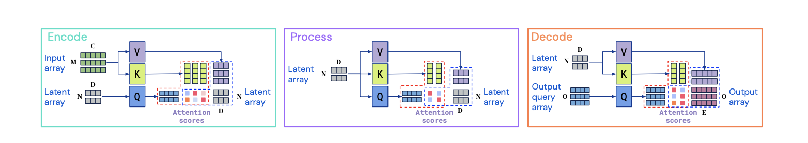
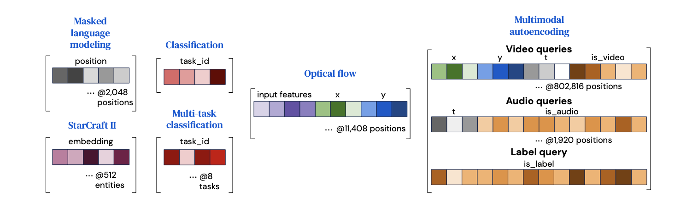
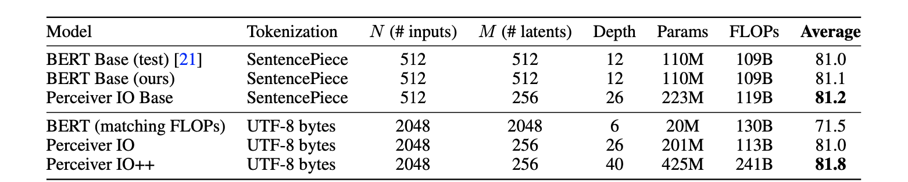

TODO: Summarize the paper:
### What is the core idea?

The authors proposes a perceiverIO model that scales linearly in computation on varying inputs and outputs sizes by encoding its inputs into smaller latent arrays achieving SOTA results .

### How is it realized (technically)?

- Inputs are __encoded__ to a latent space using the attention module

- The latent representation is refined via many layers of __processing__

- The latent space is __decoded__ to produce outputs using attention module

The attention modules combines both a global query-key-value (QKV) operation and a multi-layer perceptron (MLP) operation.Similar to transformer but efficient in compute and memory.The model produces an output query matrix, O, that varies with the input size depending on the task.computational complexity of each attention module in QKV attention,is O(M N F ) for two matrix multiplication of  dimension M x F and M x N,with L latent attention blocks has complexity O([M + O + LN ]N F ).

PerceiverIO uses queries constructed with output-specific features to produce outputs with different semantics.

### How well does the paper perform?

 PerceiverIO performed better compared to transformer models on GLUE benchmarks. Using a UTF-8 byte model it achieved great results without tokenization which is important preprocessing step in NLP.

PerceiverIO  results on ImageNet image classification,compared to baseline results in the first two blocks rows. 

PerceiverIO with a higher accuracy  on Multi-modal autoencoding.On a audio-video labeling task with the goal to reconstruct multi-modal inputs while impeded with network bottlenecks.

Datasets

- Kinetics-700- 2020 dataset, with video, audio and class labels

Showed better a good performance on optical flow computer vision task.

- 7×7 convolution to 64 channels input model

- max pool layer, similar to the one used in our ImageNet experiments. 

- Produced an output feature grid with stride 4 and 64 channels

### What interesting variants are explored?

## TL;DR

* PerceiverIO has a faster computation time compared to a transformer

* PerceiverIO handles general purpose inputs and outputs with linear computation in both input and output sizes

* PerceiverIO showed great results on various domain and tasks, and can potentially be a general architecture that can solve nearly any task in Deep Learning

