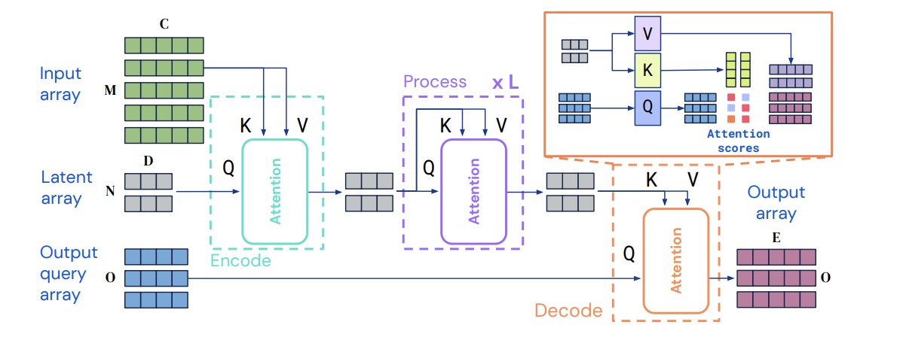
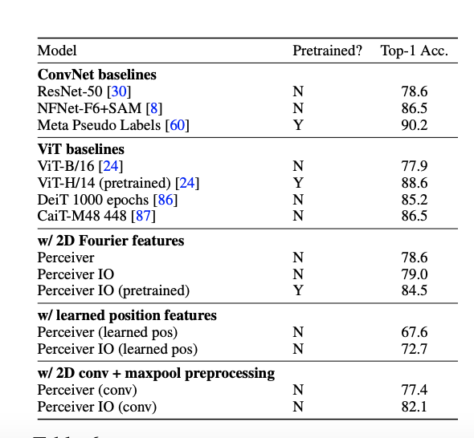
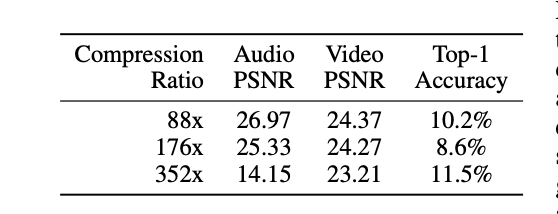
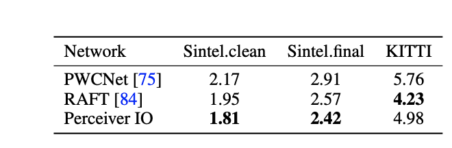

TODO: Summarize the paper:
### What is the core idea?

The authors proposes a perceiver model that scales linearly in computation on varying inputs sizes achieving SOTA results.

### How is it realized (technically)?

Perceiver uses a the Decode block that is adversarial to the Encode block known as Cross-Attention block.The model has an output query matrix, O, varies with the input size depending on the task.With an embedding array which is just before the decode block would be NxD. K, V would be NxE and Q would be OxE, then the output of the Decode block would be OxE. The computation is reduced to O(NO) compared to a transformer that is in order O(MO), where $N<<M$ and $N<<O$.

### How well does the paper perform?

Perceiver showed high  classification accuracy on ImageNet. 

Perceiver with a higher accuracy  on Multimodal autoencoding. Higher is better for accuracy and PSNR.

Showed better a good performance on optical flow computer vision task.

### What interesting variants are explored?

## TL;DR

* Perceivers has a faster computation time compared to a transformer

* Perceivers handles general purpose inputs and outputs with linear computation in both input and output sizes

