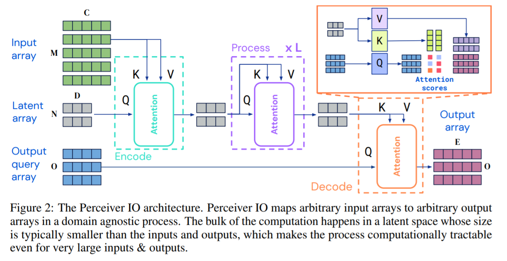
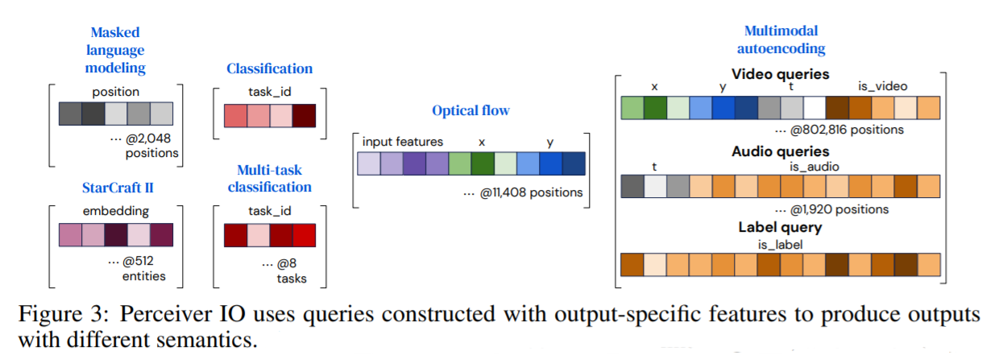
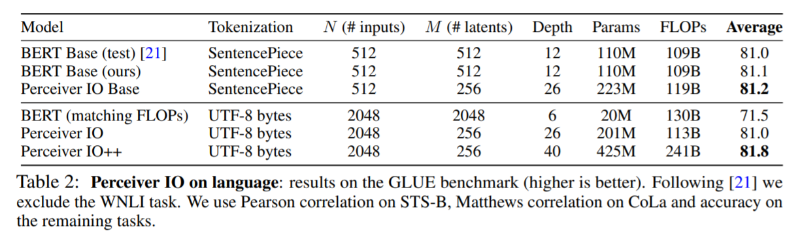
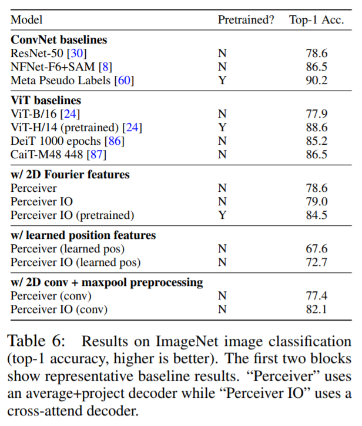

<!-- TODO: Summarize the paper:
* What is the core idea?
* How is it realized (technically)?
* How well does the paper perform?
* What interesting variants are explored? -->

The intial perceiver model provided good results, but the authors wanted to adapt the model to handle more complex outputs. PerceiverIO can succesfully be used on NLP and visual understanding problems, while the intial perceiver model can only handle simpler outputs such as image classification. 

The idea of perceiver is to create a model that can handle different tasks and perform well with minimal changes needed. They do this by using attention with the intial input to create a latent space that has a constant size. From this latent space, the rest of the network is deep and can be consistent across different tasks. 

The structure of the perceiverIO is similar to that of perceiver, but with a decoder at the end that can build out the latent space into any dimensions necessary for the given task. They use cross-attention and a query analysis on the output space to map the latent space features to the dynamic structure needed for the output.

The key to the higher performance of perceiverIO over transformers is the latent space. It allows for higher scalability since all of the computationally expensive aspects are done within the fixed size latent space. 

Related work and why this is more adaptable:

- Multi-task learning
    - Ony for computer vision
- Mask-RCNN
    - Can handle some complex computer vision tasks, but not language
- Transformers 
    - Can be used for any task, but are limited by scalability

The query for outputs of
- classification is reused
- spatital or sequence structure uses positional encodings
- multi-task structure learns a query for each task
- all other outputs should be related to the input at that query location

Experiments were done on language, visual understanding, videogames, and multi-modal tasks.

Using the GLUE benchmark, perceiverIO can outperform BERT, while also scaling to larger inputs. The tranformers were replaced with perceiverIO architecture.

The muilti-task architecture also performed the best on the GLUE benchmark with respect to single task, shared input token, and task specific input token approaches

PerceiverIO also performed very well on optical flow, multimodal autoencoding, and StarCraft II

Additionally, the new model performed better than the original architecture on classification of ImageNet

Other variants discussed were to finetune the size of the latent space specific to the task, allow for generative models, and provide more robustness to adversarial attacks. However, the author did not explicitly address these within this paper. 

## TL;DR
- PerceiverIO improves on the original Perceiver architecture by using a decoder with cross-attention to allow for more complex structures of outputs
- PerceiverIO is more scalable than current popular methods such as transformers due to the fixed size of PerceiverIO's latent space
- It can perform very well on various tasks with respect to language, visual understanding, videogame strategy, multi-modal tasks 
