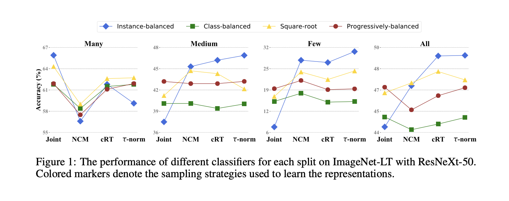
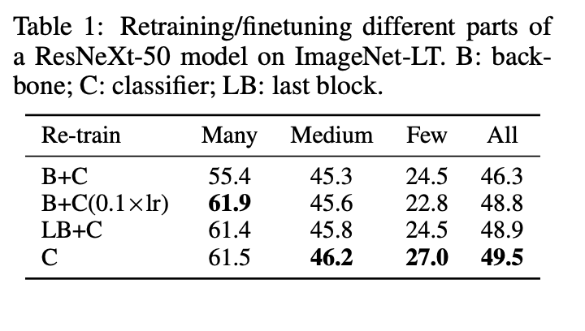
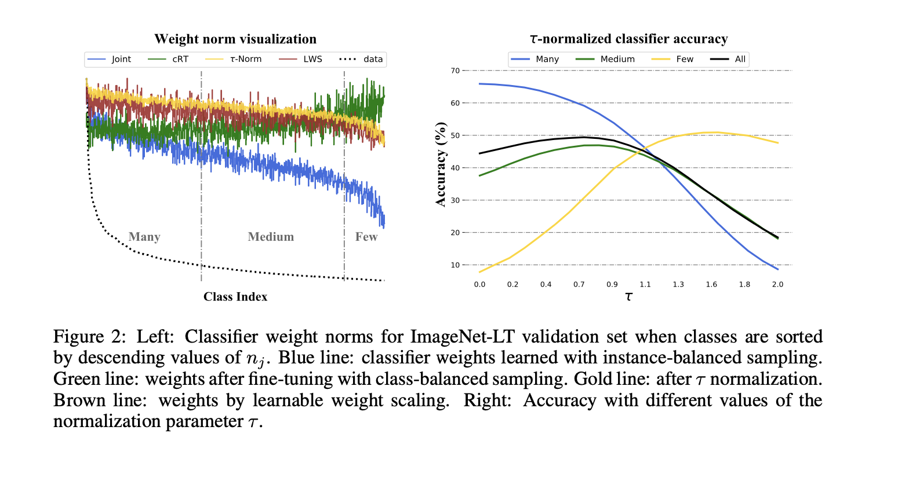
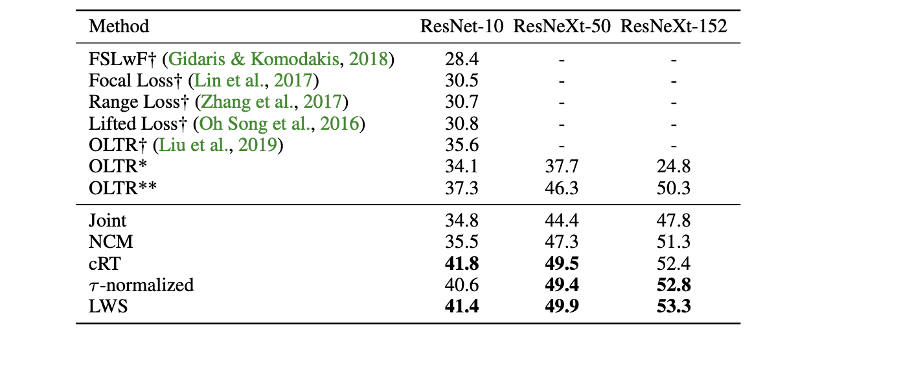
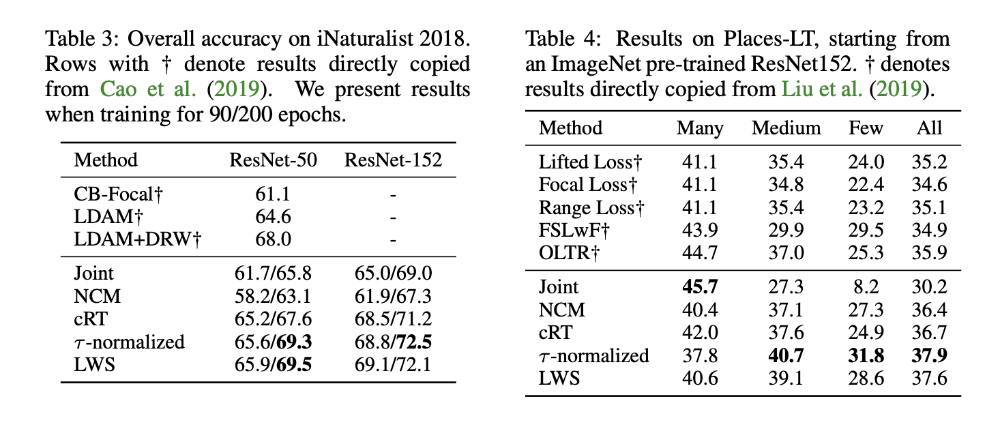

### What is the core idea? 

The introduces a two-fold approach to solving long-tail distribution problem in image recognitions by using representation learning and classification during training.

### How is it realized (technically)?

Long-tail distribution has been a common problem in real world recognition tasks because of imbalance in data classes. However the authors considered different sampling methods with the combination of different classification methods show better performance and generalization compared to current SOTA.

[1] Learning representations

 The authors employed use of these sampling methods during training.

- Instance-balanced sampling - training example used are selected with equal probability. q = 1

- Class-balanced sampling - classes are selected with equal probability. The first a class is selected uniformly from the set of classes, and then an instance from that class is subsequently uniformly sampled. q = 0,pCB = 1/C

- Square-root sampling -  q is set to 1/2

- Progressively-balanced sampling - combines the strength of instance-balanced sampling training for a number of epochs, and then class-balanced sampling for the last epochs.

[2] Classifications 

The authors employed different approaches to train the classification model. classifier weights were retrained.

- Classifier Re-training (cRT) - With fixed representations, classifier weights are re-initialize and optimize for a small number of epochs using class-balanced sampling.

- Nearest Class Mean classifier (NCM) - The mean feature representation is computed for each class on the training set then a nearest neighbor search either using cosine similarity or the Euclidean L2 norm.

- τ-normalized classifier (τ-normalized) - Computes the norms of the weights are correlated with the cardinality of the classes.

- Learnable weight scaling (LWS) - similar to τ-normalized, the rescaling is done with the magnitude of the classifier weight.

### How well does the paper perform?

#### Datesets 

Places-LT - 365 classes with  4980 to 5 images per class.

ImageNet-LT -  1000 classes with 1280 to 5 images per class.

iNaturalist - real-world data with consisting of samples from 8,142 species

#### Experimental Setup 

 On Places-LT dataset, ResNet-152 as the backbone network and pretrained on the full ImageNet-2012 dataset.

 On ImageNet-LT , ResNet - 10,50,101,152 and ResNeXt- 50,101,152 (32x4d) but mainly used the ResNeXt-50 for analysis

 iNaturalist used ResNet 50,101,152 as backbone network

SGD optimizer with momentum 0.9, batch size 512 with a cosine learning rate schedule from 0.2 - 0 on  224 × 224 image resolution. 

First representation learning stage, the backbone network is usually trained for 90 epochs. In the second stage, i.e., for retraining a classifier (cRT), we restart the learning rate and train it for 10 epochs while keeping the backbone network fixed.

Comparison among different sampling methods combined with different classification models

Retraining result comparing linear classifier C with using a  ResNeXt-50 as backbone B and a retrained last block LB done using smaller (0.1×) learning rate on the last block.

Performance changes for the τ-normalized classifier varies and τ increases from 0 where many-shot accuracy decays dramatically while few-shot accuracy increases.

The authors compare the recognition accuracy on ImageNet-LT for different backbone architectures. LWS was performant across different backbones.

On both the iNaturalist and Places-LT datasets, both τ -normalized and LWS gained performance improvement when trained on 300 epochs.

<!-- * What interesting variants are explored? -->

## TL;DR

* Long-tail problems can be solved using the right data sampling strategy

* Instance-balanced sampling  is a more generalizable  approach  to learning representations.