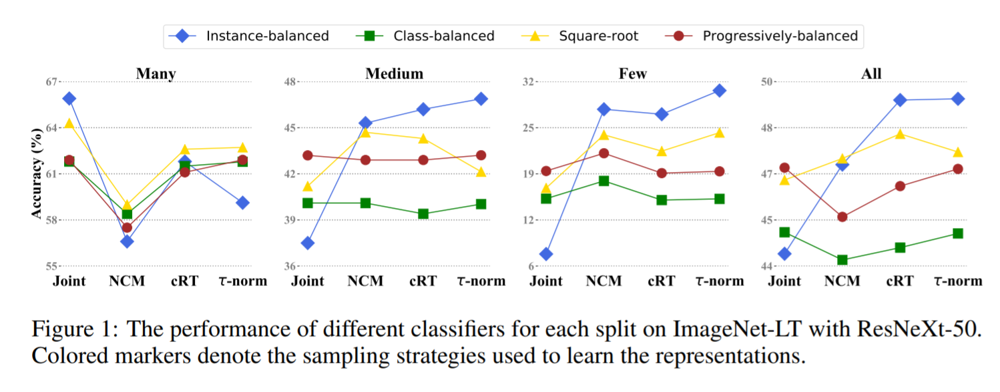
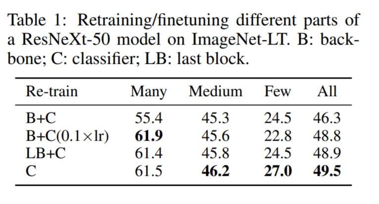
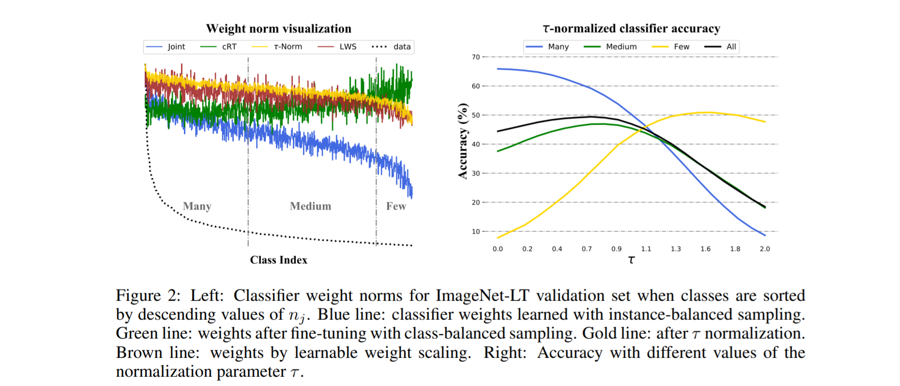
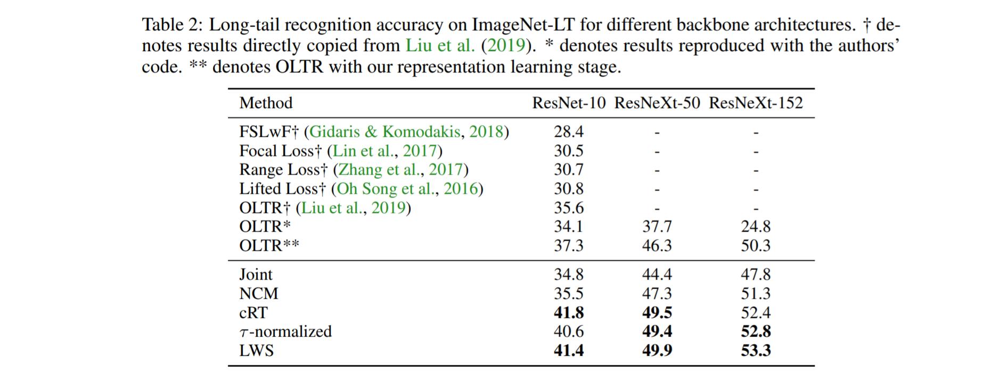
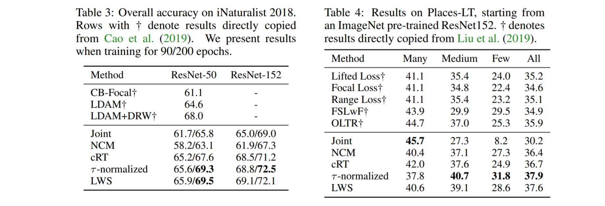

<!-- TODO: Summarize the paper:
* What is the core idea?
* How is it realized (technically)?
* How well does the paper perform?
* What interesting variants are explored? -->
## What is the core idea?
Visual recognition solutions can struggle when there is a long-tailed distribution, which is also known as the class imbalance problem. This paper separates the this problem into two processes: representation learning and classification. 

Representation learning
- trained with different sampling techniques and losses

Classification
- the long tailed classes are recognized by the model from various classifiers  

The paper determined the following findings from using their decoupled process:
- instance based sampling provided really good generalized results
- during representation learning it's beneficial to adjust decision boundaries of classifier 
    - done by sampling or weight normalization
- Can apply to any standard network 

## How is it realized technically?

Experiments covered the following different decoupled techniques to determine which were most effective

Representation Learning:
- Instance-balanced sampling
    - All examples have same chance of being sampled
- Class-balanced sampling
    - Each class has same chance of being sampled and then example uniformly sampled within the class
- Square-root sampling
    - Middle ground between the two previous sampling techniques. Square-roots the total number of images in each class when calculating the ratio of images in specific class / total images
- Progressively-balanced sampling
    - Uses instance-balanced sampling for some epochs and then switches to class-balanced sampling
- Loss re-weighting
    - Not tested in this paper, but the approaches they did test produced better results

Classification:
- Classifier Re-training (cRT)
    - Use class-balanced sampling and re-initialize and optimize the weights for a few epochs 
- Nearest Class Mean classifier (NCM)
    - First get the mean feature representation for each class, then run nearest neighbors using cosine similarity or Euclidean distance
- τ -normalized classifier (τ -normalized)
    - Normalize the weights with a hyperparameter factor τ
- Learnable weight scaling (LWS)
    - Variant of previous method - keeps the representations and weights fixed and learns scaling factors

## How well does the paper perform?

Experiments done on three datasets
- Places-LT (artificially unbalanced from original)
- ImageNet-LT (artificially unbalanced from original)
- iNaturalist 2018 (natural)

The many, medium, few, all titles below refer to the number of images trained on from the dataset

Sampling method critically matters for joint methods, but overall decoupled methods worked better. 

Looking at different areas of restarting learning

Instance-balanced sampling provides generalizable representations

Results continue to show decoupled methods providing the best results

## What interesting variants are explored?
- Mentioned but didn't evaluate loss re-weighting in representation learning
- No other variants besides all the different methods evaluated above 

## TL;DR
- This paper evaluated different ways of implementing joint and decoupled models for the long-taled distribution problem 
- Joint methods were heavily dependent on the type of sampling
- Instance-balanced sampling with re-balancing the classifiers provides state of the art results