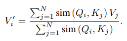
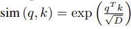
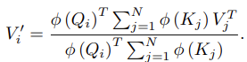
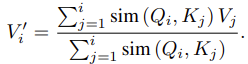
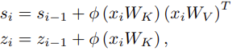
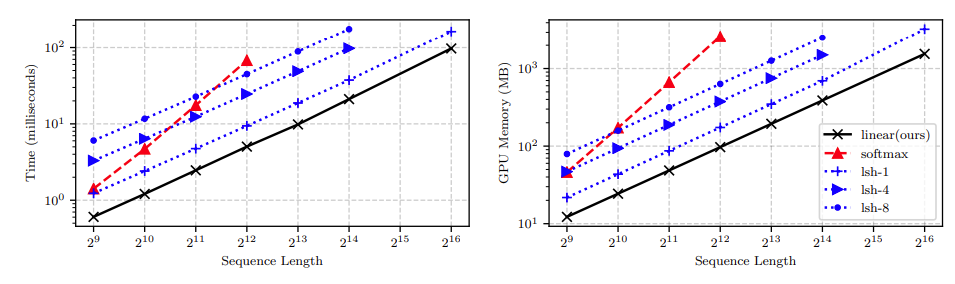

## What is the core idea?
A new linear transformer model is introduced that uses a kernel based self-attention method that reduces the memory footprint of the model. They also linearize the masking of the attention computation making it run in linear time.

## How is it realized (technically)?

They change the attention mechanism from the traditional softmax function to a dot product feature map. In a traditional transformer, given the queries Q, keys K and values V, the self attention function A_l can be calculated as:

where,

Instead of a softmax similarity function, the authors propose using a kernel function of a feature representation \phi(x). So the new self attention function is:

The above attention function has computation cost of O(N) where N is the sequence length. It's memory footprint is also lower as the terms can be reused for every query hence we don't need to store the full attention matrix making it's memory complexity O(N). The authors state that for small sequences the below feature map, phi(x), was used and shown to perform on par to the full traditional transformer.

They further change the masking function to span until the i-th position of the query instead of the whole sequence (i.e. all N inputs). They called this ``causal'' masking. They further show how their formulation of a transformer with causal masking can be understood as an RNN.

## How well does the paper perform?

The authors test the linear transformers on 3 different tasks, namely:

- symbol copying task

The authors found that their transformer had a lower computational time (log linear) for a given sequence length compared to other attention functions in literature, including softmax. The memory footprint of their linear transformer was also significantly lower than other in literature, including softmax.

- Image generation

They tested their transformer on the MNIST and CIFAR-10 dataset. They were able to achieve performance on par with softmax attention in terms of bits per dimension and perplexity. There network excelled at speed, being able to generate images around 300 times faster with constant memory per image on MNIST and ~4000 times faster on CIFAR-10. 

- Automatic speech recognition

They trained the linear transformer with connectionist temporal classification (CTC) loss on 80hrs of the WSJ dataset. They find that the Linear transformer converges to a Prediction Error rate (PER) that is lower than LSH-4 and Bi-LSTM. However, their Linear transformer has a PER that is worse than softmax attention. They however beat all other models in terms of training time and evaluation time.

## TL;DR
- Introduce a linear transformer with a different attention function with causal masking
- Linear transformer has much lower memory footprint and computational cost and is faster to train and evaluate than softmax attention transformer
- Demonstrate how transformers with linear attention with causal masking can be seen as an RNN

