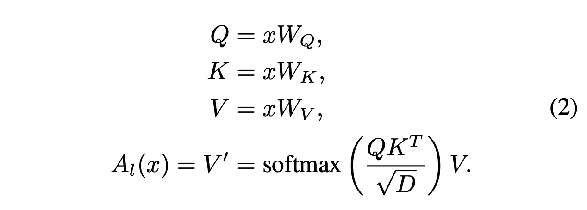
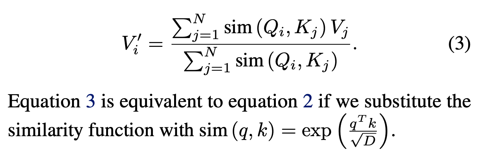
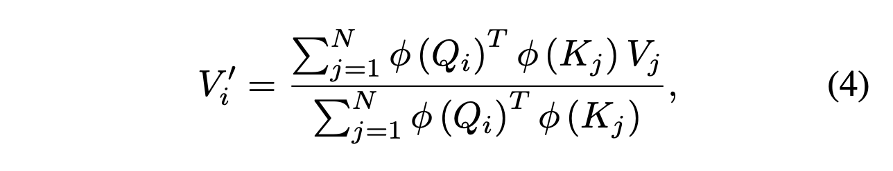
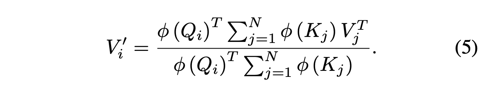
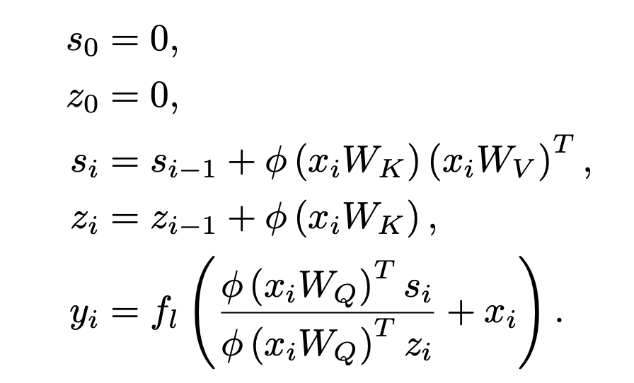
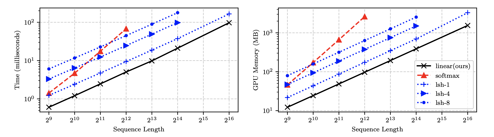
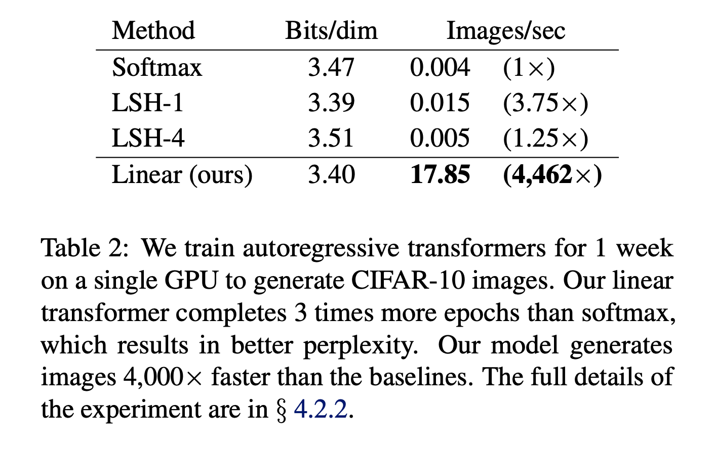

# Core Idea
- Expressing self-attention using kernel feature maps can reduce its time and space complexity from quadratic to linear
- Re-expressing autoregressive transformers as RNNs can achieve much greater inference speed

# Main Contributions
- Formulation of "linear attention" using kernel feature maps
- Formulation of autoregressive transformers with linear time, constant memory (can also be expressed as RNNs)
- Experiments demonstrating speedups of autoregressive linear transformers over reformer and transformer with softmax attention

# Softmax Attention to Linear Attention via Kernel Feature Maps

The transformer from Vaswani et. al. 2017 implements the following form of self-attention, where the similarity score is the exponential of the dot product between a query and a key:

Generalizing from dot product to any positive-valued similarity function, we can rewrite (2) as:

Our similarity function can also be a **kernel function**. In this context, a kernel function takes two vectors, maps them to another vector space using a **kernel feature map**, and returns their inner product in that space. Here is the self-attention equation using kernel feature map $\phi$:

The associative property of matrix multiplication allows us to make the following simplification,

The reduction from quadratic to linear complexity comes from the fact that the matrix product of the keys and values can be computed once and reused for every query.

# Autoregressive Transformers
- In autoregressive tasks, inputs from future timesteps are masked to the model.
- Autoregressive transformers can benefit from parallelization during training, unlike RNNs. However, neither can be parallelized during inference.

## Linearizing Autoregressive Transformers
- For autoregressive transformers, we cannot precompute the full value of the key-value matrix product as shown above.
- However, the authors show that part of the attention computation, $\phi (K_j) V^T$ can be computed iteratively. In other words, it can be computed in constant time using the previous value. This observation allows for time complexity linear in the sequence length.
- Similarly, gradients can be derived iteratively, enabling both the forward and backward pass to be computed in linear time and constant memory.

## Autoregressive Transformers as RNNs
- The recurrence noted in the previous section allows the authors to express an autoregressive transformer as an RNN:

- "Best of bost worlds": linear, autoregressive transformers can be parallelized (unlike RNNs) and also have linear-in-the-sequence time complexity (unlike traditional softmax attention)

# Experiments
### Synthetic experiments ###
- They train autoregressive transformers for an artificial copy task.
- They show that computation and memory scales linearly with linear transformer and reformer, and quadratically with softmax attention.
- Despite being much faster, the linear transformers achieved the same performance as traditional softmax transformers.

### Image generation ###
- They use autoregressive transformers to generate CIFAR-10 images pixel by pixel.
- Linear transformer generates images 4000x times faster than transformer with softmax attention.

### Automatic Speech Recognition ###
- Linear transformer has lower phoneme error rate and 3x faster training epochs/sec compared to Bi-LSTM, transformer with softmax attention, and reformer.

## TL;DR
* Softmax attention expressed with kernel feature maps can be computed with linear time and space
* For autoregressive (linear) transformers, both inference and backpropagation can be computed with linear time and constant memory, offering (in one application) a 4000x speedup
* Autoregressive transformers can be formulated as RNNs
