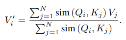
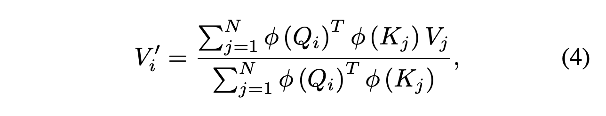
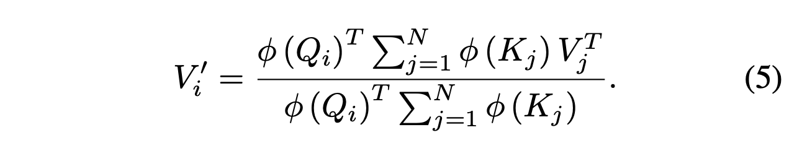
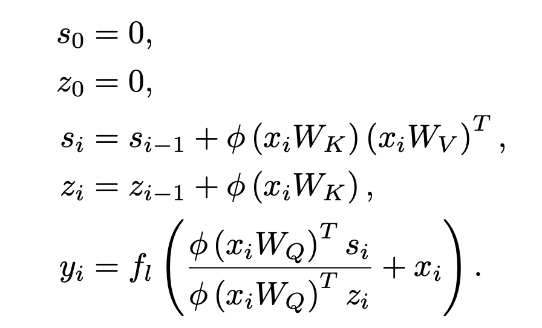

# Core idea: Expressing self-attention using kernel feature maps can reduce its time and space complexity quadratic to linear in the sequence length. This formulation allows for a linear, auto-regressive transformer that can be expressed as a recurrent neural network.

# Softmax/dot product attention

The transformer from Vaswani et. al. 2017 implements the following form of self-attention, where the similarity score is the exponential of the dot product between a query and a key:

Generalizing from dot product to any positive-valued similarity function, we can rewrite (2) as:

Our similarity function can be a *kernel function*. In this context, a kernel function takes two vectors, maps them to another vector space using a "feature map", and returns their inner product. Here is the self-attention equation using a kernel with feature representation phi:

The associative property of matrix multiplication allows us to make the following simplification,

The reduction from quadratic to linear complexity comes from the fact that the matrix product of the keys and values can be computed once and reused for every query.

# Linear Autoregressive Transformers
- In autoregressive tasks, inputs from future timesteps are masked to the model. For autoregressive transformers, we cannot precompute the full value of the key-value matrix product as shown above.
- However, the authors show that part of the attention computation at each timestep can be computed iteratively. In other words, it can be computed in constant time using the previous value. This observation allows for time complexity linear in the sequence length.
- Similarly, gradients can be derived iteratively, enabling both the forward and backward pass to be computed in linear time and constant memory.

# Autoregressive Transformers as RNNs
- The recurrence noted in the previous section allows the authors to express an autoregressive transformer as an RNN:

- "Best of bost worlds": linear, autoregressive transformers can be parallelized (unlike RNNs) and also have linear-in-the-sequence time complexity (unlike traditional softmax attention)

# Experiments
- *Synthetic experiments:* They train autoregressive transformers for an artificial copy task. They show that computation and memory scales linearly with linear transformer and reformer, and quadratically with softmax attention.
- *Image generation:* They use autoregressive transformers to generate CIFAR-10 images pixel by pixel. Linear transformer generates images 4000x times faster than transformer with softmax attention.
- *Automatic Speech Recognition (ASR):* Linear transformer has lower phoneme error rate and 3x faster training epochs/sec compared to Bi-LSTM, transformer with softmax attention, and reformer.

## TL;DR
* Softmax attention expressed with kernel feature maps can be computed with linear time and space
* For autoregressive (linear) transformers, both inference and backpropagation can be computed with linear time and constant memory, offering (in one application) a 4000x speedup
* Autoregressive transformers can be formulated as RNNs
