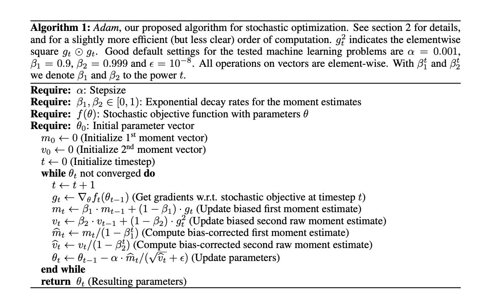

Adam (derived from adaptive moment estimation) is an optimization algorithm that can be used instead of the classical stochastic gradient descent procedure to update network weights iterative based in training data.

* Straightforward to implement.
* Computationally efficient.
* Little memory requirements.
* Invariant to diagonal rescale of the gradients.
* Well suited for problems that are large in terms of data and/or parameters.
* Appropriate for non-stationary objectives.
* Appropriate for problems with very noisy/or sparse gradients.
* Hyper-parameters have intuitive interpretation and typically require little tuning.

### Algorithm

### Adam Configuration parameters

* **alpha**. Also referred to as the learning rate or step size. The proportion that weights are updated (e.g. 0.001). Larger values (e.g. 0.3) results in faster initial learning before the rate is updated. Smaller values (e.g. 1.0E-5) slow learning right down during training
* **beta1**. The exponential decay rate for the first moment estimates (e.g. 0.9).
* **beta2**. The exponential decay rate for the second-moment estimates (e.g. 0.999). This value should be set close to 1.0 on problems with a sparse gradient (e.g. NLP and computer vision problems).
* **epsilon**. Is a very small number to prevent any division by zero in the implementation (e.g. 10E-8).

"Good default settings for the tested machine learning problems are alpha=0.001, beta1=0.9, beta2=0.999 and epsilon=10−8"

### How is Adam Different to classical stochastic gradient descent?

Stochastic gradient descent maintains a single learning rate (termed alpha) for all weight updates and the learning rate does not change during training. "[Adam] computes individual adaptive learning rates for different parameters from estimates of first and second moments of the gradients."

The authors describe Adam as combining the advantages of two other extensions of stochastic gradient descent. Specifically:

* Adaptive Gradient Algorithm (AdaGrad) - that maintains a per-parameter learning rate that improves performance on problems with sparse gradients (e.g. natural language and computer vision problems).

* Root Mean Square Propagation (RMSProp) - that also maintains per-parameter learning rates that are adapted based on the average of recent magnitudes of the gradients for the weight (e.g. how quickly it is changing). This means the algorithm does well on online and non-stationary problems (e.g. noisy).
Adam realizes the benefits of both AdaGrad and RMSProp.

Instead of adapting the parameter learning rates based on the average first moment (the mean) as in RMSProp, Adam also makes use of the average of the second moments of the gradients (the uncentered variance).

Specifically, the algorithm calculates an exponential moving average of the gradient and the squared gradient, and the parameters beta1 and beta2 control the decay rates of these moving averages.

The initial value of the moving averages and beta1 and beta2 values close to 1.0 (recommended) result in a bias of moment estimates towards zero. This bias is overcome by first calculating the biased estimates before then calculating bias-corrected estimates.

### Result

"Empirical results demonstrate that Adam works well in practice and compares favorably to other stochastic optimization methods."

"Using large models and datasets, we demonstrate Adam can efficiently solve practical deep learning problems."

## TL;DR
* Adam is an optimization algorithm 
* It is used instead of classical gradient descent procedure to update weights
* It produces fast results
