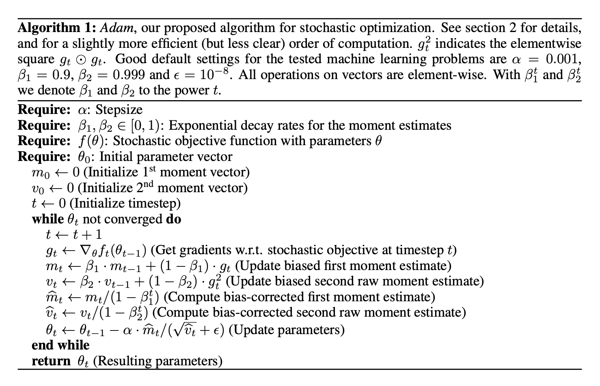
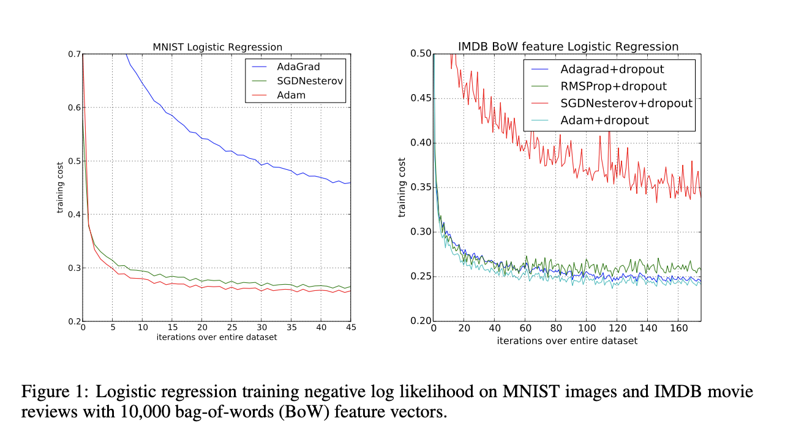

* What is the core idea?
  * Introduces the Adam (Adaptive Moment Estimation) algorithm.
    * First-order gradient-based optimization of stochastic objective functions
  * Algorithm based on adaptive estimates
  * Computationally efficient
  * Intended to combine the advantages of AdaGrad and RMSProp. 
  * Moment estimates bias toward 0 without bias correction
* How is it realized (technically)?
  * 
* How well does the paper perform?
  * Very well
  * 
* What interesting variants are explored?
  * AdaMax - based on the infinity norm

## TL;DR
* Computationally efficient algorithm
* Really good results in experiments
* Combines the advantages of AdaGrad and RMSProp
