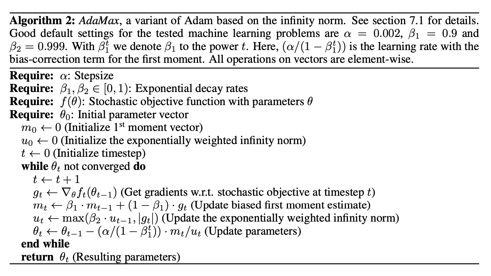

* What is the core idea?
  * Introduces the Adam (Adaptive Moment Estimation) algorithm.
    * First-order gradient-based optimization of stochastic objective functions
    * Method uses estimates of first and second moments of the gradients to compute individual adaptive learning rates for different parameters
  * What exactly is a moment?
    * an n-th moment ($$m_n$$) is defined as the expteced value of that variable to the power of n, i.e. $$m_n = E[X^n]$$
      * So the first moment is the mean, and the second moment is uncentered variance
  * Advantages:
    * Algorithm based on adaptive estimates
      * This avoids gradient explosion. 
    * Computationally efficient
    * Memory efficient
    * Appropriate for problems with very noisy and/or sparse gradients
    * Combines the advantages of AdaGrad and RMSProp
      * Like RMSProp, Adam also keeps a running average of $$v_t$$ (see algorithm below).
        * RMSProp lacks a bias correction term
      * AdaGrad and Adam correspond to each other directly when $$\beta_1$$ and $$\beta_2$$ are carefully chosen in the algortihm below.
    * Includes bias correction to ensure moment estimates do not bias toward 0
  * Disadvantages:
    * Looking back, Adam got people excited with it's great results (see some below), but does not converge for some tasks - like image classifcaiton on the CIFAR datasets.
    * The proof of convergence in the paper is wrong - prompted another paper which proves the convergence of Adam - An improvement of the convergence proof of the ADAM-Optimizer by Bock et al.
* How is it realized (technically)?
  * 
  * Current $$m_t$$ and $$v_t$$ keep an expoentially decaying average of past values of $$m_t$$ and $$v_t$$. 
* How well does the paper perform?
  * Very well in the experiments run in the paper.
  * 
* What interesting variants are explored?
  * AdaMax - based on the infinity norm
  * 

## TL;DR
* Computationally efficient algorithm that uses adaptive estimation to find individual learning rates for each parameter.
* Really good results in experiments
* Combines the advantages of AdaGrad and RMSProp

