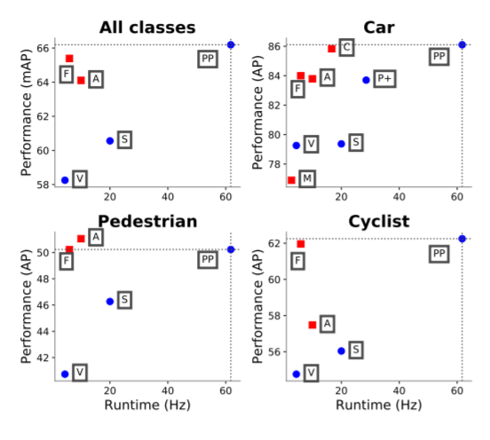

<!-- TODO: Summarize the paper:
* What is the core idea?
* How is it realized (technically)?
* How well does the paper perform?
* What interesting variants are explored? -->

## What is the core idea?

Previous solutions for 3D object detection were too slow, especially for real time usage. This paper proposes PointPillars, a novel point cloud encoder and network, to solve 3D object detection while only using 2D convolution layers in the end to end learning process. It does this by using "pillars", which is basically looking at the 3D object from a bird's eye view and interpreting each space of the 2D bird's eye view as a vertical column (providing 3D depth). PointPillars then predicts 3D boxes for the objects. This network can work with any standard 2D convolutional architecture.

There are several benefits to PointPillars over other common approaches
- Uses full information provided by point cloud by learning features 
- Using pillars instead of voxels saves time since voxels have to be vertically tuned
- All important layers are done in 2D which is more efficient
- Can easily use multiple lidar scans or radar point clouds 

## How is it realized technically?

There are three stages

1. Encoder that takes the point cloud and maps it to a sparse pseudo-image
- point cloud input is x,y,z,r where r is reflectance
- point cloud is turned into a grid
- The points within each pillar are then additionally described by their distance to the pillar arithmetic mean and offset to the x,y center
- Sparse nature of pillar used to create dense tensor representation
    - Random sampling if too many points
    - Zero padding if not enough
- Apply simple version of PointNet
- Following encoding, pesudo-image created from features being brought back to original locations

2. 2D convolutional backbone network that takes in the pseudo-image and learns a high-level representation
- Similar backbone to VoxelNet
- There's two networks:
    - Creates features from smaller spatial resolution images (harder to tell when objects are close)
    - Concatenates and upsamples features from previous network

3. Detection head predicts 3D boxes
- Single Shot Detector
- Uses 2D Intersection over Union (IoU)
- Box height was an additional regression target

Loss was the same as used in SECOND
- Combination of localization loss, object classification loss, and discretized direction loss
    - Localization loss defined as the L1 loss of Sigma( ∆ (x,y,z,w,l,h,theta) )
    - Focal loss used for object classification
    - Softmax classification loss on discretized directions

PointPillars uses NMS with overlapping threshold of 0.5 IoU to pick best bounding box

Data augmentation was very important to the performance of PointPillars
- Ground truths were randomly sampled into point cloud
- Each true box was rotated and translated to provide more robust test set
- All data received flipped x axis, rotation and scaling, and translation to emulate noise

## How well does the paper perform?
- Uses KITTI object detection benchmark dataset
    - Only trains on lidar point clouds
- Performed better than SOTA in both accuracy and speed

<!-- image 1 bird's eye view mean average precision -->
Bird's eye view results:

<!-- image 2 3d detection results -->
3D detection results:

Object orientation results:
<!-- image 3 orientationr results -->

Ablation results: 

There was a speed vs accuracy trade off 
- Smaller pillars are slower, but provide more features and learning

Learning the feature encoding was significantly better than methods using a fixed encoding

## What interesting variants are explored?

Not any significant variants.

- Minimal box augmentation was found to be better, which differed from SECOND and VoxelNet
- Additional point features than VoxelNet allowed for better performance

## TL;DR
- PointPillars provides a faster and better solution to both the 3D object detection and bird's eye view detection problems when using lidar point clouds
- PointPillar encoder learns point clouds in vertical columns, which allows for 2D convolutional layers and faster computation
- Encoded image is mapped back to point cloud location and Single Shot Detector used to compute 3D box
