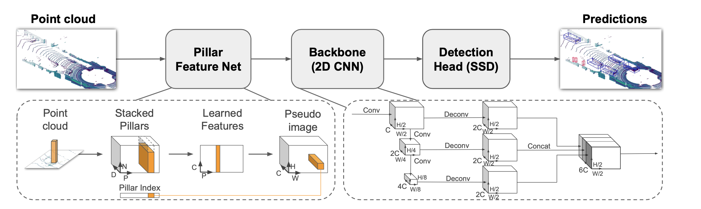
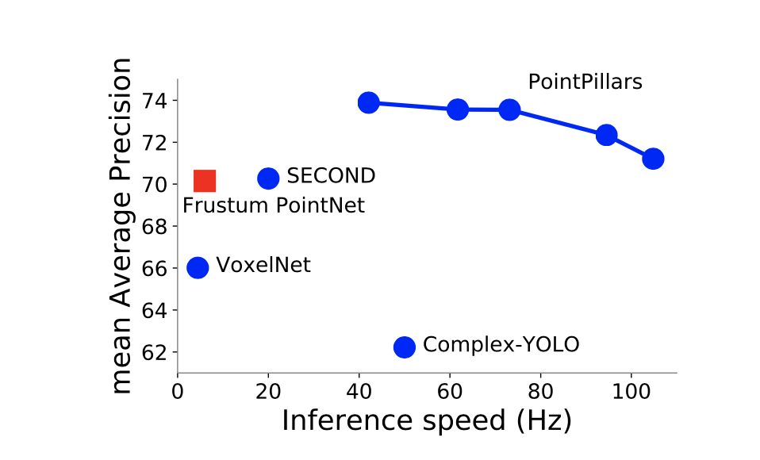

<!-- 
TODO: Summarize the paper:
* What is the core idea?
* How is it realized (technically)?
* How well does the paper perform?
* What interesting variants are explored? -->

# Core Idea

The authors proposes faster and efficient approach for 3D object detection and representation. PointPillars is an encoder that learns 3D point cloud representations by stacking learned features as vertical tensors and flattens to 2D pseudo image.

# Main Contributions

* Representation of the 3-D lidar point cloud inputs as pseudo-images

* 2-D convolutional backbone processes the images

* Single-shot detectors regresses to 3D boxes

PointPillars can be used with an standard 2D backbone.

# Loss function 

The loss formulation combines the sotfmax classification loss, focal loss on object classification and localization loss.This is optimized using Adam of learning rate of $2 * 10^−4$ with a decay rate 0.8 at every 15 epoch.

Data augmentation was crucial to achieving great performance and one of the approaches used was the random selection of ground truth samples from a lookup table.

# Performance

On KITTI datasets PointPillars  outperforms fusion based methods recognizing cars and cyclists with respect to mean average precision (mAP) compared to lidar-only methods.

PointPillar showed better accuracy and speed compared to SOTA methods while varying the size of the spatial binning.

## TL;DR

* PointPillars uses only the lidar point clouds as inputs and it is computationally efficient on object detection.

* Data Augmentation is required for good performance.

* PointPillars can be used with different backbones.