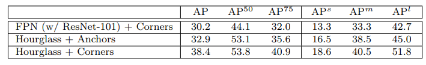

## Core Idea
Typically, one-stage detectors make use of a extremely large set of anchor boxes which leads to slow training and they also introduce a lot of hyperparameters and design choices based on them. Cornernet provides a new approach to one-stage object detection that predicts coordinates of objects (top-left coordinate and bottom-right) completely avoiding anchor's issues. Additionally, a new pooling layer is introduced that helps models better localize corners of objects. This model receives competitive results on MS COCO when compared to one-stage detectors.

## Design
Cornernet uses a single convolutional network that predicts 2 heatmaps: One for top left corners and one for bottom right corners. Additionally, it produces an embedding vector for each detected corner which is used to pair corners to the same object by predicting similar embeddings and offsets to create tighter bounds.

  

The architecture can be seen in the following graph:

  

The backbone of the network is an hourglass network used to capture both global and local features info followed by 2 prediction modules, one for top-left corners and the other for bottom right. This architecture does multiple downsamplings and upsamplings and skip connections are used to retain information lost in max-poolings.

  

Within each prediction module the output of the hourglass network is first passed to a new pooling method presented in the paper referred to as corner pooling. The motivation behind corner pooling is the difficulty of predicting corners for objects in which the corner is not close to the object itself. 

  

The way it works in the module for top-left is that for each coordinate, corner pooling provides the new value by looking at max value right, max value down, and adds them. This allows for the edges of objects to be found. Additionally a skip connection is fed after the corner pooling function to avoid edge cases with over lapping coordinate values.

  

The model's heatmaps are of shape height by width by number of classes. For a given predicted coordinate, the position in the height and the width dimensions indicate the location and the location on the class dimension indicates what class the object belongs to. The embeddings purpose is to connect top-left and bottom-right coordinates. The idea is to predict an embedding for each detected corner and group coordinates that are closest. Additionally, to produce tighter bounding boxes predicted offsets are used.

When training, each corenet has one ground truth location but neighboring locations are given smaller penalties to give wiggle room to predictions. These penalty reductions are given by a 2D gaussian. For offsets, a smooth L1 loss is used at ground truth corner.

  

## Results
The importance of corner pooling to localize corners:

  

Full results compared to other models on MS COCO

  

As can be seen the results of the model often outperform all other one-stage detectors and is competitive with two-stage detectors.

Importance of hourglass network to CornerNet:

  

## TL;DR
* Anchors which are difficult to configure are not necessary for one-stage detectors
* Hourglass networks provide strong backbones for object detectors
* Associative embedding is applicable to detecing pairs of corners even for multiple classes

