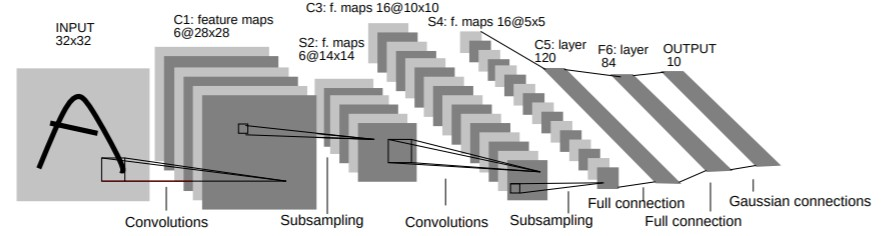
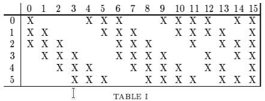

This is one of those papers that's well ahead of its time.
The paper explores the use ConvNets for optical character recognition, and graph neural networks (called graph transformer, not to be confused with the new fancy transformers) for text recognition.
At 40+ pages it's a true beast of a paper, but most of the space is devoted to a gentle introduction to deep learning.

There are two core ideas in the paper: The new LeNet architecture for digit classification, a graph transformer for streaming text classification.

The LeNet-5 architecture (shown above) is quite simple:
 * Convolutional layer (C1) with kernel size $$5 \times 5$$ (6 output channels)
   * Convolution is followed by a tanh (or sigmoid) activation
 * Average pooling layers (S2) with a kernel size of $$2\times 2$$ and stride $$2$$
   * The average pooling uses a trainable scale and bias term (hello BatchNorm)
 * Convolutional layer (C3) with kernel size $$5 \times 5$$ (16 output channels)
   * Convolution is followed by a tanh (or sigmoid) activation
 * Average pooling layers (S4) with a kernel size of $$2\times 2$$ and stride $$2$$
 * Convolutional layer (C5) with kernel size $$5 \times 5$$ (120 output channels)
   * Convolution is followed by a tanh (or sigmoid) activation
   * Note this convolution outputs just a single 120 dimensional vector
 * Linear layer (F6) with 86 outputs
   * Convolution is followed by a tanh (or sigmoid) activation
 * Linear layer (F7) with 10 outputs

LeNet-5 contains some interesting details.
The authors realized that the parameters of CNNs yield many symmetries.
They propose to use a (sparse) banded structure in the weights of the second convolutional layer to break these symmetries (see figure below).
This didn't survive into the current era. Modern CNNs use random initializations to break these symmetries.

The original LeNet-5 used a Euclidean-distance-based classifier.
However, moderns CNNs a Softmax is preferred.

The second part of the paper focuses on graph transformer to recognize streaming digits.
It jointly segments and classifies the digits.

This is the less-developed part of the paper.
It does have some nice nuggets though.
For example, LeNet-5 is applied in a streaming manner (fully-convolutional; hello FCNs).

In terms of evaluation, there is not all that much there, except for some MNIST results.

## TL;DR
* The paper that **introduces LeNet-5**
* Graph transformer for streaming text recognition
* *Ahead of it's time*: scaling params rediscovered by BatchNorm, FCNs
