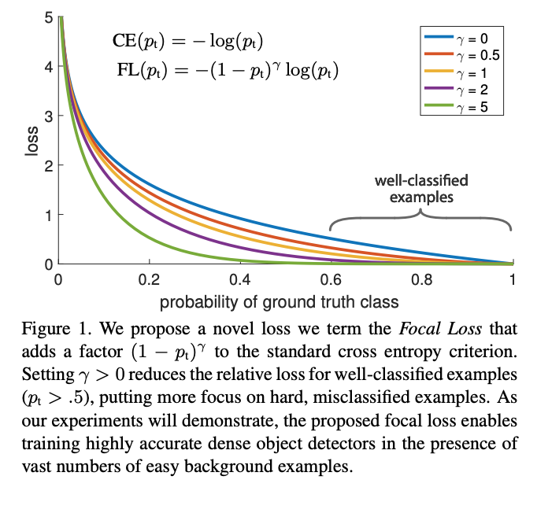
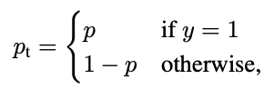
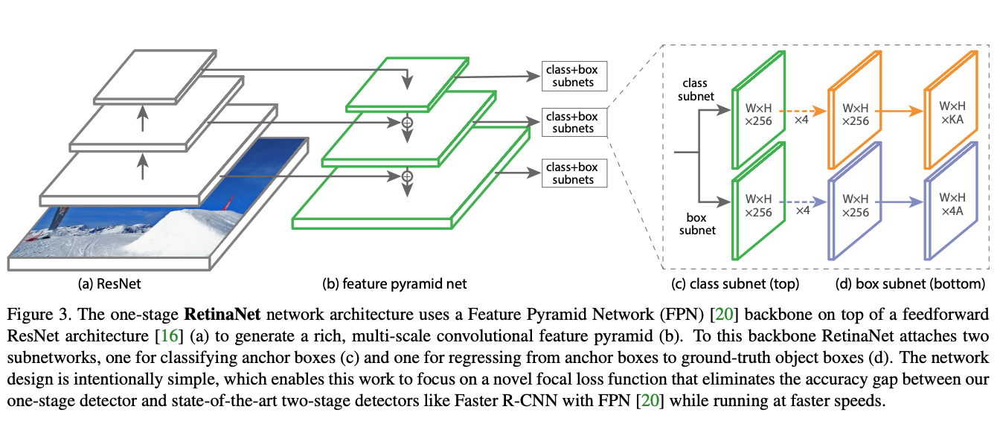
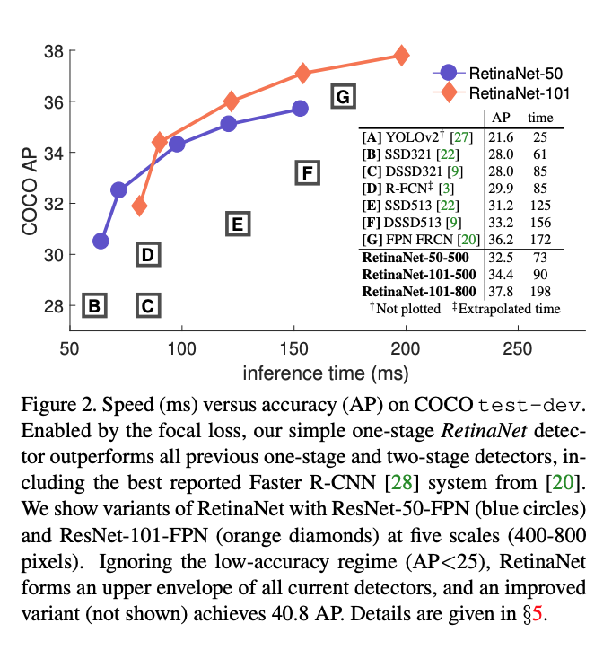
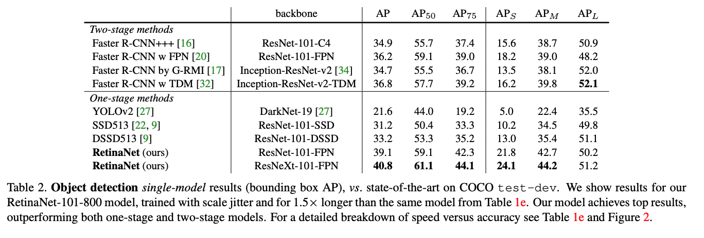
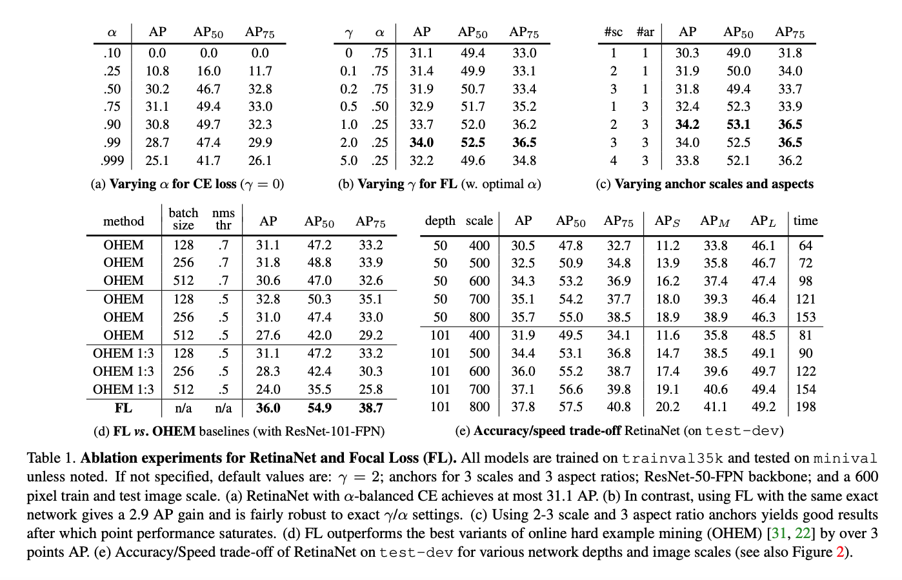

What is the core idea?

In object detection there are two-stage models, models in which there is a recognizer (which filters out important candidates) as well as a classifier (which outputs the class confidence). Examples: Mask-RCNN, Faster-RCNN. There is also a one-stage model, which uses a united architecture to do both detection and classification. One-stage models are typically much faster than two-stage models, since they don't have to run classification over all the candidates. However, they tend to have a much lower accuracy. This paper finds that this is because of a class imbalance, where background objects(which are easy to detect) far outweigh foreground object(harder). They offer the Focal Loss to fix this imbalance during training. Additionally they introduce a new model, which addresses the issue.

How is it realized (technically)?

In object detection, the class imbalance problem comes from the fact that in the training dataset there are more objects in the background, which are easier to detect and offer little signal. However, cross entropy loss is not ideal to deal with this issue, as the class imbalance leads to the loss attributed to easier examples is much larger. Class imbalance is addressed in R-CNN-like detectors by a two-stage cascade and sampling heuristics. The proposal stage (e.g., Selective Search, EdgeBoxes  rapidly narrows down the number of candidate object locations to a small number filtering out most background samples. In the
second classification stage, sampling heuristics, such as a fixed foreground-to-background ratio (1:3), or online hard example mining (OHEM) maintain a manageable balance between foreground and background. In contrast, a one-stage detector must process a much larger set of candidate object locations regularly sampled across an image.

This figure shows the proposed loss function. In ordinary CE, we calculate the loss, where p is the predicted probability and y is the ground truth (where y is either 0 or 1). In this paper we introduce a expression which leads to the CE loss curve getting stepper. Note that for gamma = 0, the focal loss just becomes cross entropy. The steeper curve ensures that the loss is greater for more incorrect predictions, thus increasing the loss that harder examples contribute to training.

This is the one stage classifier the paper uses for all the experiments. This architecture builds off the  Feature Pyramid Network (FPN) where each level of the pyramid can be used for detecting objects at a different scale.

How well does the paper perform?

Does better than all the models, when speed is taken into account.

What interesting variants are explored?

## TL;DR
* One stage models suffer from weak signals due to class imbalance
* Paper introduces Focal Loss to deal with this
* Performs SOTA on Object detection
