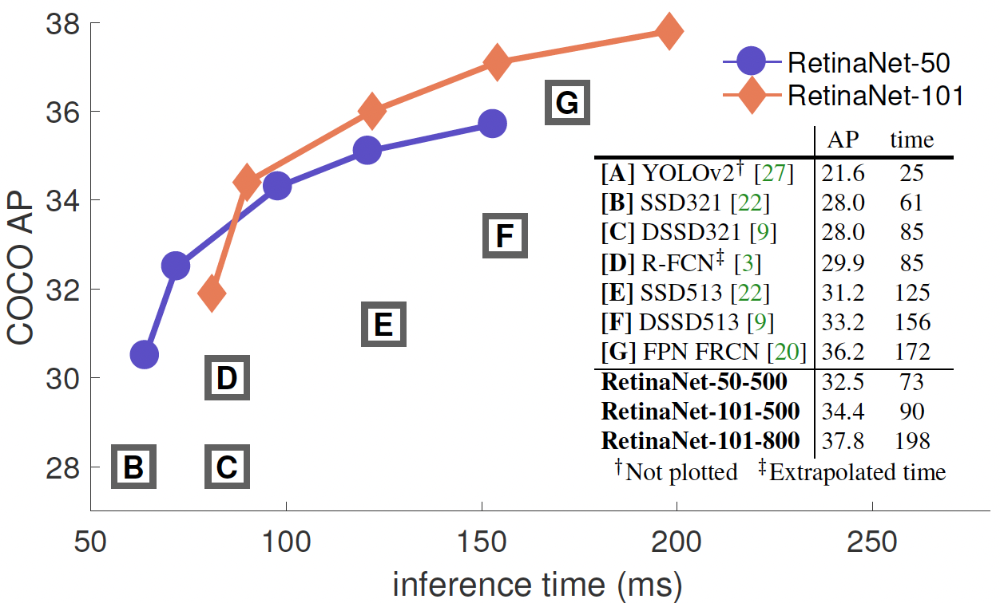

## The core idea
* The paper studies a class of object detection models -- _one-stage detectors_ and discovers that they fail to achieve high accuracy numbers  because of the class imbalance between foreground and background.
* They propose a novel loss function called Focal Loss (that focuses on hard examples for the loss) to resolve this problem; this loss with a one-stage detector outperforms all state of the art models on the COCO benchmark. 
* The primary idea of the loss function is to dynamically scale the cross entropy loss for each example based on the confidence of the model prediction in the correct class: higher the confidence, smaller the scale.
* Being a much simpler model than the more sophisticated two-stage detectors, their one-stage detector RetinaNet with the proposed loss is much faster in inference while still achieving better performance.

## How is it realized (technically)?

One-stage detectors before this paper employed the cross-entropy loss for training, $$CE(p_t)=-log(p_t)$$ for a binary case where $$p_t = p$$ if $$y=1$$ and $$p_t=(1-p)$$ otherwise. Here, $$y$$ and $$p$$ are the ground-truth class and model's estimated probability for $$y=1$$ class respectively. The problem with this is that it assigns a non-trivial loss to easily classified ($$p_t >>0.5$$) examples which due to the class imbalance (background $$>>$$ foreground) gets aggregated over a large number of such easy negatives to overwhelm the more important loss from the rare positive class. 

The class imbalance can be somewhat addressed using a balanced CE loss $$CE(p_t) = -\alpha_t log(p_t)$$ where $$\alpha_t$$ is higher for the rare class to assign more importance, but it is unable to distinguish between hard and easy examples. Therefore, to enable the loss from hard examples to drive the model updates, the paper introduces Focal Loss to down-weight easy examples and focus on hard negatives. The focal loss is defined as $$FL(p_t) = -(1-p_t)^{\gamma} log(p_t)$$ with a tunable focusing parameter $$\gamma > 0$$.

  

Figure above shows a comparison of the CE loss with the proposed loss for different values of $$\gamma$$. It can be seen that FL reduces the loss contribution from easy examples ($$p_t >> 0.5$$) and extends the range in which an example receives low loss. E.g. it reduces the loss 100$$\times$$ for $$p_t=0.9$$ and 1000$$\times$$ for $$p_t\approx 0.97$$ compared to CE. This increases the importance of correcting misclassified examples ($$p_t < 0.5$$) whose loss is scaled down by only a single-digit factor. 

  

Figure above shows the cumulative distribution of the loss for positive (rare foreground) and negative (frequent background) examples from a converged (trained with $$\gamma=2$$) model. The second plot clearly shows that as $$\gamma $$ increases the proposed loss concentrates only on the very few hard negative examples and the large number of easy negatives contribute negligibly to the loss.

It is worth noting that the exact form of the loss function is not important but what makes the difference are some key properties this loss exhibits:
* For a misclassified example with low $$p_t$$ the value of the modulating factor $$(1-p_t)^{\gamma}$$ is close to 1 and the loss is unaffected. 
* For a well-classified example with $$p_t$$ near 1, the factor tends to 0 and thus down-weights the loss.
* The rate of down-weighting of the easy examples is smoothly adjusted by the focusing parameter $$\gamma$$.

Another key design choice is the model initialization. A default initialization to predict each class equally would lead to instability in early training because of large loss from the frequent class. Therefore, the paper chooses to introduce a bias such that model's estimated $$p$$ for the rare class is low, e.g. 0.01 resulting in a high loss for rare class.

### RetinaNet

RetinaNet is a one-stage object detection network that uses a Feature Pyramid Network (FPN) on top of a feedforward ResNet architecture. The paper uses 5 levels of different resolution in the pyramid each with 256 channels. Each level has a total of 9 anchor boxes with 3 different aspect ratios and 3 different scales. Each level then feeds to 2 separate FCN with same architecture -- one for object classification and other for bounding box regression. 

## Performance
The paper uses a balanced focal loss with $$\gamma=2$$ and $$\alpha=0.25$$ to report the results of their evaluation on the bounding box detection track of the COCO benchmark. They compare the inference speed and the accuracy (AP) of their model with 2-stage and other 1-stage detector baselines on the test-dev split of the dataset with no public labels.

  

  

The plot and table above demonstrate the substantial gain in accuracy provided by the proposed loss function while maintaining the high inference speed of the 1-stage network. RetinaNet with focal loss beats existing 1-stage networks by 6 AP points and the SOTA 2-stage networks by $$\sim 3$$ AP.

## Interesting variants
The paper mentions that the exact form of the loss function is not crucial and therefore explores another instantiation of the focal loss with similar properties and shows that it performs equally well.

## TL;DR
* Existing 1-stage detectors, though much faster, yield subpar accuracy compared to SOTA 2-stage models because of class imbalance.
* Paper introduces a novel Focal Loss to down-weight the contribution of the large number of easily classified negatives from the frequent class, thereby focusing on hard examples.
* The focal loss does wonders for the dense 1-stage object detectors which now outperform all existing models in accuracy as well as speed.
