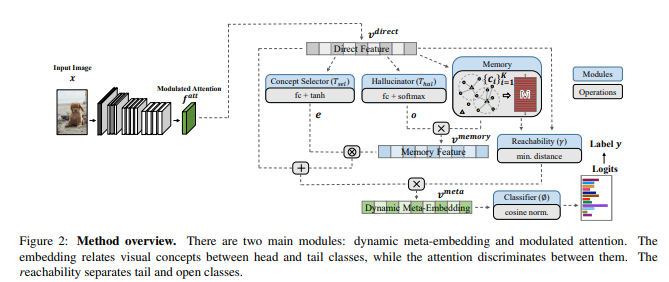
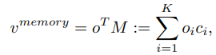
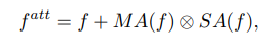
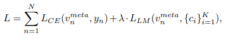
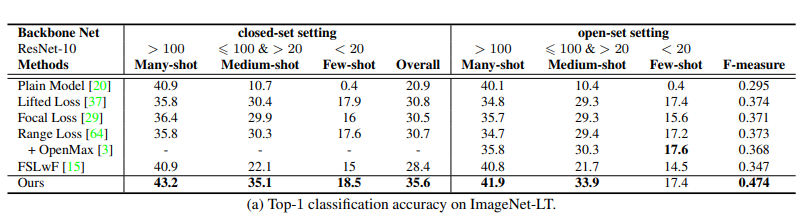

## The Core Idea of this paper?
Real world data is long tailed and open-ended distributed. A practical recognition system must classify among majority and minority classes. 
This paper discusses about the Open Long-Tailed Recognition (OLTR) as learning from naturally distributed data and optimizing the classification 
accuracy over a balanced test set including head, tail, and open classes. OLTR focuses on imbalanced classification, few-shot learning, and open-set 
recognition in single integrated algorithm, however the existing classification approaches focus only on one aspect and deliver poorly. The key 
challenges for OLTR are tail recognition robustness and open-set sensitivity. The core idea of this paper is to develop an integrated OLTR algorithm 
that maps an image to a feature space such that visual concepts. It can relate to each other based on a learned metric that respects the closed-world 
classification while acknowledging the novelty of the open world. This dynamic meta-embedding combines a direct image feature and an associated memory 
feature, with the feature norm indicating the familiarity to known classes. It has modulated attention to encourage the head and tail classes to use 
different sets of spatial features. As the Meta embedding relates head and tail classes, the modulated attention maintains discrimination between them.
The head, tail and open classes can be defined as per the diagram below:
 

## Model and Technical representation:

The OLTR consists of two main modules, dynamic Meta embedding and modulated attention. The former relates and transfers knowledge between head and tail 
classes and the latter maintains discrimination between them.

# Dynamic Meta-Embedding:
It has a convolutional neural network (CNN) with a softmax output layer for classification. The second-to-the last layer can be viewed as the feature 
and the last layer a linear .The feature and the classifier are jointly trained from big data in an end-to-end fashion. Let v- direct denote the direct 
feature extracted from an input image. In order to handle the small data in tail classes the v-direct is enriched with a memory feature v-memory that 
relates visual concepts in a memory module. The resulting feature Meta embedding v-meta, and it is fed to the last layer for classification.

Meta embedding is technically computed by following steps:

Learning Visual Memory: The centroids are the basic building block. It is calculated in two steps Neighbourhood Sampling; Sampling both intra-class and inter-class examples to 
compose a mini-batch during training. These examples are grouped by their class labels and the centroid of each group is updated by the direct feature 
of this mini batch. 2) Propagation: this step alternatively updates the direct feature v direct and the centroids to minimize the distance between each 
direct feature and the centroid of its group and maximize the distance to other centroids.

Composing Memory Feature (v-memory): The memory feature relates the centroids in the memory, transferring knowledge to the tail class.
	

												
Where o belongs  R K is the coefficients hallucinated from the direct feature , o = Thal(v-direct).

Obtaining Dynamic Meta-Embedding: (v-meta) combines the direct feature and the memory feature, and is fed to the classifier for the final class.

		v meta = (1/γ) • (v direct + e X v memory),

where X denotes element-wise multiplication. γ > 0 is seemingly a redundant scalar for the closed-world classification tasks.

# Modulated Attention:
While dynamic meta-embedding facilitates feature sharing between head and tail classes, it is also vital to discriminate between them. Modulated 
attention to encourage samples of different classes to use different contexts. a self-attention map SA(f)  is computed from the input feature map by 
self-correlation . It is used as contextual information and added back  to the original feature map. The modulated attention MA(f) is then designed as 
conditional spatial attention applied to the self-attention map.The final attention feature map becomes:

												
where f is a feature map in CNN, SA(•) is the self attention operation, and MA(•) is a conditional attention function with a softmax normalization.	

Learning: The cosine classifier  is used to produce the final classification results.

Loss Function: The final loss function L is a combination of the cross-entropy classification loss LCE and the large-margin loss between the embeddings 
and the centroids LLM.

## Experiments: 

• Task : To compute Top-1 classification accuracy.

•Dataset: ImageNet-LT. it has 115.8K images from 1000 categories, with maximally 1280 images per class and minimally 5 images per class. 
 The additional classes of images in ImageNet-2010 are used as the open set.
 
•Network Architecture: ResNet 10 backbone network for ImageNet-LT.

•Results:The below table represents the performance comparison of different methods

## TL;DR
•  The  OLTR task  learns from natural long-tail open-end distributed data and optimizes the overall accuracy over a balanced test set.

•  The integrated OLTR algorithm can be used, with dynamic meta-embedding, in order to share visual knowledge between head and tail classes and to reduce 
   confusion between tail and open classes.It gives good accuracy over ImageNet-LT.
   
• It has been validated on three curated large-scale OLTR benchmarks (ImageNet-LT, Places-LT and MS1M-LT) for future research. 