* Core idea
They present a learning method called Open Long-Tailed Recognition (OLTR) to learn on real world data. The method aims to handle imbalanced classification instead of traditional classifiers which only focus on head classes (majority). OLTR also recognizes novel instances in data, i.e open set. 

* How is it realized (technically)?

OLTR combines 3 different tasks namely, imbalanced classification, few-shot learning and open-set recognition. Direct feature embeddings in CNNs lack sufficient gradient updates from tail classes. To deal with tail recognition, they introduce "dynamic meta-embedding". It combines direct features from standard embedding and induced features to enrich tail classes. They generate induced features from memory using principles from meta learning to capture visual concepts from training classes that are retrieved from a shallow model. The meta embedding is combined with the direct embedding to give more features to tail classes.

They compute class centroids in two steps: neighborhood sampling and propagation. For an input image v^memory enhances its direct feature if it is in the tail class. v^memory is calculated as:

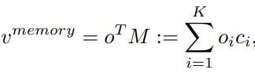

where o is the coefficient hallucinated from the direct feature.

To obtain the dynamic meta embedding, they use the formulation:

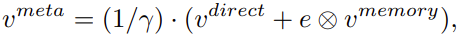

where gamma is given by:

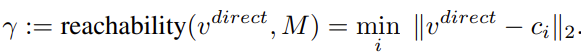

gamma is small if the input likely belongs to the training class and is very big otherwise. This helps in encoding open classes.

e is a concept selector that adaptively selects between the memory and direct features in a soft manner. It is given by:

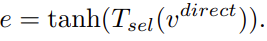

They use modulated attention to encourage samples from different classes to use different contexts, given by:
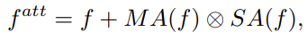

A cosine classifier is used as:
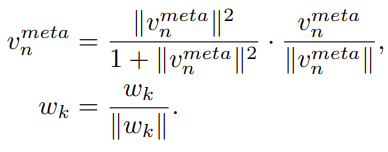

The loss function is a combination of cross entropy and large margin loss between the embeddings and centroids:

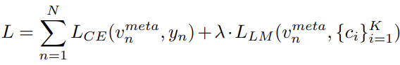

The final model is given by:
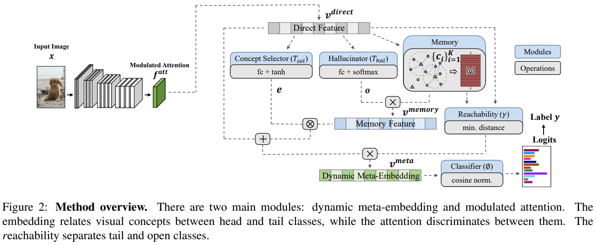

* How well does the paper perform?

They test their model on different curated datasets namely ImageNet, Places, MS1M. They are curated to have long tails. The model performance is evaluated on classification accuracy of many-shot, medium-shot and few-shot classes. It is also evaluated based on the open-class detection error.
The model achieves SOTA results on ImageNet-LT, MegaFace and SUN-LT datasets and does very well on Places-LT dataset as shown below:

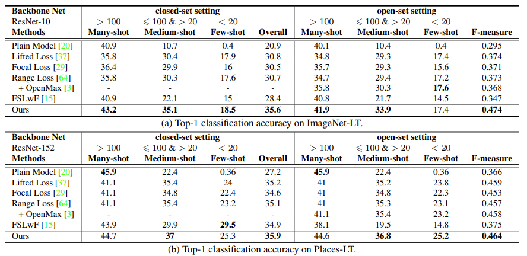

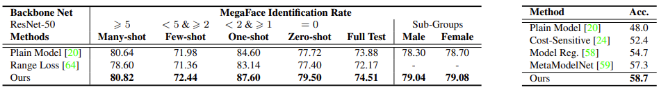

* What interesting variants are explored?
They explore using different memory features and influence of dataset long tailed-ness. They find that their method is very robust to skewed/imbalanced datsets.

![robustness]](liu2021swin_1k.png)

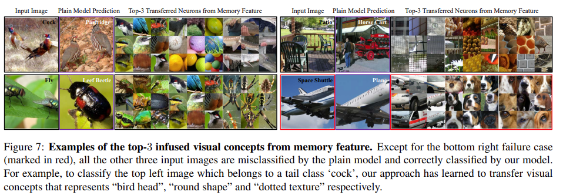

## TL;DR
* Introduce OLTR model which optimizes for balanced classification on skewed/long tailed datasets
* Proposes a dynamic meta embedding feature which combines direct features and memory embeddings to enhance feature set of few-shot samples
* OLTR achieves SOTA results in terms of balanced classification and open-set identification and displays robustness to long tails.
