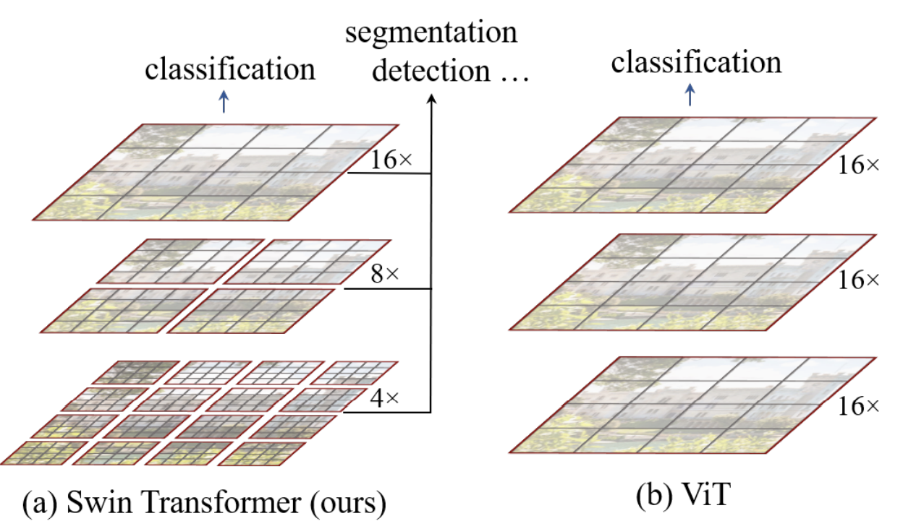
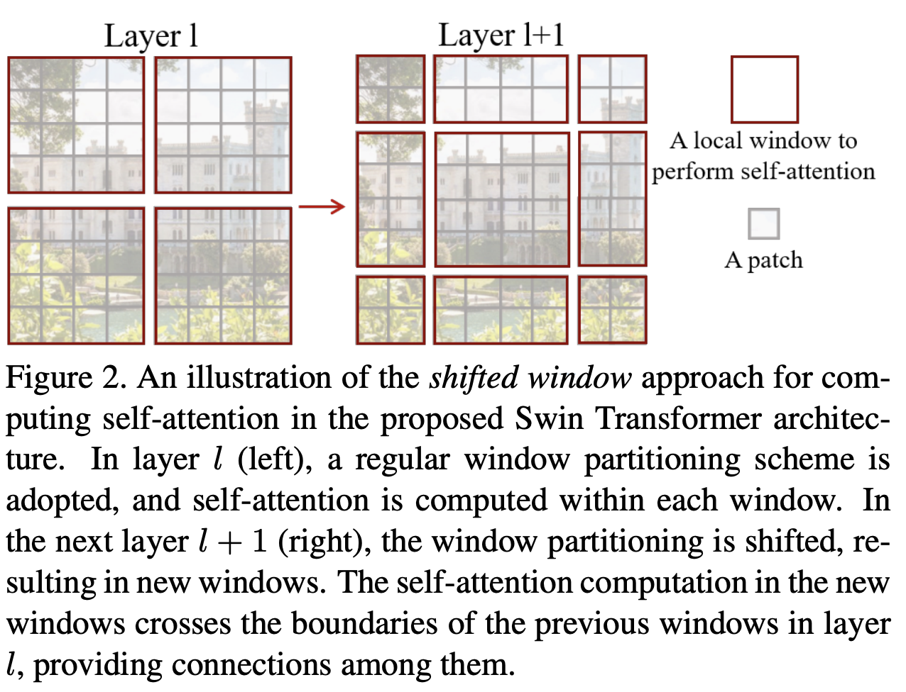
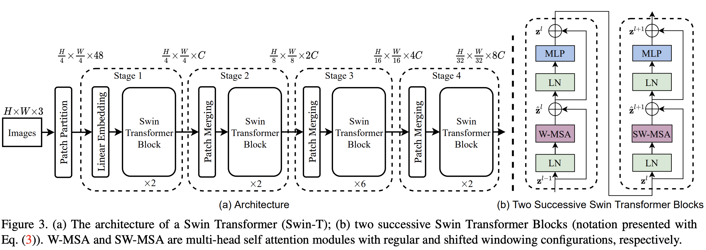
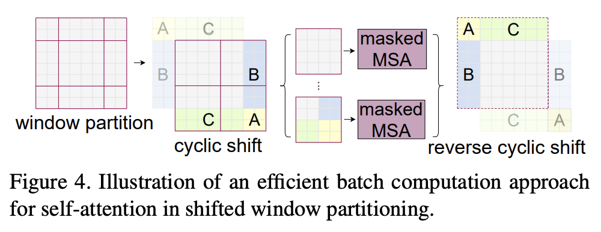
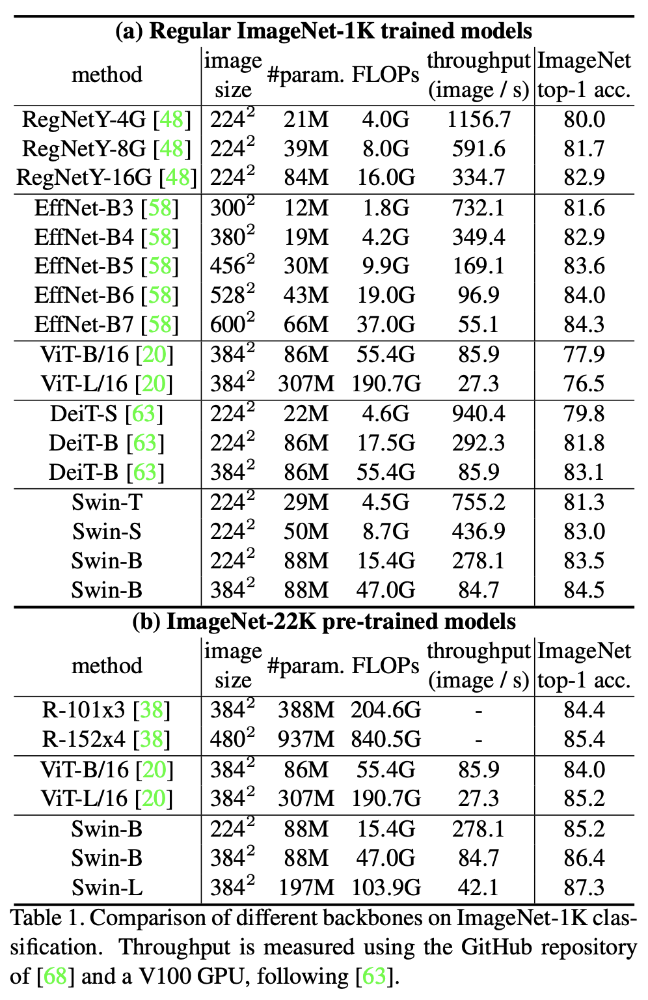
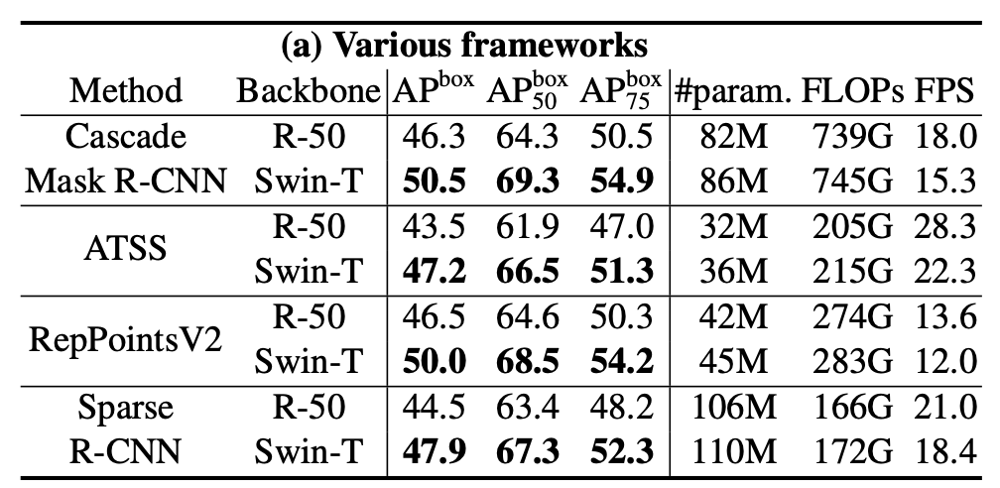
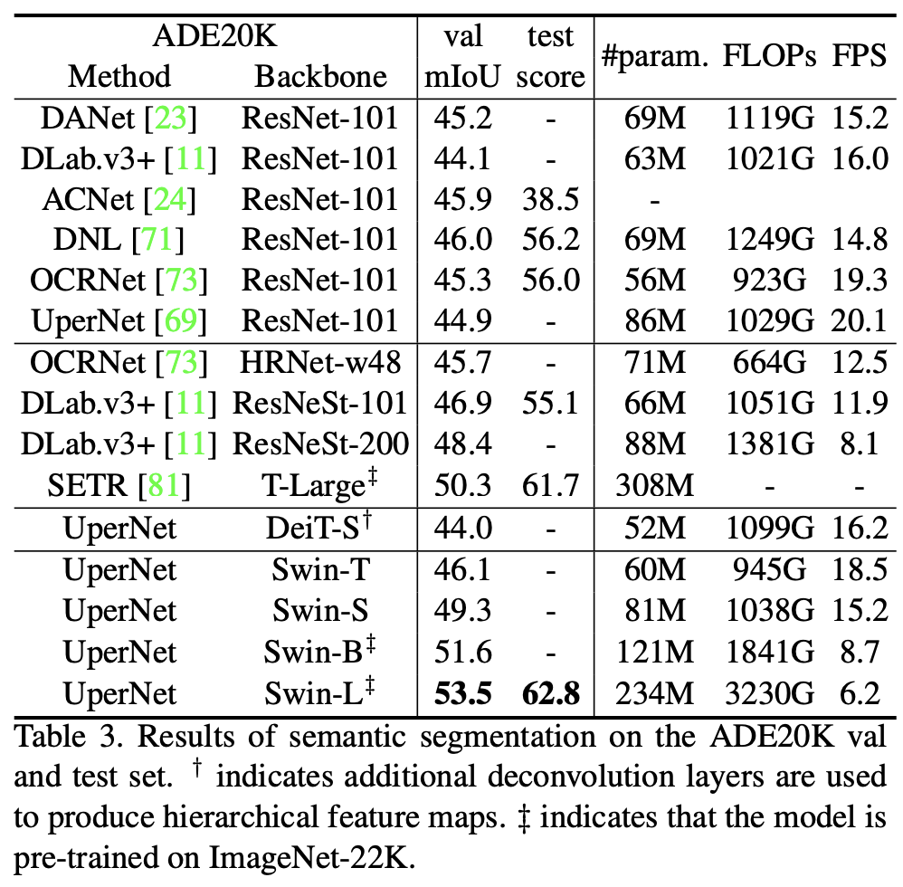

## Abstract
* Transformer is designed for text domain. The high resolution of pixels in images prevent smooth application of transformer in visual domain. 
* Semantic segmentation that require dense prediction at the pixel level, and this would be intractable for Transformer ($$O(n^2)$$).
* This paper proposed to a hierarchical Transformer whose representation is computed with shifted windows (SWIN). 
* By limiting self-attention computation to non-overlapping local windows while also allowing for cross-window connection, SWIN has linear computational complexity with respect to image size. 
* Ultimate goal: expand the applicability of Transformer such that it can serve as a general-purpose
backbone for computer vision, as it does for NLP and as CNNs do in vision. 

## Motivation
To reduce complexity, Swin Transformer constructs a hierarchical representation by starting from small-sized patches (outlined in gray) and gradually merging neighboring patches in deeper
Transformer layers. 

  

The linear computational complexity is achieved by computing self-attention locally within non-overlapping windows that partition an image (outlined in red). The number of patches in each
window is fixed, and thus the complexity becomes linear to image size.

A key design element of Swin Transformer is its shift of the window partition between consecutive self-attention layers. The shifted windows bridge the windows of the preceding layer, providing connections among them that significantly enhance modeling power. 

  

## Overall Architecture

Swin Transformer first splits an input RGB image into non-overlapping patches by a patch splitting module. Each patch is treated as a “token” and its feature is set as a concatenation of the raw pixel RGB values. A linear embedding layer is applied on this raw-valued feature to project it to an arbitrary dimension (denoted as C).

Swin Transformer blocks are applied on these patch tokens. The Transformer blocks maintain the number of tokens ($$\frac{H}{4} \times \frac{W}{4}$$), and together with the linear embedding are referred to as “Stage 1”.

The first patch merging layer concatenates the features of each group of 2 × 2 neighboring patches, and applies a linear layer on the 4C-dimensional concatenated features. This reduces the number of tokens by a multiple of 2×2 = 4 (2× downsampling of resolution), and the output dimension is set to 2C. Swin Transformer blocks are applied afterwards for feature transformation, with the resolution kept at $$\frac{H}{8} \times \frac{W}{8}$$. This first block of patch merging
and feature transformation is denoted as “Stage 2”.

  

## Shifted Window based Self-Attention
### Self-attention in non-overlapped windows
Global self-attention computation is generally unaffordable for a large $$hw$$, while the window based self-attention is scalable.

### Shifted window partitioning in successive blocks
To introduce cross-window connections while maintaining the efficient computation of non-overlapping windows, we propose a shifted window partitioning approach which alternates between two partitioning configurations in consecutive Swin Transformer blocks.

As illustrated in the above figure, the first module uses a regular window partitioning strategy which starts from the top-left pixel, and the $$8 \times 8$$ feature map is evenly partitioned into $$2 \times 2$$ windows of size $$4 \times 4 (M = 4)$$. 

Then, the next module adopts a windowing configuration that is shifted from
that of the preceding layer, by displacing the windows by $$(\text{floor}(\frac{M}{2}), \text{floor}(\frac{M}{2}))$$.

### Efficient batch computation for shifted configuration
To reduce the latency, the authors  propose a more efficient batch computation approach by cyclic-shifting toward the top-left direction, as illustrated in figure below. After this shift, a batched window may be composed of several sub-windows that are not adjacent in the feature map, so a masking mechanism is employed to limit self-attention computation to within each sub-window.

  

## Experiements

The paper conducted a thorough empirical evaluation on ImageNet-1k classification, object detection and semantic segmentation. The results showed that Swin-Transformer outperforms ResNet and Vit when used as the backbone model.

## TL;DR
Swin-Transformer — A hierarchical Transformer whose representation is computed with Shifted windows. This hierarchical architecture has the flexibility to model at various scales and has linear computational complexity with respect to image size. It achieved SOTA on various of vision benchmarks when used as the backbone model.