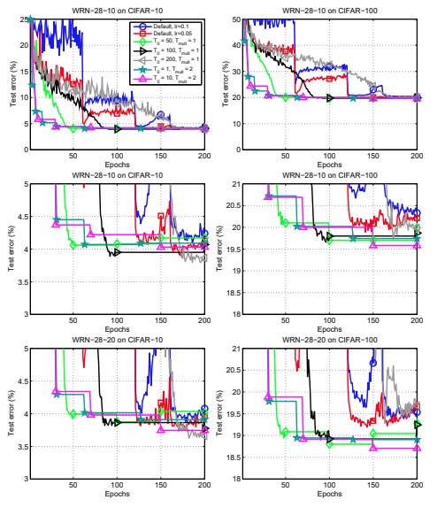

TODO: Summarize the paper:
* What is the core idea?

- The paper proposed stochastic gradient descent with warm restart (SGDR), a training method that allows for faster convergence and better performance on CIFAR datasets.

* How is it realized (technically)?

- The paper incoprporated restart idea from evoluation based and other optimization algorithms to stochastic gradient descent. The origional gradient descent formula is:

$$x_{t+1} = x_t - \eta_t \Delta f_t(x_t)$$

where $$x_{i}$$ represents the parameter at step i, $$\Delta f_i(*)$$ represents the gradient at step i, and $$\eta_i$$ represents the scale of the gradient (otherwise known as the learning rate) at step i.

The paper proposed to modify the learning rate $$\eta$$ by the following:

$$\eta_t = \eta_{min}^i + \frac{1}{2}(\eta_{max}^i - \eta_{min}^i)(1 + cos(\frac{T_{cur}}{T_{i}}\pi))$$

where $$\eta_{t}$$ is constraint between $$[\eta_{min}^i, \eta_{max}^i]$$ and due to the nature of the cosine function, at $$T_{cur} = 0$$ and minimum at $$T_{cur} = T_i$$.  

The paper suggested to make $$T_{cur}$$ discredited values (for example, 0.1, 0.2, 0.3 .. etc) in combination with cosine have a looping behavior. $$T_{i}$$ can be a fixed value, or increased by a factor of $$T_{mult}$$ for better performance.

In addition, the author recommended the training to stop at $$\eta_t = \eta_{min}^i$$ to avoid temporary worsening result due to warm start.

* How well does the paper perform?

The paper presented test errors of state of art models trained on CIFAR-10 and CIFAR-100. When using their methods, the training method improved the CIFAR-10 result from 4.17 to 3.66, and CIFAR-100 result from 20.04 to 18.70 across 5 runs. Even without specific optimization in the SGDR hyperparameters, the training method is able to lower the error percent. 

In addition, in comparasion to SGD with momentum, SGDR is able to outperform and provide faster convergence across the board.

* What interesting variants are explored?

The paper mostly focuses on the comparasion mentioned above. They also reported ensemble results and found 3.25% and 16.64% test error on CIFAR-10 and CIFAR-100 dataset. 

Note that the ensemble reported in this paper is known as **snapshot** ensemble. They did not train each model from scrach, but instead take the last M snapshots before restart to do ensembling.

They have also run their method on EEG recording classification and demonsrated 1-2% performance improvement.

## TL;DR
* The paper presented SGDR, a novel gradient based optimization technique that allows for faster performance and better convergence on CIFAR-10 and CIFAR-100.
* Additional variants demonstrated that this method works on models trained on other domains as well, and on ensembles.
* Incorporating well known method (i.e. warm start) from other related fields may yield better performance.
