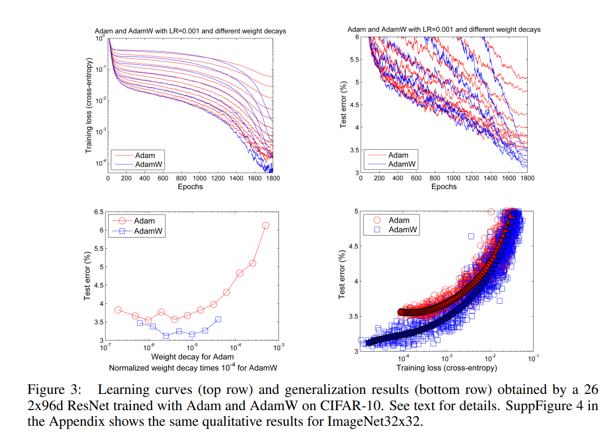
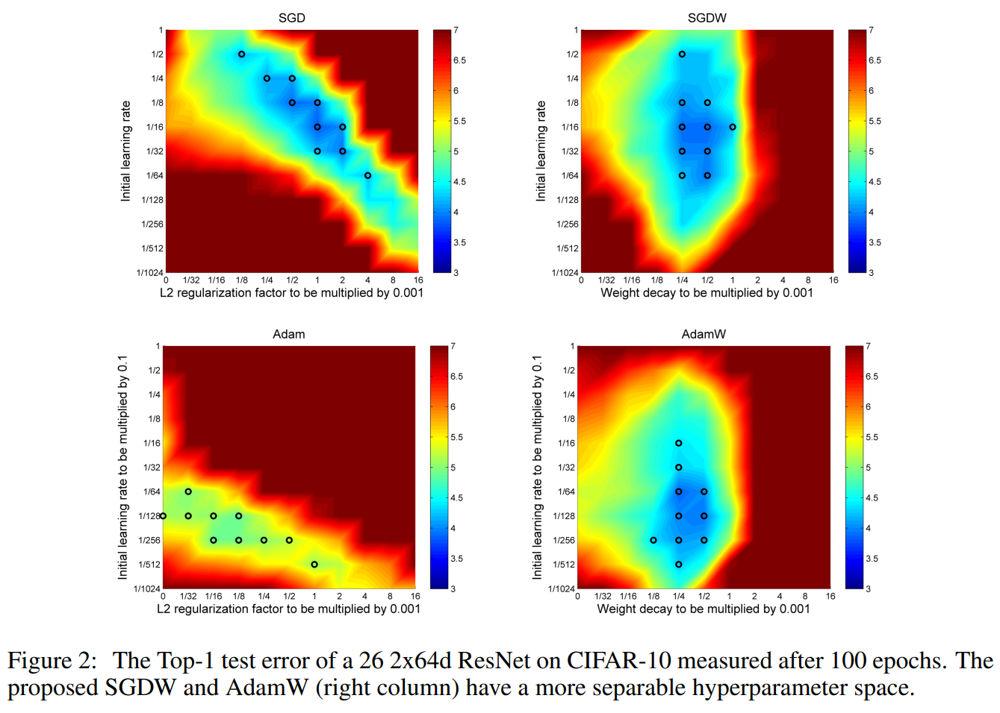

Stochastic Gradient Descent (SGD) with momentum was currently beating out Adam optimizers in Image Classification.

This paper posits that the standard L2 regularization used with both optimizers does not serve the function of weight decay when used with Adam, while doing so with SGD.

SGD is able to reparameterize itself to make its L2 regularization function the same as weight decay.  However, Adam uses adaptive gradients which causes less weight regularization than weight decay.

The result of this is that SGD gains the benefits of weight decay in certain image classification cases, while Adam does not.

To solve this issue, the paper forms a new method called decoupled weight decay.  Decoupled weight decay separates the loss gradient updates from weight decay.  This avoids the issue of L2 regularizing weights by too small of an amount by using the same $$\lambda$$ rate for all weights (which leads to more regularization for weights with larger gradients).

The results of decoupled weight decay (AdamW) on Adam error rates and loss curves can be seen below.

Results also show that decoupled weight decay allows both SGD and Adam optimizers to better tune their hyperparameters independently.  The left two graphs not using decoupled weight decay show a diagonal trend that makes hyperparameters more dependent on each other.

One final variation tested in the paper is the learning rate schedule used by Adam.  Cosine Annealing provided the best results when used with AdamW.

## TL;DR
* SGD Optimizer outperformed Adam in Image Classification
* L2 Regularization does not optimally perform weight decay for Adam
* Decoupled Weight Decay fixes this and makes Adam competitive to SGD
