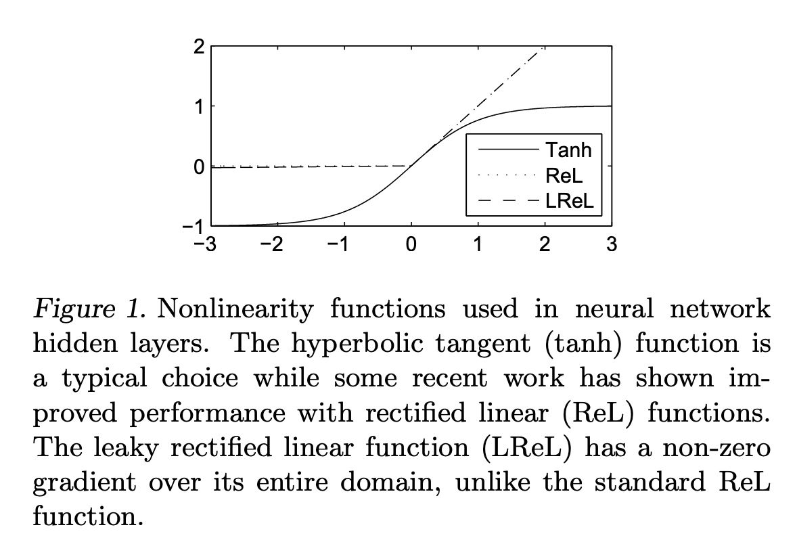
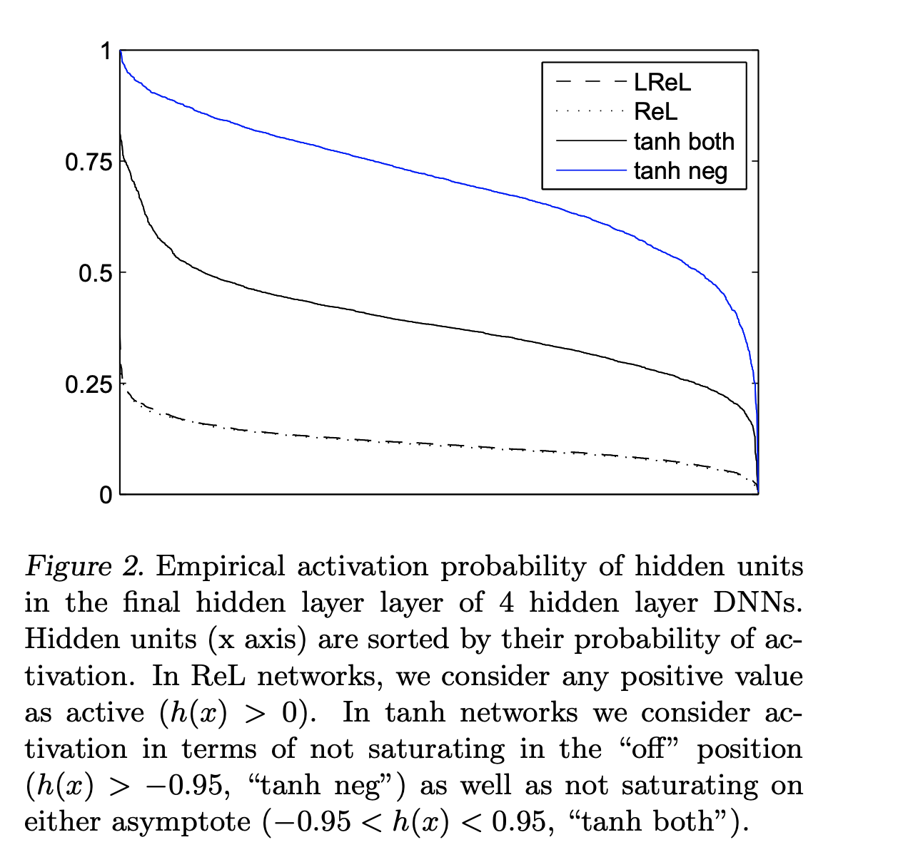

# Core idea: Rectifier DNNs > Sigmoidal DNNs in Speech Recognition

### Main Contributions
- This paper demonstrates that deep neural network (DNN) models for speech recognition perform better when they use rectifier activation functions instead of sigmoidal ones.
- Previous work compares the two, but without isolating all other variables. This paper isolates the effect of the activation function in DNN-based speech recognition.
- The authors theorize that the performance benefit is attributable to "sparse-disperse" coding properties of Rectifier functions and provide evidence in support of this theory.

### Motivation for Rectifier Functions
Drawbacks of sigmoidal activation functions:
- Sigmoidal activation functions suffer from "vanishing gradients" which can slow training and/or cause the network to converge to poor local minima.
- They do not induce hard-sparsity (values of 0) in activations, which can be a drawback if you want to use activations as feature representations for some downstream task.
Both of these issues can, in principle, be solved with rectifier activation functions.

### Experiment setup
- Task: Large Vocabulary Continuous Speech Recognition (LVCSR)
- Data: 300-hour Switchboard conversational corpus
- Model: DNN with ReLU, Leaky-ReLU, and tanh activation function
- Evaluation metric: word-error rate (WER)
- Side note: the authors validate that their baseline implementations are comparable to existing ones.

### Results
- Rectifier DNNs produce WER reductions of up to 2% as compared with sigmoidal DNNs, which is a substantial improvement for this task.
- Rectifier DNNs benefit more from depth as compared with sigmoidal DNNs. Each time a hidden layer was added, rectifier DNNs show a greater absolute reduction in WER than sigmoidal DNNs.
- Choice of Rectifier function (leaky vs. non-leaky) does not impact performance. Leaky converges slightly faster.

### Analyzing coding properties
- ReLU DNNs contain substantially more sparse representations than sigmoidal DNNs.
- ReLU networks, as compared with tanh networks, produce sparse codes where information is distributed more uniformly across hidden units.
- Information/coding theory suggests that sparsity and dispersion (even distribution of information) are important for invariance to inputs.

## TL;DR
* Rectifier activation functions improve neural-net based speech recognition over sigmoidal functions (tanh).
* Choice of rectifier function (leaky vs. non-leaky) did not matter for this task.
* Rectifier functions produce sparse and evenly distributed representations, which may contribute to the performance increase.
