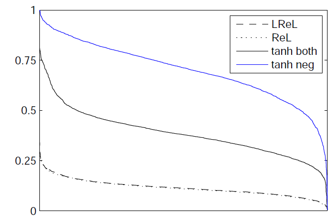
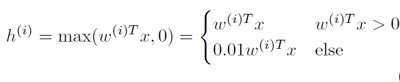

TODO: Summarize the paper:
* What is the core idea?

DNNs (Deep Neural Networks) with ReLU and other non-sigmoid activation functions performed better on image recognition tasks. This paper explores using DNNs as acoustic models and how rectifier non-linearities can improve estimation accuracy of the acoustic model.

* How is it realized (technically)?

The authors train a DNN acoustic model in an LVCSR (large vocabulary continuous speech recognition) task. To study the impact of different non-linearities on the training accuracy, they do not use regularization or pre-trained weights for the network. 

For the same speech recognition task, they replace the GMM/HMM acoustic model with a DNN. The DNN training inputs are MFCC (Mel frequency cepstral coefficients) features of the audio signal. The output of the DNN is the senone likelihood probability function. They train DNNs (2-4 layers containing 2048 units/layer) with sigmoid, ReLU and Leaky ReLU activation functions using stochastic gradient descent (SGD). A cross entropy loss function was used to quantify the classification error of the network.

* How well does the paper perform?

The paper evaluated the WER (word error rate) and cross entropy (for frame-wise error) obtained by replacing the GMM (Gaussian Mixture Model) acoustic model with the different DNNs. They trained the DNN with a 300 Hour switchboard phone conversation dataset (LDC97S62). 

They found that ReLU DNNs had a lower WER and cross entropy indicating a better estimation of the senone likelihood function. They observed a 2% decrease in WER when using ReLU DNNs compared to ones using sigmoidal activations. Even 4 layer Sigmoidal DNNs performed slightly worse than 2 layer ReLU DNNs despite having 80% more free parameters. Unlike tanh DNNs, the ReLU networks do not suffer from the vanishing gradient problem and hence enable training of deeper networks. So adding a new layer to the ReLU DNN resulted in greater absolute reduction in WER compared to sigmoidal DNNs.

They further attribute the better performance to the lower activation probability in a ReLU DNN. They show that the ReLU Layers are more dispersed (low standard deviation) making it a sparser representation than the sigmoidal DNN.

* What interesting variants are explored?

They explored using Leaky ReLU instead of ReLU and evaluate with multiple layers (2-4). They found no performance improvements but noticed that the Leaky DNNs converged faster during training.

## TL;DR
* Use a DNN as the acoustic model in a speech recognition system
* Use DNNs with different non-linearities and see how they improve recognition performance
* ReLU and Leaky ReLU DNNs perform better as acoustic models than sigmoidal DNNs. ReLU DNNs result in dispersed units and a sparser model.
