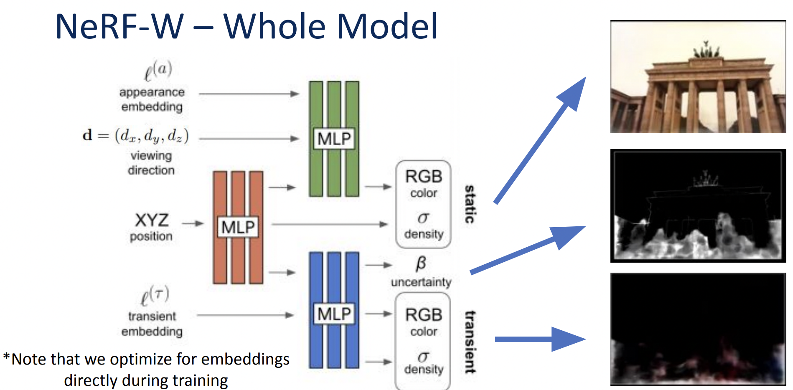
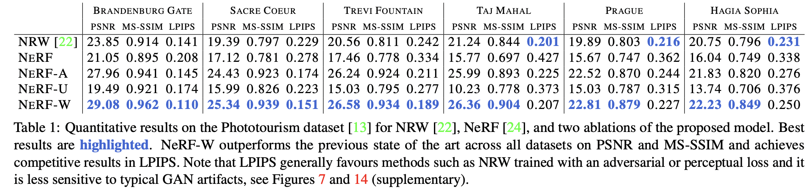
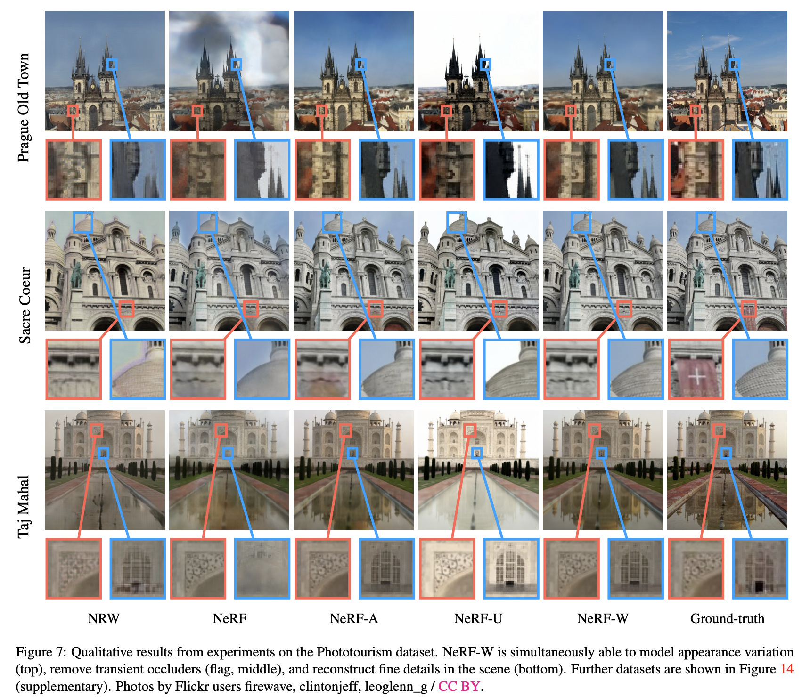

## What is the core idea?
* NeRF works well on images of static subjects captured under controlled settings, but it fails to model real-world variabilities such as illumination and transient occluders
* NeRF-W (this paper) extends NeRF to address these issues and is able to render accurate reconstructions from unconstrained image collections taken from the internet!

   

Sample image renders taken from https://nerf-w.github.io 

## How is it realized (technically)?

  

 Overview of NeRF-W model (<a href="http://www.pair.toronto.edu/csc2547-w21/assets/slides/NeRFInTheWild_GaryLeung.pdf">Source</a>) 

### Latent appearance modelling
* To adapt to the various lighting and camera settings, NeRF-W learns a separate low-dimensional "appearance" embedding for each of the training image.
* The appearance embedding is only fed to the MLP which gives out the color but not to the MLP which estimates the density, this ensures that the 3-D geometry is shared across all training images of a scene

### Transient objects modelling
* Another MLP outputs color and density at each location of its own, which models the transient objects in the image
* Note, in the this part, the density is allowed to be different for different training images of the same scene
* The transient MLP also outputs a uncertainity parameter which allows it to adapt reconstruction loss to ignore unreliable pixels and 3D locations that are likely to contain occluders. 
  
## How well does the paper perform?
NeRF-W outperforms baselines on various scenese from Phototourism dataset

  

  

## TL;DR
* Most neural rendering algorithms including NeRF doesn't work very well on images taken in uncontrolled settings
* NeRF-W **models the photometric variabilities** and **disentangles static and transient features** of the image to do novel view synthesis on unconstrained photo collections
