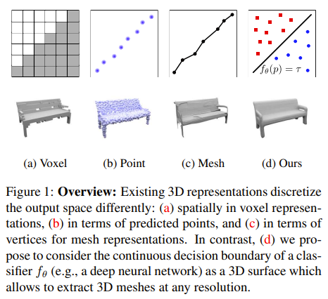
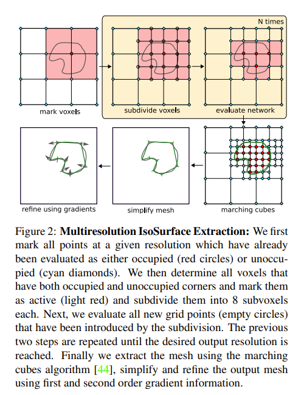
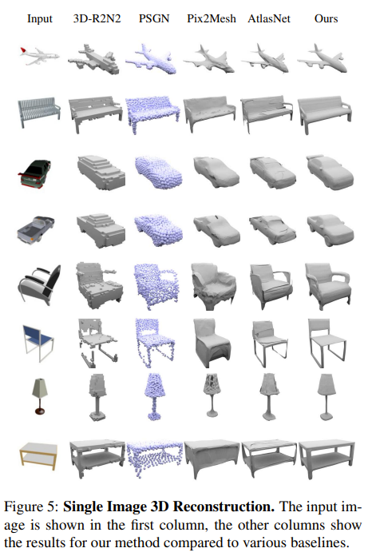
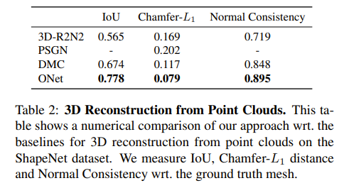
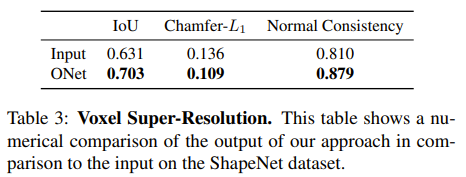

Problem: Need a good representation of 3D data for deep learning.

Unlike images, there's no canonical representation for 3D objects.

## Related Work
* Voxels: 3D pixels, but memory requirements grow cubically with size.
* Point Clouds: Don't have connectivity information between points, so difficult to extract surfaces.
* Meshes: Usually based on a template mesh, because it is very difficult to handle meshes of very different objects.

## Solution
Reason about occupancy not only at fixed discrete 3D locations, but at any possible 3D point.

Learn a nonlinear binary classifier that can determine whether any given 3D point is inside or outside the object.

The function is called an occupancy network, because it predicts the probability that a point is occupied.

Using an occupancy network results in less space complexity, because you only need to store the network instead of every 3D point.

The surface of points where the probability of occupancy is 0.5 is the surface of the object.

For 3D reconstruction, the occupancy network takes a pair of the input image and 3D location as inputs.

## Training and Inference

Implemented using a fully-connected neural network with 5 ResNet blocks.

Occupancy network is trained on a uniform random sample of points with known labels.

Use Multiresolution IsoSurface Extraction (MISE) to extract surface from occupancy network.
* Evaluate all points in a starting resolution.
* Mark all voxels with at least one occupied and one unoccupied corners as active.
* Split all active voxels into 8 sub-voxels.
* Keep finding active voxels and splitting active voxels until you reach desired resolution.
* Finally, use Marching Cubes algorithm to get a surface.

## Results

Evaluate on ShapeNet dataset against voxel-based, point-based, and mesh-based approaches.

Representation Power:
* Evaluate on the "chair" category of the ShapeNet dataset.
* The occupancy network is able to encode all 4746 training samples with only 6M parameters.

Condition Occupancy Networks on Noisy Point Clouds:

Condition Occupancy Networks on Low-Resolution Voxels (3D Super-resolution):

Found that uniform random sampling performs significantly better than sampling the same number of points inside and outside the mesh (equal sampling) or sampling half the points uniformly and half the points near the surface of the mesh (surface sampling).

## TL;DR
* Representing 3D data for deep learning is a difficult problem.
* Solution: Use a binary classifier that classifies any 3D point as occupied or not.
* Combine input 3D point with an input image to perform 3D reconstruction.
