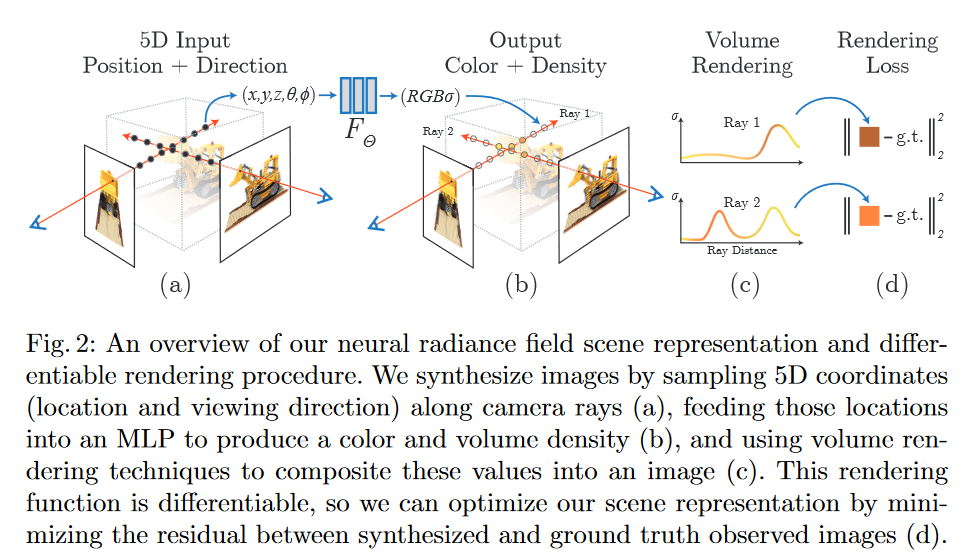
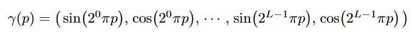
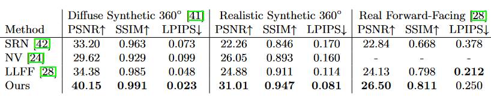
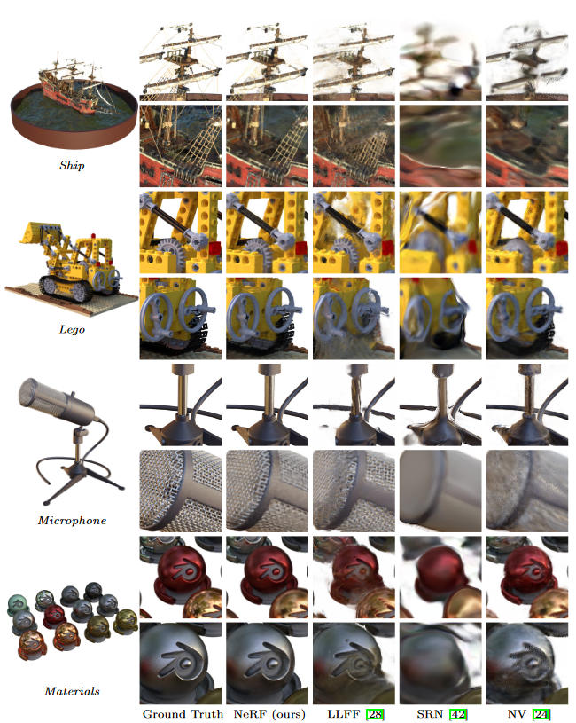
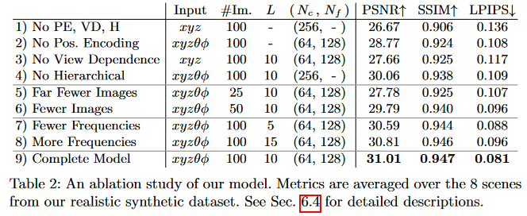

## Core Idea
This paper introduces a fully connected deep network that synthesizes 2D views of complex 3D scenes given a location $$(x,y,z)$$ and viewing direction $$(\Theta , \Phi )$$. 
The scene is represented by the network and is trained by using multiple images from know location and viewing directions.

## Technical Implementation

The 3D scenes are represented by the network as a Neural Radiance Fields (NeRF) consisting of a color and a volume density, $$\sigma$$. 
Volume density can be thought of as the probability that a ray terminates at a given point.
 

The network is restricted so that the location density, $$\sigma$$ is dependant only of the location while color value is depenant on location and viewing direction.  
It is optimized to be consistent with all of the (training) images with known locations and viewing directions.

### Positional Encoding

The authors reference previous work that suggests that neural networks are biased towards learning lower frequency functions. 
This was backed up by the fact that early iterations of NeRF struggled when trying to represent high frequency variations in geometry and color. 
To overcome this the authors project the input into higher dimentional space before feeding them into the network. 
The projection can be seen below:

$$\gamma$$ is applied to each of the three location inputs (x,y,z) individually. 
It is also applied to a Cartesian unit vector constructed from $$(\Theta , \Phi )$$. 
This encoding is very similar to the one used in the popular transformer presented in the Attention is all you need paper.  

## Results

NeRF is evaluated accross three dataset, Diffuse Syntheic 360, Realistic Syntheic 360, and as well as a dataset presented in the LLFF paper and augmented with more examples generated by the authors.  

Evaluation Metrics:
- Peak Signal-to-Noise Ratio (PSNR) 
- Structural Similarity Index (SSIM)
- Learned Perceptual Image Patch SImilarity (LPIPS)  

NeRF is compared against the following methods for View Synthesis
- **Neural Volumes (NV)**: Leverages pairs of images, one with just the background, one with the object in front of the background to train a 3D deep convolutional network for rendering.
- **Scene Representation Networks (SRN)**: Represents a scene using a fully connected network which maps each point to a feature vector. Uses a recurrent network to move through rays in the scene using the features to predict next steps and ulitmately prediciting color values. 
- **Local Light Field Fusion (LLFF)**: A 3D convolutional network that takes location, direction, as well as images of the scene at know locations as input and redners views from novel locations and directions. Note that this network does not have to be trained for each scene.

AS seen in the table above NeRF out performs the three other methods in all but one metric on one dataset where LLFF performs better.

Subjectively we can see that NeRF performs better as the rendered views seen above from NeRF are signifcantly sharper than those of the other three methods. 
This is most easily seen with complex scenes such as those from the ship and the lego figure.

## Ablations

Ablation studies were conducted using the Real Synthetic 360 dataset. 

The authors explored the affects of each of the three main compentents (positional encoding, view dependencem hierarchical sampling) of the system design as seen in rows 1-4 above. 
As we would expect intuitively a lack view dependence was more determintal to model performance than a lack of positional encoding or a a lack of hierarchical sampling.
They also show (rows 5-6) that with less views of the object (training data) the network is not able to optimize as well and suffers decreases in performance (as expected).
Finally the authors show that the choice of maximum frequence used (rows 7-8) in the postional encoding step is in fact a sweet spot as increasing or decreasing this value hurts performance.

## TL;DR
* Introduces a fully connected network to synthesize a complex scene and render 2D images of the scene from novel locations and viewing directions
* Projects the 5D input information into a higher dimesnional space using positional encoding allowing for better handling of high frequency color and geometry changes
* Generally outperforms other methods in scene synetheiss and novel view rendering tasks
