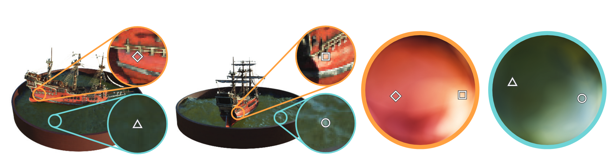

# NeRF: Representing Scenes as Neural Radiance Fields for View Synthesis

## What is the core idea?

The authors propose a way to represent 3d scenes using fully-connected deep networks (without convolutions) from a set of images.

Given a set of input images and viewing angles, a model is optimized that can generate images from different angles.

This approach outperforms prior work like SRN, NV and LLFF.

## How is it realized (technically)?

The network takes a continuous 5D coordinate (3D location + viewing direction) and outputs the volume density at that location and radience at that location/angle.

To get an output image from the network, 3D points are generated from rays that are marched through the scene. 

The model predicts a density and color value for these coordinates and viewing directions. These values are accumulated into pixel values using classical volume rendering techniques.

Since this process is differentiable, gradient descent can be used to optimize the scene model given a set of images and viewing directions.

The density of a coordinate is predicted using only the spatial coordinates (since it is the same regardless of the viewing angle) using an MLP with 8 layers of size 256 and ReLU activation functions. The output of this network is the density and a feature vector, which is concatenated with the viewing angle and passed through another layer to predict the color that is visible from this angle. 

### Optimizations:

The results produced by the core model are not satisfactory. The authors introduce two optimizations:

* **Positional encoding:** Performance can be significantly improved by operating on coordinates mapped to a higher-dimensional space. Each coordinate (in range [-1,1]) is therefore transformed using

$$
\gamma(p) = (sin(2^0 \pi p), cos(2^0 \pi p), ..., sin(2^{L-1} \pi p), cos(2^{L-1} \pi p))
$$

L was is set to 10 for the positional coordinates and to 4 for the viewing angle coordinates.

* **Hierarchical volume sampling:** The evaluation of the base model is very inefficient, since free space and occuluded regions are sampled as well as the useful ones.

The authors therefore employ a technique inspired by early volume rendering strategies: they train two networks, a coarse and a fine one.

The coarse network is evaluated first at a set of locations; the distribution of the values at those locations is then used to determine regions with visible content, which are assigned more samples that the fine network is then evaluated on.

## How well does the paper perform?

NeRF and three baselines (Scene Representation Networks, Neural Volumes, Local Light Field Fusion) are evaluated on the synthetic datasets Diffuse Synthetic 360° and Realistic Synthetic 360° and one created by the authors.

The NeRF manages to outperform the competition on all but one metric.

[Result videos](https://www.matthewtancik.com/nerf)

## Interesting notes:

* NeRF takes 1-2 days to train per scene on a NVIDIA V100 GPU
* The models are about 5MB in size (less than the images used to train it!)

## TL;DR
* NeRF is a model of a 3D scene that can be used to generate images from new angles given a set of training images/angles
* it is trained using the derivation of classical ray-based volume rendering
* it outperforms prior deep network based approaches
