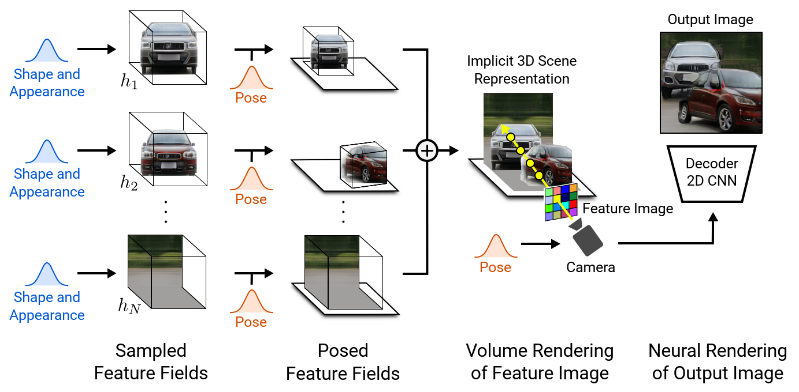
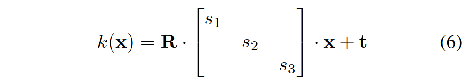
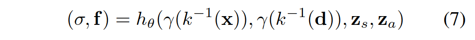
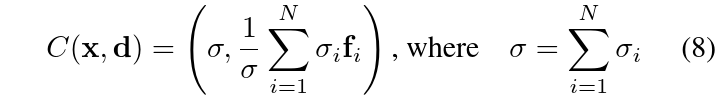
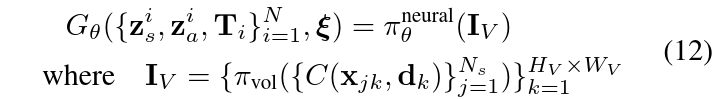
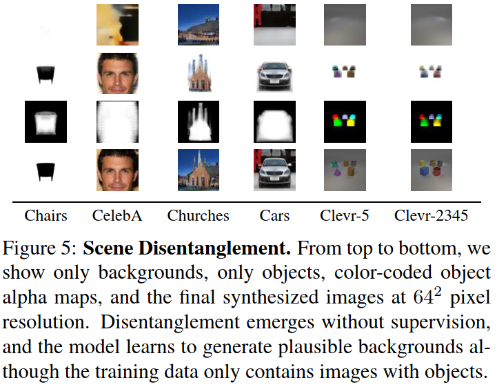
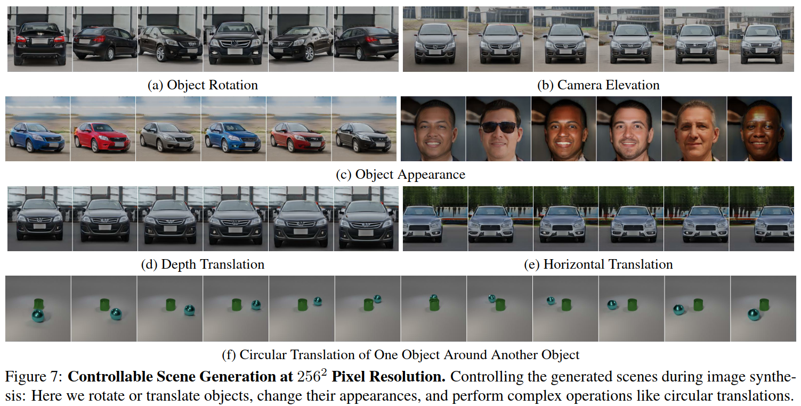
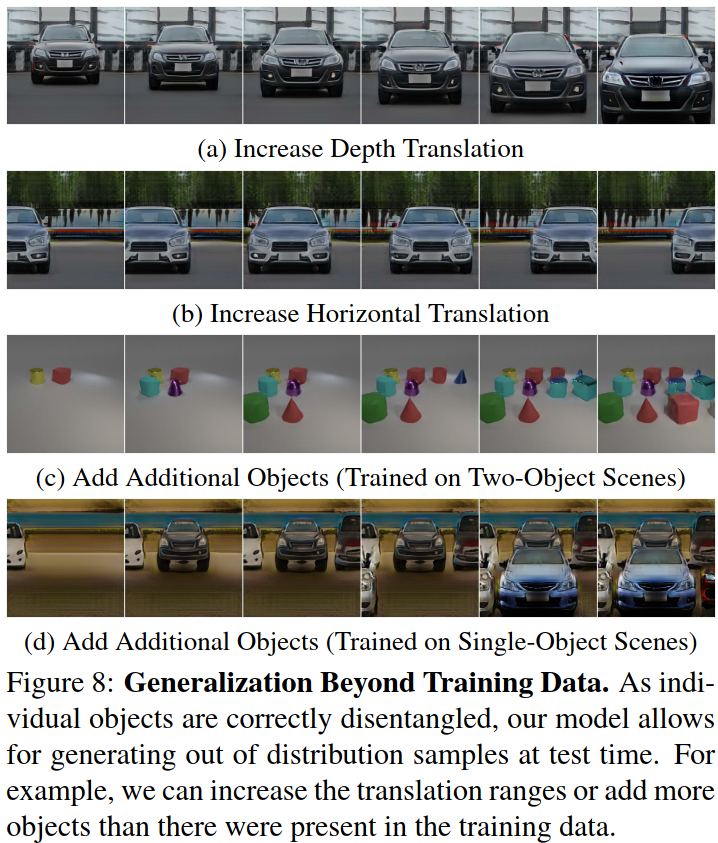
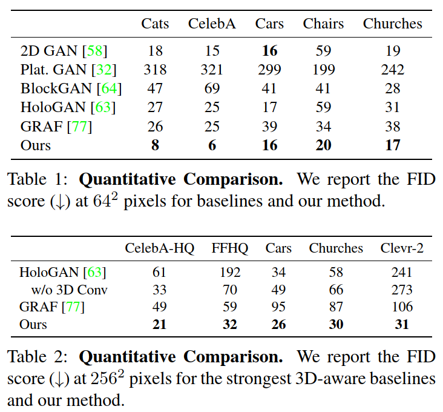

## What is the core idea?

* <u>Problem:</u> content creation needs to be controllable
* <u>Solution:</u> 
  * interpret the scene in the 3D domain rather than 2D
  * disentangle the scene by multiple "feature fields" (i.e., h_1 ~ h_N)

## How is it realized (technically)?

<u>Object as Neural Feature Fields</u>

How to represent multiple objects?

- Using a separate feature filed in combination with an affine transformation for each object.
- Transform points from object to scene space by:
  - 
  - **s**: scale parameter
  - **t**: translation parameter
  - **R**: rotation matrix
  - **x**: 3D points

Volume rendering

- The **generative neural feature field (h_θ)** maps (x, d, z_s, z_a) to volume density and scene features which are used to construct the scene
  - 
  - **σ**: volume density
  - **f**: features (for scene generation)
  - **x**: 3D points
  - **d**: view direction
  - **z_s**: shape code
  - **z_a**: appearance code

<u>Scene composition</u>

Summation of all feature fields

- **σ**: volume density
- **f**: features (for scene generation)

<u>Training</u>

- Generator objectives: 
  - 
  - **N**: number of entities (i.e., objects and background)
  - **N_s**: number of sample points along each ray
  - **d_k**: ray for *k*-th pixel
  - **x_jk**: the *j*-th sample point for the k-th pixel / ray
- Discriminator objectives: binary cross entropy

## How well does the paper perform?

<u>**Disentangled Scene Generation**</u>

- Which degree our model learns to generate disentangled scene representations?
  - "disentangled scene": are objects disentangled from the background?

<u>**Controllable Scene Generation**</u>

- How well the scene can be controlled?

**<u>Generalization Beyond Training Data</u>**

- Do the compositional scene representations allow us to generalize outside the training distribution?

<u>**Comparison to baselines**</u>

## TL;DR
* Compositional 3D scene representation leads to more controllable image synthesis
* The neural rendering pipeline brings us faster inference and more realistic images
* The proposed method allows for controllable image synthesis for single-/multi-object scenes given training on raw unstructured image collections

