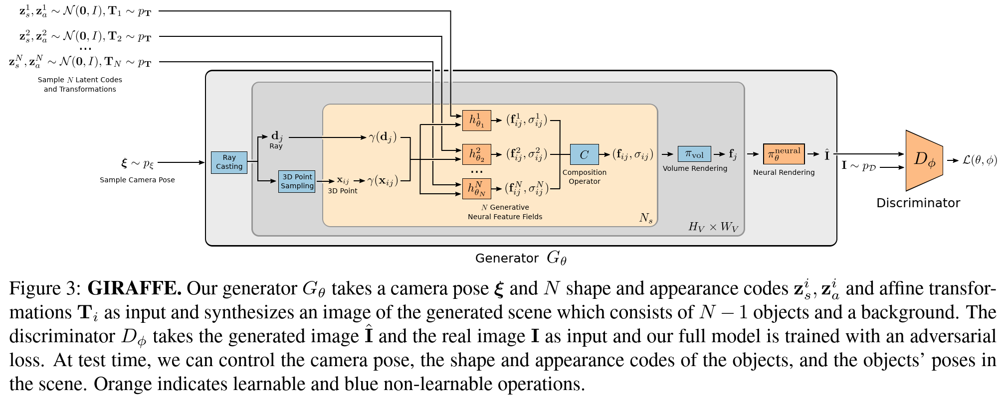

## What is the core idea?

* <u>Problem:</u> content creation needs to be controllable
* <u>Solution:</u> disentangle the scene by multiple "feature fields"

## How is it realized (technically)?

<u>Object as Neural Feature Fields</u>

Represent each object using a separate feature filed in combination with an affine transformation.

* s: scale parameter
* t: translation parameter
* R: rotation matrix

Transform points from object to scene space by

Volume rendering

<u>Scene composition</u>

Summation of all feature fields

<u>Neural Rendering</u>

<u>Objectives</u>

## How well does the paper perform?

<u>**Disentangled Scene Generation**</u>

- Which degree our model learns to generate disentangled scene representations?
- Are objects disentangled from the background?

<u>**Controllable Scene Generation**</u>

- How well the scene can be controlled?

**<u>Generalization Beyond Training Data</u>**

- Do the compositional scene representations allow us to generalize outside the training distribution?

<u>**Comparison to baselines**</u>

## TL;DR
* Compositional 3D scene representation leads to more controllable image synthesis
* The neural rendering pipeline brings us faster inference and more realistic images
* The proposed method allows for controllable image synthesis for single-/multi-object scenes given training on raw unstructured image collections

