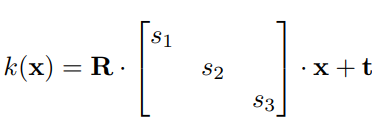
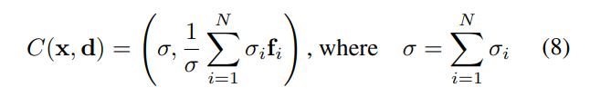

# **Summary - GIRAFFE: Representing Scenes as Compositional Generative Neural Feature Fields, Niemeyer, Geiger; 2020**

## What is the core idea?

TODO

## How is it realized (technically)?

The paper represents objects in an image as neural feature fields. To allow for disentanglement, they decided to have each object have its own feature field. This is different from previous approaches such as NeRF, because this paper's approach does not represent the entire scene with one model. A transformation from object space to scene space is performed using the below procedure:

Next, they rely on the additive nature of the object neural feature fields to create a feature image representation of the scene. This composition operator adds the outputs of the individual feature fields (density values) given a point and its viewing direction denoted x and d respectively:

The paper finally uses a combination of 3D volume rendering and 2D neural rendering to devise a 2D neural rendering network that takes a feature image and maps it to an RGB image. 

The Generator aspect of their model is defined by the three steps summarized above. The Discriminator portion of the model is a CNN that use Leakly ReLU non-linearity. The gradient of the Discriminator based on the Generator output was used to train on a non-saturating GAN objective. The paper claims they were able to effectively train their model on raw images without extra supervision. 

## How well does the paper perform?

TODO

## What interesting variants are explored?

TODO

## TL;DR
* Three
* Bullets
* To highlight the core concepts
