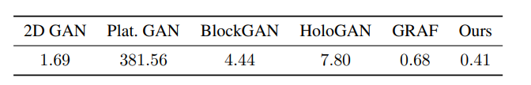

# **Summary - GIRAFFE: Representing Scenes as Compositional Generative Neural Feature Fields, Niemeyer, Geiger; 2020**

## What is the core idea?

Generating 2D images that are realistic and at high resolutions has been made possible by GANs (Generative Adversarial Networks). However, it is also important to be able to generate these images in a manner that is controllable. The paper suggests an approach, GIRAFFE, which unlike previous approaches, uses a 3D composition representation of scenes that leads to better disentanglement and controllable image generation. This compositional scene approach allows GIRAFFE to be able to learn from raw collections of images without any supplementary supervision.

## How is it realized (technically)?

The paper represents objects in an image as neural feature fields. A feature field is a mapping function outputs a volume density and RGB value with a 3D point and a viewing direction as input. To allow for disentanglement, they decided to have each object have its own feature field. This is different from previous approaches such as NeRF, because this paper's approach does not represent the entire scene with one model. A transformation from object space to scene space is performed using the below procedure:

Next, they rely on the additive nature of the object neural feature fields to create a combined representation of the scene. This composition operator adds the outputs of the individual feature fields given a point and its viewing direction to obtain a scene as compositions of the objects and background:

The paper then creates a feature image from the 3D scene representation using a 3D Volume Rendering approach. The feature image is passed to a 2D neural rendering network that upsamples the feature image into an RGB image. They claim that the combination of 3D volume rendering and 2D neural rendering led to better quality of images and faster image rendering.

The Generator aspect of their model is defined by the three steps summarized above. The Discriminator portion of the model is a CNN that use Leakly ReLU non-linearity. The gradient of the Discriminator based on the Generator output was used to train on a non-saturating GAN objective. The paper claims they were able to effectively train their model on raw images without extra supervision. 

## How well does the paper perform?

Experiments were done on a variety of single-object datasets with limited backrgound information. The paper also looks at model results on more real-world datasets. 

Experiments revealed that there was good disentanglement of the objects with the background of an image, not requiring supervision that would cause such a behavior. Their model was even able to disentangle multiple objects in a scene from each other through the unsupervised training approach. 

The model also exhibited controllable scene generation. With the help of disentangling parts of a scene, the model was also capable of successfully applying some transformations to objects such as rotation and changing camera elevation. Here are the results presented in the paper:

GIRAFFE attains similar if not better FID scores than the baseline approaches. This was done using fewer number of network parameters when compared to the baseline models. 

  
   

## What interesting variants are explored?

The combination of 3D volume rendering and 2D neural rendering led to faster inference for the GIRAFFE approach. They even report a significant rendering time speed up such as 1595 ms to 5.9 ms for 256 * 256 pixels. The paper also claims that GIRAFFE is able to generate objects or actions that were not directly found in the training data while correctly maintaining disentanglement. GIRAFFE's ability to disentangle the background from the objects allowed for more consistent image generation when performing tasks such as rotating objects in a scene when compared to the baseline methods.

## TL;DR
* GIRAFFE is a image synthesis approach that leads to effective disentanglement and controllable results.
* This paper utilizes compositional 3D representations of scenes that led to disentanglement between objects and background in the image.
* GIRAFFE achieved baseline results with faster inference times, less parameters, and less additional supervision.
