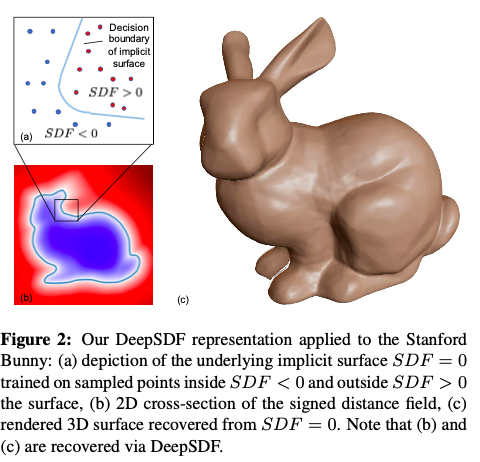
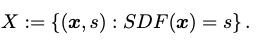

**What is the core idea?**

The paper introduces a DeepSDF, a learned continuous Signed Distance Function (SDF), which represent class of shapes that results in 3D shape representation, interpolation and completion from partial and noisy 3D input data. A generative model is lea*rned to produce the DeepSDF. The DeepSDF acts as a learned shape-conditioned classifier for which decision boundary is the shape surface itself. A novel way of using probabilistic auto decoder to learn the 3D shapes is used.

**How is it realized (technically)?**

* DeepSDF represents a continuous surface boundary by a continuous volumetric field. The value of a point in the field is the distance to the surface boundary. The (-) and (+) sign of the DeepSDF function specify the region is inside or outside of the shape respectively with the iso-surface represented by SDF (·) = 0 

* A deep neural network is trained given a target shape by preparing a set of pairs X composed of 3D point samples and their SDF values. 

* The parameter θ of multilayer fully connected network is trained on training set S to make fθ a good approximator. 

* The training is done by minimizing sum over losses between predicted and real SDF values by using the following loss function where clamp(x, δ) := min(δ, max(−δ, x))

* A latent vector z, encoding the desired shape is added as a second input to the neural network. The latent shape code vector is stacked with the sample location and feeded to the fully connected neural network (8 layers) at the input and 4th layer. The latent vectors are randomly assigned initialled and later on optimized by bac propogation.

* In the previous works, auto encoder is not used in inference, hence they proposed to use just auto decoder to learn shape embeddings. A probabilistic auto-decoder is used where each latent code zi is paired with training shape Xi where θ parameterizes the SDF likelihood. 

* SDF likelihood with a deep feedforward neural network is represented as:

* At training time, the joint log posterior over all training shapes is maximised with respect to the individual shape codes {zi}Ni=1 and the network parameter θ :

* For inference, a shape code zi for shape Xi can be evaluated via Maximum-a-Posterior (MAP) estimation as:

* The model was trained on "ShapeNet" with complete 3D shape meshes. Each mesh was normalized to a unit sphere and sampled signed distance values for 500,000 spatial points. Sampling was done more aggresively on surfadce areas o capture greater geometric detail of the object.

**How well does the paper perform?**

DeepSDF outperformed state-of-the-art methods such as AtlasNet and OGN in known and unknown 3D shape representation tasks regarding model generalization and detail description while reducing the model size by an order of magnitude compared with previous work. Both qualitative and quantitative results showed DeepSDF’s ability to produce a wide class of shapes (chair, plane, table, etc.) with high accuracy and precision, smooth and complete surface detail, and no defects.

**What interesting variants are explored?**

During inferemce, auto decoding takes more time than previous models as it optimizes explicitly over the latent vector. A future work is to replace ADAM optimization by more efficient Gauss-Newton or similar methods which utlizes analytic derivative of the model.

## TL;DR
* DeepSDF, a continuous shape surface represents a class of shapes which enables representing 3D shapes and completing it from partial and noisy data. 
* An auto decoder model is used to learn the DeepSDF function. 
* DeepSDF produces state-of-the-art results for learned 3D shape representation and completion with less model size compared to previous work. 
