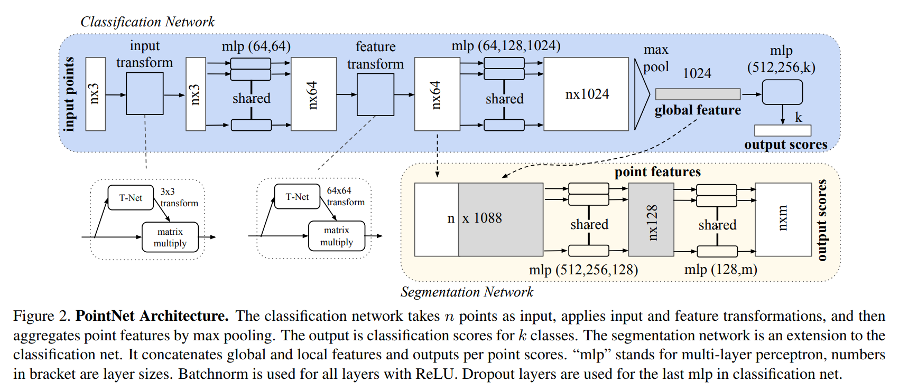
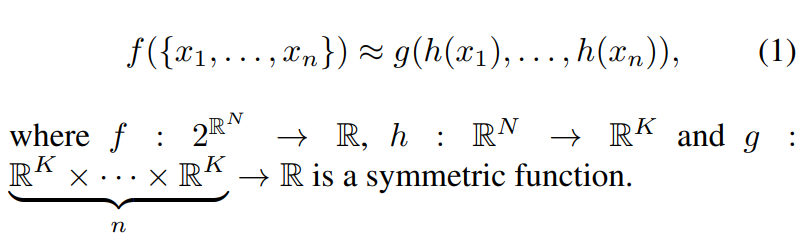
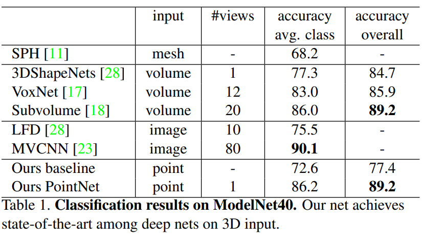
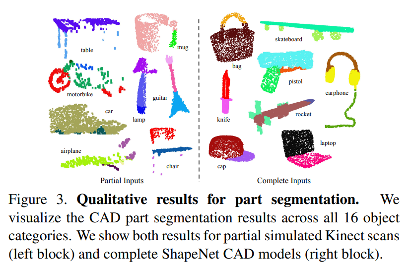
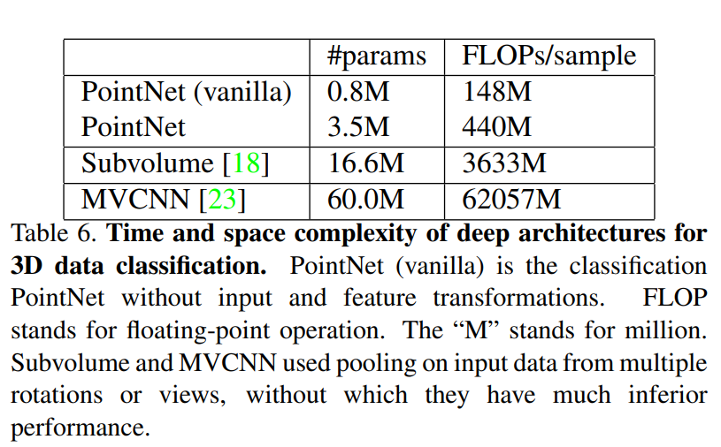
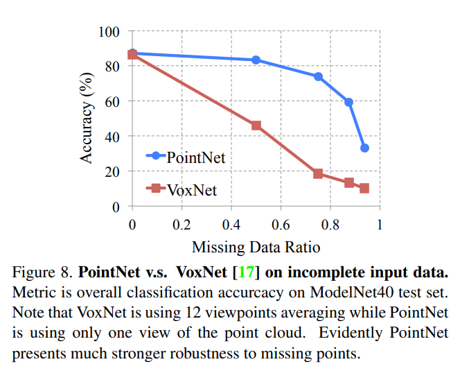

* What is the core idea?

Before this paper, state-of-the-art 3D classification/segmentation models all required 3D input to be transformed into voxel grids or multiple image views.  However, this paper introduces PointNets, which only requires point clouds as input to its model.  Using point clouds as input avoids issues with dense image inputs, and avoid irregularities that are difficult to learn from.

* How is it realized (technically)?

The input to PointNet consists of (x,y,z) coordinates, and may be entered to the network in an unordered fashion.  Because of this, it is essential that the network is immune to augmentations of the same point cloud and that it is able to learn both a local and global context.

Above is the architecture for PointNet.  The first layers go through an input and feature transformer.  These transformers are themselves mini networks and protect against variance in the point cloud input (ensuring we regard different transformations of the point cloud the same way).  The input transformer consists of a shared MLP network with ReLU activations and batch normalization.  The feature transformer is similar except it adds a regularization loss to the softmax loss in order to output an orthogonal matrix (which keeps input data from being lost).

Another part of the architecture is the split between a classification network and segmentation network.  This allows sharing of global knowledge with local knowledge.  As you can see in the above figure there is a connection between the two networks.

Finally, the MLPs and Max pooling layers are used to simulate a symmetric function.  A symmetric function is needed to protect against input permutations.  Looking at the symmetric function used below, the MLPs represent collection h, and max pooling represents g.

This function benefits from protection against small changes in the input, and when implemented with the max pooling layers stops extra points or corruptions from changing the output.  Theoretical analysis showed the reason for this to be that the function finds a few key points in the input cloud to represent the entire shape of the input.

* How well does the paper perform?

Above we can see that PointNet outperforms other 3D input models, except for MVCNN which has a slight lead.

In segmentation tests qualitatively seen above, PointNet also achieved State-of-the-art results.  Similar results were achieved in semantic scene segmentation tasks.

Finally, PointNet achieved much higher classification speeds than other competitive models MVCNN and Subvolume.  The table above shows a 141 times decrease in FLOPS per sample compared to MVCNN.

* Interesting Variants

To test the earlier claims that PointNet was less susceptible to input variations and augmentations, the authors tested the network's resistance to missing input points.  Below you can see that compared to VoxNet
the PointNet model maintained a much higher accuracy until more than 80 percent of the points were missing.

## TL;DR
* PointNet uses only Point Clouds as input for 3D vision tasks
* Upholds input invariance with its architecture
* Outperforms most 3D models in classification/segmentation with great efficiency.
