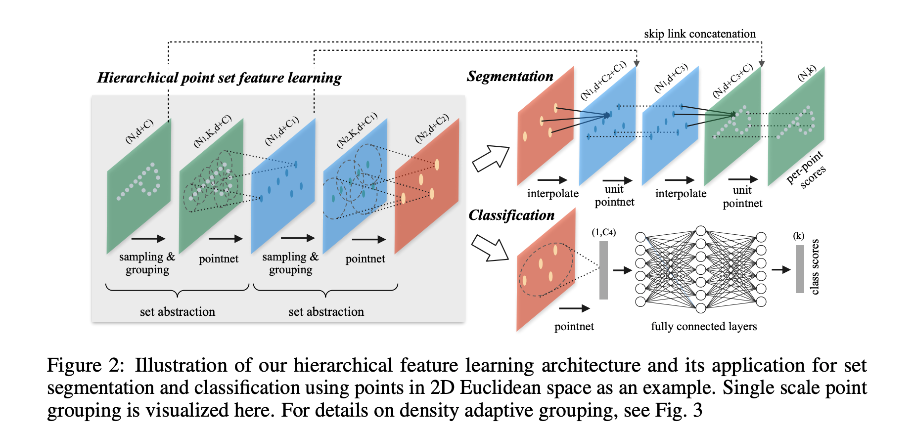
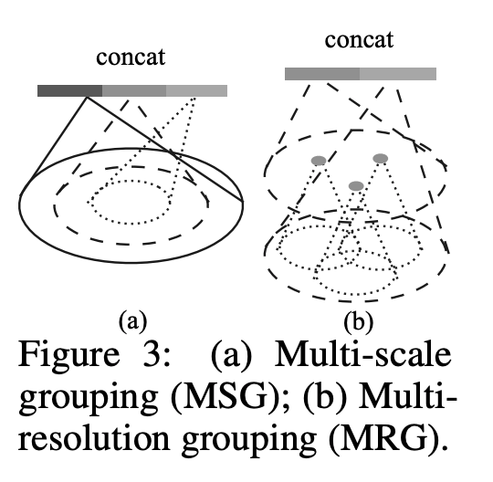
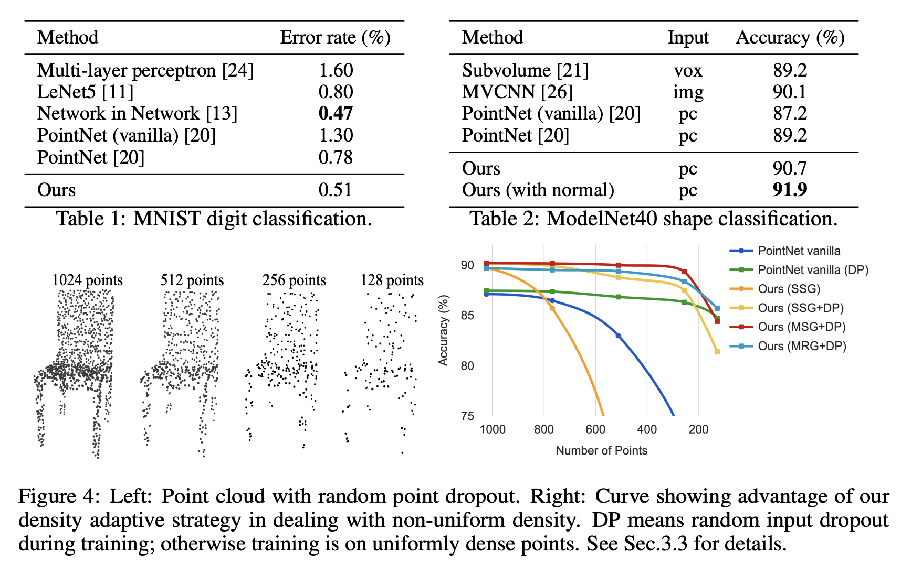

## What is the core idea?

* PointNet was a pioneer in studying deep learning on point sets
  * However, by design, PointNet does not capture local structures which limits generalizability to complex scenes
* PointNet++ is a hierarchical neural network that applies PointNet recursively on a nested partitioning of the input point set. 
  * This network is able to learn local features
  * This is similar to a CNN 

## How is it realized (technically)?

* Hierarchical strucuture
* PointNet uses a single max pooling operation, PointNet++ builds a hierarchichal grouping of points and progressively abstract larger and larger local regions along the hierarchy.
* Hierarchichal structutre has a number of *set abstraction* levels.
  * Here is where the set of points are processed and abstracted to produce a net set with fewer elements.
  * Done in three layers:
    * Sampling Layer
      * Selects a set of points from input points - defines centroids of local regions
      * Done using iterative farthest point sampling (FPS)
        * Better coverage of the entire point set than random sampling
      * In contrast to CNN 
        * CNN scans the vector space agnostic to data distribution but FPS is data dependent
    * Grouping Layer
      * Constructs local region sets by finding "neighboring" points around the centroids
      * In CNN, a local region is of a pixel is some pixels within a certain Manhattan distance (kernel size) of the pixel
        * Here the neighbourhood of a point is defied by metric distance
    * PointNet Layer
      * Mini-PointNet to encode local region patterns into feature vectors
      * The coordinates of points in a local region are translated into a local frame relative to centroid
        * Allows capturing of point-to-point relations in local region
* Non-Uniform Sampling Density
  * PointNet++ intelligentally extracts multiple scales of local patterns and combines them at each abstraction level
  * Two types of density adaptive layers:
  * 
  * Multi-scale grouping (MSG):
    * Simply concatenate features at different scales to form a multi-scale feature
    * Train the network to learn an optimised strategy to combine the multi-scale features
  * Multi-resolution grouping (MRG):
    * MSG is computationally expensive
    * Avoids expensive computation while still presevering ability to adaptively aggregate information according to distributional properties of points

## How well does the paper perform?

* Experiments on 4 datasets - MNIST, ModelNet40, SHREC15, ScanNet
* 

## TL;DR
* An extension of PointNet which allows for better learning of local features for better recognition of fine-grained patterns and generalizability 
* Learns by using increasing contextual scales
* Achieve state-of-the-art performance by using two novel set abstraction layers to intelligentaly aggregate multi-scale information
