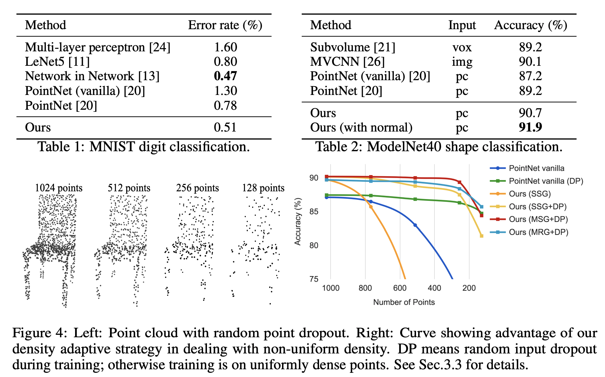

# Motivation

The basic idea of PointNet is to learn a spatial encoding of each point and then
aggregate all individual point features to a global point cloud signature. By its design, PointNet does
not capture local structure induced by the metric. However, exploiting local structure has proven to
be important for the success of convolutional architectures.

To utilize local structure, the authors designed hierarchical neural network (PointNet++). They first partition the set of points into overlapping local regions by the distance metric of the underlying space. Local features are further grouped into larger units and processed to produce higher level features.

PointNet++ addressed two issues in the above overview: how to generate the partitioning of the point set and how to abstract sets of points or local features through a local feature learner.

# Core idea

**Setup:** Suppose that $$\mathcal{X} = (M, d)$$ is a discrete metric space whose metric is inherited from a Euclidean space $$\mathbf{R}^n$$., where $$M \in \mathbf{R}^n$$ is the set of points and $$d$$ is the distance metric. We are interested in learning set functions $$f$$ that take such $$\mathcal{X}$$ as the input (along with additional features for each point) and produce information of semantic interest regrading $$\mathcal{X}$$.

## PointNet as the local feature learner
Given an unordered point set $$\{ x_1, x_2, \dots, x_n\}$$ with $$x_i \in \mathbf{R}^d$$, one can define a set function $$f: \mathcal{X} \to \mathbf{R}^n$$ that maps a set of points to a vector:
$$ f(x_1, x_2, \dots, x_n) = \gamma \Big( \max_{i=1,\dots,n} \{ h(x_i) \} \Big)$$
where $$\gamma$$ and $$h$$ are usually MLP networks. Max pooling makes $$f$$ invariant to the permutations. 

## Hierarchical Point Set Feature Learning
The hierarchical structure is composed by a number of set abstraction levels. At each level, a
set of points is processed and abstracted to produce a new set with fewer elements. The set abstraction
level is made of three key layers: Sampling layer, Grouping layer and PointNet layer. The Sampling
layer selects a set of points from input points, which defines the centroids of local regions. Grouping
layer then constructs local region sets by finding “neighboring” points around the centroids. PointNet
layer uses a mini-PointNet to encode local region patterns into feature vectors.

 

**Sampling layer**: Given input points $$\{ x_1, x_2, \dots, x_n\}$$, use iterative farthest point sampling (FPS) to choose a subset of points $$\{ x_{i_1}, x_{i_2}, \dots, x_{i_{j-1}}\}$$ such that $$x_{i_j}$$ is the most distant point (in metric distance) from the set $$\{ x_{i_1}, x_{i_2}, \dots, x_{i_{j-1}}\}$$ with regard to the rest points.

**Grouping layer**: Ball query finds all points that are within a radius to the query point with an upper limit of K. The grouping layer transform the input point set of size $$N \times (d + C)$$ and a set of centroids of size $$N' \times d$$ to $$N' \times K \times (d + C)$$ where K is the number of points in the neighborhood of centroid points. K varies across groups but the succeeding PointNet layer is able to convert flexible number of points into a fixed length local region feature vector.

**PointNet layer**: Transform input point set of size $$N' \times K \times (d + C)$$ to $$N' \times (d + C')$$. The coordinates of points in a local region are firstly translated into a local frame relative to the centroid point.

## Non-Uniform Sampling Density (PointNet++)
Non-uniformity introduces a significant challenge for point set feature learning. Features learned
in dense data may not generalize to sparsely sampled regions. Consequently, models trained for sparse point cloud may not recognize fine-grained local structures.

In PointNet++, each abstraction level extracts multiple scales of local patterns and combine them
intelligently according to local point densities. Two variants are proposed, 

**Multi-scale groupoing (MSG)**: Apply grouping layers with different scales followed by according PointNets to extract features of each scale. Features at different scales are concatenated to form a multi-scale feature. Train the netowrk to learn an optimized strategy to combine the multi-scale features. This is done by randomly dropping out input points with a randomized probability for each instance, which they call random input dropout.

 

**Multi-resolution grouping (MRG)**: The MSG approach above is computationally expensive since
it runs local PointNet at large scale neighborhoods for every centroid point.  Features of a region at some level $$Li$$ is a concatenation of two vectors. One vector (left in figure) is obtained by summarizing the features at each subregion from the lower level Li−1 using the set abstraction level. The other vector (right) is the feature that is obtained by directly processing all raw points in the local region using a single PointNet.

## Results
The authors evaluate our network on classifying point clouds sampled from both 2D (MNIST) and 3D
(ModleNet40) Euclidean spaces. MNIST images are converted to 2D point clouds of digit pixel
locations. 3D point clouds are sampled from mesh surfaces from ModelNet40 shapes. In default, they 
use 512 points for MNIST and 1024 points for ModelNet40.

 

In MNIST, a relative 60.8% and 34.6% error rate reduction from PointNet (vanilla) and PointNet to PointNet++. In ModelNet40 classification, using same input data size (1024 points) and features (coordinates only), PointNet++ is remarkably stronger than PointNet. Secondly, we observe that point set based method can even achieve better or similar performance as mature image CNNs.

In the experiment of randomly dropping points during test time (to validate network’s robustness to non-uniform and sparse data). MSG+DP (multi-scale grouping with random input dropout during training) and MRG+DP (multi-resolution grouping with random input dropout during training) are very robust to sampling density variation. MSG+DP performance drops by less than 1% from 1024 to 256 test points. 

PointNet++ also outperforms CNN state-of-the-art ate on semantic scene labeling task where the goal is to predict semantic object label for points in indoor scan. It is also robust to sampling desnity variation in this task.

## TL;DR
* Extending the PointNet with hierarchical point set feature learning.
* This allows for better learning of local features and propagate them for set segmentation.
* It can be adjusted to increase the robustness to non-uniform density.